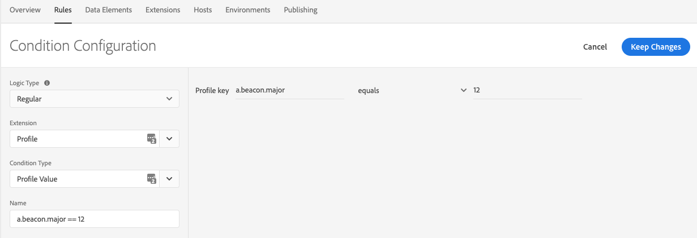
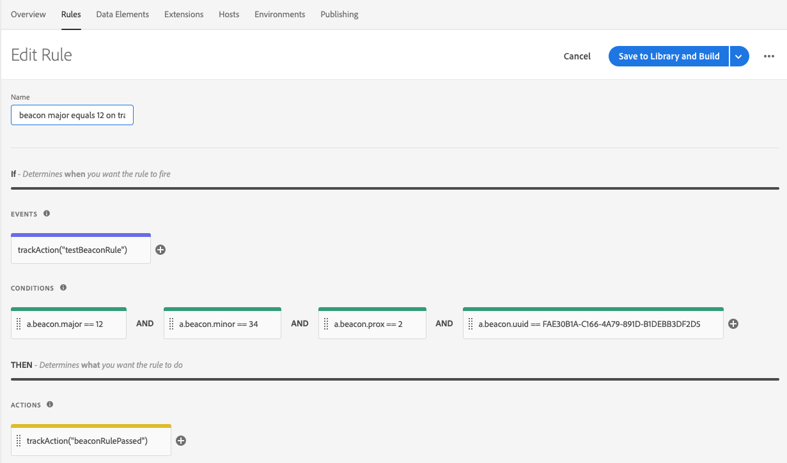
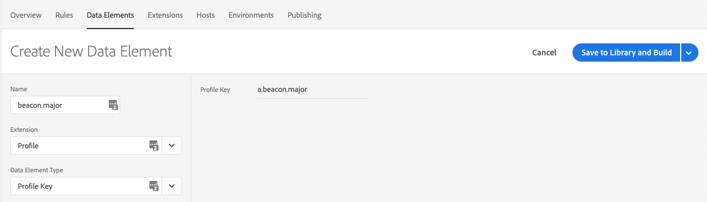

# Tracking Beacons

## Emulate the trackBeacon call from the v4 SDKs

The `trackBeacon` call is no longer available in the Experience Platform SDKs. Now, you need to manually send beacon tracking data to your Analytics server and create the rules based on a user's proximity to your beacons. This solution relies on the [Profile extension](../../using-mobile-extensions/profile/) to generate beacon-related rules.

This topic contains sample code to help you implement your own `trackBeacon` calls.

### Track a beacon

When your user comes within the range of a beacon, call this method to send beacon data to [Analytics](../../using-mobile-extensions/adobe-analytics/). This code also saves all beacon-related data in the client-side Profile for use with the Rules Engine.



In this method, the `proximity` parameter is an `int` that represents the various distances:

* 0 - Unknown
* 1 - Immediate
* 2 - Near
* 3 - Far

```java
static final String ACP_BEACON_MAJOR = "a.beacon.major";
static final String ACP_BEACON_MINOR = "a.beacon.minor";
static final String ACP_BEACON_UUID = "a.beacon.uuid";
static final String ACP_BEACON_PROXIMITY = "a.beacon.prox";

void trackBeacon(final String beaconUUID, final String major, final String minor, final int proximity, final Map<String, String> cdata) {
    final HashMap<String, String> contextData = cdata == null ? new HashMap<String, String>() : new HashMap<String, String>(cdata);

    if (major != null && !major.isEmpty()) {
        contextData.put(ACP_BEACON_MAJOR, major);
        UserProfile.updateUserAttribute(ACP_BEACON_MAJOR, major);
    } else {
        UserProfile.removeUserAttribute(ACP_BEACON_MAJOR);
    }

    if (minor != null && !minor.isEmpty()) {
        contextData.put(ACP_BEACON_MINOR, minor);
        UserProfile.updateUserAttribute(ACP_BEACON_MINOR, minor);
    } else {
        UserProfile.removeUserAttribute(ACP_BEACON_MINOR);
    }

    if (beaconUUID != null && !beaconUUID.isEmpty()) {
        contextData.put(ACP_BEACON_UUID, beaconUUID);
        UserProfile.updateUserAttribute(ACP_BEACON_UUID, beaconUUID);
    } else {
        UserProfile.removeUserAttribute(ACP_BEACON_UUID);
    }

    contextData.put(ACP_BEACON_PROXIMITY, String.valueOf(proximity));
    UserProfile.updateUserAttribute(ACP_BEACON_PROXIMITY, String.valueOf(proximity));

    final HashMap<String, Object> eventData = new HashMap<>();
    eventData.put("trackinternal", true);
    eventData.put("action", "Beacon");
    eventData.put("contextdata", contextData);

    final Event event = new Event.Builder("TrackBeacon", "com.adobe.eventType.generic.track", "com.adobe.eventSource.requestContent")
            .setEventData(eventData)
            .build();

    MobileCore.dispatchEvent(event, null);
}
```



Currently, `CLBeacon` is only available in iOS. The sample code contains the necessary checks to ensure OS compatibility.

#### Objective-C

```objectivec
#if TARGET_OS_IOS
static NSString* const ACP_BEACON_MAJOR = @"a.beacon.major";
static NSString* const ACP_BEACON_MINOR = @"a.beacon.minor";
static NSString* const ACP_BEACON_UUID = @"a.beacon.uuid";
static NSString* const ACP_BEACON_PROXIMITY = @"a.beacon.prox";

+ (void) trackBeacon:(CLBeacon *)beacon data:(NSDictionary*)data {
    NSMutableDictionary *contextData = data ? [data mutableCopy] : [@{} mutableCopy];

    if (beacon.major) {
        contextData[ACP_BEACON_MAJOR] = [beacon.major stringValue];
        [ACPUserProfile updateUserAttribute:ACP_BEACON_MAJOR withValue:[beacon.major stringValue]];
    } else {
        [ACPUserProfile removeUserAttribute:ACP_BEACON_MAJOR];
    }

    if (beacon.minor) {
        contextData[ACP_BEACON_MINOR] = [beacon.minor stringValue];
        [ACPUserProfile updateUserAttribute:ACP_BEACON_MINOR withValue:[beacon.minor stringValue]];
    } else {
        [ACPUserProfile removeUserAttribute:ACP_BEACON_MINOR];
    }

    if (beacon.proximityUUID.UUIDString) {
        contextData[ACP_BEACON_UUID] = beacon.proximityUUID.UUIDString;
        [ACPUserProfile updateUserAttribute:ACP_BEACON_UUID withValue:beacon.proximityUUID.UUIDString];
    } else {
        [ACPUserProfile removeUserAttribute:ACP_BEACON_UUID];
    }

    switch (beacon.proximity) {
        case CLProximityImmediate:
            contextData[ACP_BEACON_PROXIMITY] = @"1";
            break;
        case CLProximityNear:
            contextData[ACP_BEACON_PROXIMITY] = @"2";
            break;
        case CLProximityFar:
            contextData[ACP_BEACON_PROXIMITY] = @"3";
            break;
        case CLProximityUnknown:
        default:
            contextData[ACP_BEACON_PROXIMITY] = @"0";
    }
    [ACPUserProfile updateUserAttribute:ACP_BEACON_PROXIMITY withValue:contextData[ACP_BEACON_PROXIMITY]];

    NSDictionary *eventData = @{
                                @"trackinternal":@(YES),
                                @"action":@"Beacon",
                                @"contextdata":contextData
                                };

    ACPExtensionEvent *event = [ACPExtensionEvent extensionEventWithName:@"TrackBeacon"
                                                                    type:@"com.adobe.eventType.generic.track"
                                                                  source:@"com.adobe.eventSource.requestContent"
                                                                    data:eventData
                                                                   error:nil];
    [ACPCore dispatchEvent:event error:nil];
}
#endif
```

#### Swift

```swift
#if TARGET_OS_IOS
private let ACP_BEACON_MAJOR = "a.beacon.major"
private let ACP_BEACON_MINOR = "a.beacon.minor"
private let ACP_BEACON_UUID = "a.beacon.uuid"
private let ACP_BEACON_PROXIMITY = "a.beacon.prox"

class func trackBeacon(_ beacon: CLBeacon?, data: [AnyHashable : Any]?) {
    var contextData = data != nil ? data : [:]

    if beacon?.major != nil {
        contextData?[ACP_BEACON_MAJOR] = beacon?.major.stringValue ?? ""
        ACPUserProfile.updateUserAttribute(ACP_BEACON_MAJOR, withValue: beacon?.major.stringValue ?? "")
    } else {
        ACPUserProfile.removeUserAttribute(ACP_BEACON_MAJOR)
    }

    if beacon?.minor != nil {
        contextData?[ACP_BEACON_MINOR] = beacon?.minor.stringValue ?? ""
        ACPUserProfile.updateUserAttribute(ACP_BEACON_MINOR, withValue: beacon?.minor.stringValue ?? "")
    } else {
        ACPUserProfile.removeUserAttribute(ACP_BEACON_MINOR)
    }

    if beacon?.proximityUUID.uuidString != nil {
        contextData?[ACP_BEACON_UUID] = beacon?.proximityUUID.uuidString ?? ""
        ACPUserProfile.updateUserAttribute(ACP_BEACON_UUID, withValue: beacon?.proximityUUID.uuidString)
    } else {
        ACPUserProfile.removeUserAttribute(ACP_BEACON_UUID)
    }

    switch beacon?.proximity {
        case .immediate?:
            contextData?[ACP_BEACON_PROXIMITY] = "1"
        case .near?:
            contextData?[ACP_BEACON_PROXIMITY] = "2"
        case .far?:
            contextData?[ACP_BEACON_PROXIMITY] = "3"
        case .unknown?:
            fallthrough
        default:
            contextData?[ACP_BEACON_PROXIMITY] = "0"
    }
    ACPUserProfile.updateUserAttribute(ACP_BEACON_PROXIMITY, withValue: contextData?[ACP_BEACON_PROXIMITY])

    let eventData = [
    "trackinternal": NSNumber(value: true),
    "action": "Beacon",
    "contextdata": contextData
]

var event: ACPExtensionEvent? = nil
do {
    event = try ACPExtensionEvent(name: "TrackBeacon", type: "com.adobe.eventType.generic.track", source: "com.adobe.eventSource.requestContent", data: eventData)
} catch {
}
do {
    try ACPCore.dispatchEvent(event)
} catch {
}

#endif
```



### Clear the current beacon

The `clearCurrentBeacon` code removes the user attributes that were previously set in the Profile extension. To keep Rules working as expected, this method should be called when the user is no longer within range of your beacon.



This example uses `static` constant strings that were provided in the `trackBeacon` code sample above.

```java
void clearCurrentBeacon() {
    UserProfile.removeUserAttribute(ACP_BEACON_MAJOR);
    UserProfile.removeUserAttribute(ACP_BEACON_MINOR);
    UserProfile.removeUserAttribute(ACP_BEACON_UUID);
    UserProfile.removeUserAttribute(ACP_BEACON_PROXIMITY);
}
```



Currently, `CLBeacon` is only available in iOS. The sample code contains the necessary checks to ensure OS compatibility.

This example uses `static` constant strings that were provided in the `trackBeacon` code sample above.

#### Objective-C

```objectivec
#if TARGET_OS_IOS
+ (void) clearCurrentBeacon {
    [ACPUserProfile removeUserAttribute:ACP_BEACON_MAJOR];
    [ACPUserProfile removeUserAttribute:ACP_BEACON_MINOR];
    [ACPUserProfile removeUserAttribute:ACP_BEACON_UUID];
    [ACPUserProfile removeUserAttribute:ACP_BEACON_PROXIMITY];
}
#endif
```

#### Swift

```swift
#if TARGET_OS_IOS
+clearCurrentBeacon
do {
    ACPUserProfile.removeUserAttribute(ACP_BEACON_MAJOR)
    ACPUserProfile.removeUserAttribute(ACP_BEACON_MINOR)
    ACPUserProfile.removeUserAttribute(ACP_BEACON_UUID)
    ACPUserProfile.removeUserAttribute(ACP_BEACON_PROXIMITY)
}
#endif
```



## Use beacon values in Experience Platform Launch rules

In the code samples above, attributes are set in the client-side user profile. We can use these attributes when creating a rule in Experience Platform Launch to provide a custom experience or to take a specific action when the user is near a beacon.

### Beacon data in rule conditions

In conditions, you can mix-and-match beacon data to determine the specific audience for your action. You can use the following beacon-related variables:

* UUID \(`a.beacon.uuid`\)
* Major ID \(`a.beacon.major`\)
* Minor ID \(`a.beacon.minor`\)
* User Proximity \(`a.beacon.prox`\)

Configure your condition by selecting the `Profile` extension, selecting `Profile Value` as the condition type, and typing the variable. The following graphic shows an example of a condition that passes when the Major ID \(`a.beacon.major`\) of the beacon is equal to `12`:





### Beacon data in rule actions

Before you can use beacon data in your actions, create a data element for each variable that you want to use in your actions. The following graphic shows an example of creating a data element called `beacon.major` for the `a.beacon.major` key in our profile:



After creating a data element, we can use this data element as a token replacement in our actions. The graphic below shows an action that sends data to Analytics and attaches the `beacon.major` data element as additional context data:


