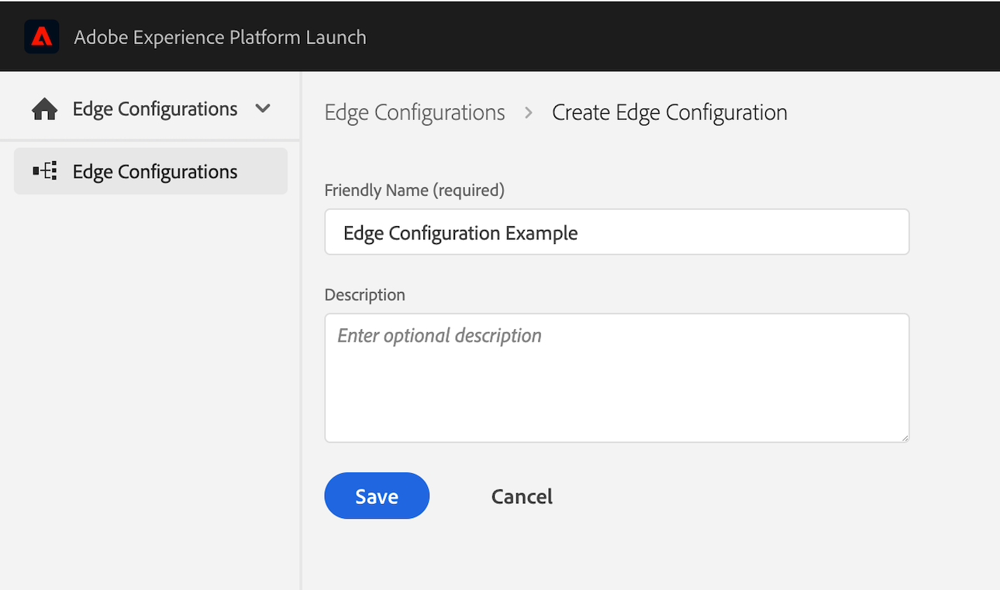
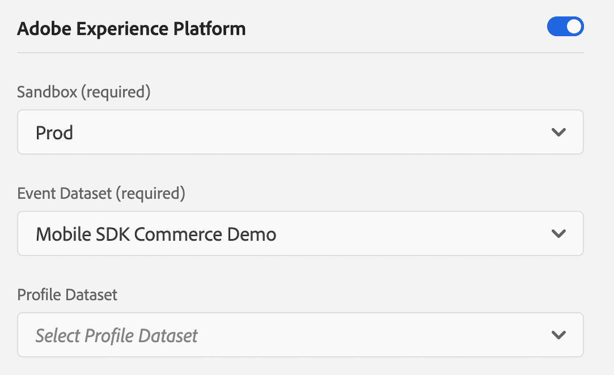

# Getting Started with Adobe Experience Platform

This tutorial illustrates how you may send XDM commerce events to Adobe Experience Platform via Experience Edge using the AEP Edge extension in a sample application, provided to you in iOS \(Swift\) and Android.

The demo mobile application has multiple tabs. For this exercise, the `Edge` and `Assurance` tabs will be used, demonstrating XDM commerce events in a mobile application.

## Prerequisites for this tutorial

* Access to Adobe Experience Platform
* Access to Adobe Experience Launch dashboard
* Access to Project Griffon
* Minimal Swift / Android development knowledge 
* General knowledge about the Adobe Experience Platform Mobile SDKs

## Setup the schema, dataset and environment identifier

### Initialize Adobe Experience Platform for data collection

To start collecting data in Adobe Experience Platform, an XDM schema and a Dataset need to be created. Follow these steps to get started:

1. In the browser, navigate to [Adobe Experience Platform](https://experience.adobe.com/platform) and login with your credentials.
2. Create an XDM Schema as follows:
   * From the left panel, select Schemas
   * Click `Create schema`
   * Select `XDM Experience event`
   * Add the following existing mixins:
     * Environment Details
     * Commerce Details
   * Set a name for this schema and click `Save`.


**Note:** on the top left corner, observe that the selected AEP Sandbox is Prod.

1. Create a dataset from the schema as follows: 
   * From the left panel, select Datasets
   * Click `Create dataset from schema`
   * Select the schema you previously created
   * Click `Next` 
   * Set a name for this dataset and click `Finish`.

### Generate an Experience Edge environment identifier

The SDK requires a configuration identifier that ensures the implementation matches the server-side Edge configuration and data is routed/received to/from the correct destination.

To create a configuration identifier use the following steps:

1. In [Adobe Experience Platform Launch](https://experience.adobe.com/launch), navigate to your mobile property and select _Edge Configurations_ from the left panel, then select _New Edge Configuration_.
2. Provide a name and description and then proceed to set up the default environment settings. These settings are used as defaults across the Experience Edge environments.



1. To send events to Adobe Experience Platform, enable the `Adobe Experience Platform` section as shown below:
   * Select `Prod` for `AEP Sandbox`.
   * For the `Event Dataset`, select the XDM dataset you created in [Initialize Adobe Experience Platform for data collection](tutorial-1-edge-extension-setup.md#initialize-adobe-experience-platform-for-data-collection).
   * Click `Save`.



## Setup the demo app

### Configure the Launch Mobile property

As a pre-requisite, the AEP Edge extension requires the successful implementation of the Adobe Experience Platform Mobile SDK - [Mobile Core](https://aep-sdks.gitbook.io/docs/using-mobile-extensions/mobile-core).

Experience Edge extension relies on the [Mobile Core](https://aep-sdks.gitbook.io/docs/using-mobile-extensions/mobile-core) for the transmission of events, managing identity \(ECID\), and triggering client-side rules based on XDM.

1. First, follow these steps to [Set up a mobile property](https://aep-sdks.gitbook.io/docs/getting-started/create-a-mobile-property) in Adobe Experience Platform Launch.
2. Install the `Adobe Experience Platform Edge` extension from the Catalog.
3. In the configuration view, select the `Edge Configuration` you created in the `Generate an Experience Edge environment identifier`  step and click `Save`.
4. Install the `AEP Assurance` extension from the Catalog.
5. Go to the Publishing Flow menu, select the development library you created and click `Add All Changed Resources`.
6. Click `Save & Build for Development` to publish the changes in the **Development** environment.

### Download the sample application and the AEP mobile extensions



#### Java

Download the Android Sample application from [GitHub - beta-assignment-1](https://github.com/adobe/aepsdk-sample-app-android/releases/tag/beta-assignment-1) then follow the steps described in [AEP SDK Sample App Android - Installation](https://github.com/adobe/aepsdk-sample-app-android/tree/beta-assignment-1#installation).



#### Swift

Download the iOS Swift Sample application from [GitHub - beta-assignment-1](https://github.com/adobe/aepsdk-sample-app-ios/releases/tag/beta-assignment-1), then follow the steps described in [AEP SDK Sample App Swift - Installation](https://github.com/adobe/aepsdk-sample-app-ios/tree/beta-assignment-1#installation).

* Navigate to the `Swift` directory, and run the following command from terminal: `pod install`.
* Open the Xcode workspace by running the command `open AEPSampleApp.xcworkspace`.
* Run the `AEPSampleApp` target on the simulator of your choice.



### Set up the configuration

In [Adobe Experience Platform Launch](https://experience.adobe.com/launch), go to the **Environments** tab in the mobile property created in the previous step \(Configure the Adobe Experience Platform Mobile SDK\) and click on the Developmenticon. Find the Environment File ID at the top and copy it.

Set the `LAUNCH_ENVIRONMENT_FILE_ID` to the copied Environment File ID in the `MainApp` \(Android\) / `AppDelegate` \(iOS\) class.

## Use the sample application

### AEP Edge extension and XDM objects

This application uses the AEP Edge extension for sending XDM formatted data to the Adobe Experience Edge Network and so to Adobe Experience Platform. The XDM data is modelled based on the XDM Schemas you have configured in Adobe Experience Platform.

The sample app includes automatically generated source classes for the XDM Objects that define the commerce mixin configured in the previous step. To explore these, check the `MobileSDKCommerceSchema` class and its usages in `EdgeViewController.swift (iOS)` / `EdgeTab.java (Android)`.

### Commerce events

In the sample app, click on the `Edge` tab that demonstrates the Commerce mixin usage. In the `XDM Commerce Example` section there are two buttons:

* Add to cart
* Purchase

When the `Purchase` button is clicked a new XDM Commerce Purchase Experience event is created and sent to the Adobe Experience Edge Network. Example:

```javascript
"events" : [
    {
      "xdm" : {
        "_id" : "F6BB7EE3-C411-4597-A97F-36A49035DCED",
        "eventType" : "commerce.purchases",
        "timestamp" : "2020-10-09T00:18:18Z",
        "productListItems" : [
          {
            "quantity" : 1,
            "currencyCode" : "USD",
            "priceTotal" : 34.76,
            "SKU" : "SHOES123",
            "name" : "Shoes"
          },
          {
            "quantity" : 2,
            "currencyCode" : "USD",
            "priceTotal" : 30.6,
            "SKU" : "HAT567",
            "name" : "Hat"
          }
        ],
        "commerce" : {
          "order" : {
            "priceTotal" : 65.36,
            "currencyCode" : "USD",
            "payments" : [
              {
                "paymentAmount" : 65.36,
                "paymentType" : "Credit card"
              }
            ]
          },
          "purchases" : {
            "value" : 1
          }
        }
      }
    }
  ]
```

### Using AEP Assurance

AEP Assurance \(also known as Project Griffon\) is a product from Adobe to help you inspect, validate, and debug data collection and experiences for your mobile application. The demo app is already set up to use Adobe's AEP Assurance mobile extension, which allows you to view the events being sent through the AEP Mobile SDK.

1. Visit [https://experience.adobe.com/griffon](https://experience.adobe.com/griffon) and login with your Adobe credentials.
2. Create a new Session:
   * Click `Create Session` in the top right.
   * In the `Create New Session` dialog, review instructions, and proceed by selecting `Start`.
   * When asked for the **Base URL**, enter `sampleapp://` , then click `Next`.
3. After starting an Assurance session from [https://experience.adobe.com/griffon](https://experience.adobe.com/griffon), click on the the Session Details button on the right corner of the Project Griffon page and copy the session link.

   **Note:** If you are using a real device, you can also use the `Scan QR Code` functionality. Then jump to step 6.

   

4. Go to the Sample application that is installed on your device, and click on the `Assurance` tab.
5. Paste the Assurance Session URL that you copied from [https://experience.adobe.com/griffon](https://experience.adobe.com/griffon), and click `Connect`.

   

6. Enter the PIN from [https://experience.adobe.com/griffon](https://experience.adobe.com/griffon) and click `Connect`.

   

7. Once connected to Assurance, you will see an AEP Icon in red color on the top right corner of the app view. The color of this AEP Icon becomes gray if the connectivity to Assurance server is lost for any reason. In this case, you want to reconnect to continue to see the session in the UI.
8. In the Assurance session, you should now start seeing events populating the Events List. When clicking the `Purchase` button from the `Edge` tab, you should see the Experience events sent to Experience Edge. For more details, refer to [Event types handled by the AEP Mobile extension](https://aep-sdks.gitbook.io/docs/beta/experience-platform-extension/experience-platform-debugging).

   **Hint:** To check the XDM Experience event was successfully validated, check that this message `validation for the given event was successful` is present in the `service com.adobe.streaming.validation` event.

### Queries in Adobe Experience Platform

After using the sample demo application to view products and checkout items in a cart, the XDM Experience Events containing the commerce data are sent to the Adobe Experience Platform through Experience Edge.

**Note:** It may take up to 15-20mins before the data is showing in Adobe Experience Platform.

Query the dataset which stores the commerce data by doing the following:

1. Log in to [Adobe Experience Platform](https://experience.adobe.com/platform) using your Adobe credentials.
2. Select your Adobe Experience Cloud Organization to the organization ID used to configure the demo application.
3. On the navigation panel, under Data Management, select Datasets and click the dataset you created at the beginning of this tutorial. From the right panel, copy the `Table name` value.
4. From the left panel, select **Queries**.
5. Click the **Overview** tab, then click **Create query**.
6. In the text box, enter a SQL query against your dataset table. Here is an example:

   ```sql
   select * from paste_your_table_name_here 
       where eventType = 'commerce.purchases' LIMIT 10
   ```

7. Click the "Play" icon to run the query. The results will appear in the **Results** tab at the bottom.

**Hint:** you can save this query and run it later when needed.

### Implement Add to cart XDM events

For this exercise, implement the Add to cart functionality in the sample application. Navigate to `EdgeViewController.swift (iOS)` / `EdgeTab.java (Android)` and implement the `sendAddToCartXDMEvent` function. The recommended eventType is `commerce.productListAdds`.

**Hint:** Use the `sendPurchaseXDMEvent` as an example and Project Griffon to validate that the XDM Experience Event is propertly formatted.

### Next steps

If you would like to explore other XDM Schemas for your mobile use-case, find more details in the [Adobe Experience Platform - Experience Edge](https://aep-sdks.gitbook.io/docs/beta/experience-platform-extension) page.

To learn more about the Experience Data Model \(XDM\), Schemas, Datasets and Mixins, read [XDM System overview](https://experienceleague.adobe.com/docs/experience-platform/xdm/home.html).

