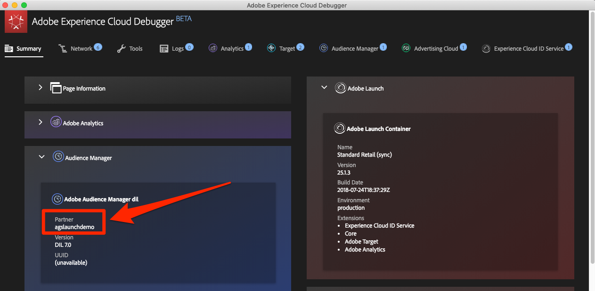
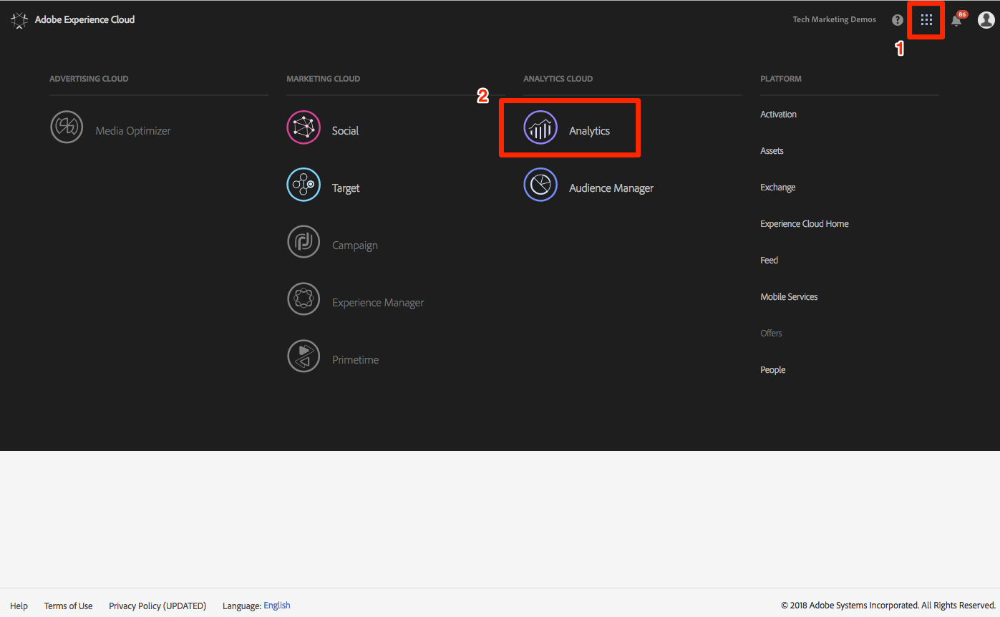
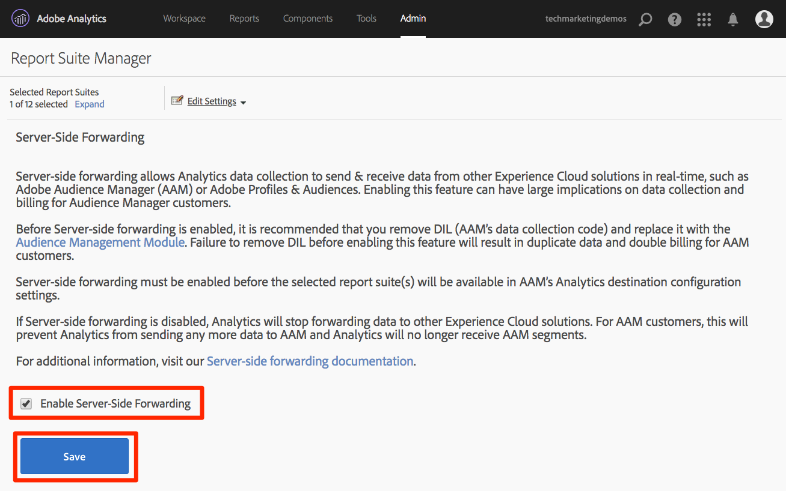
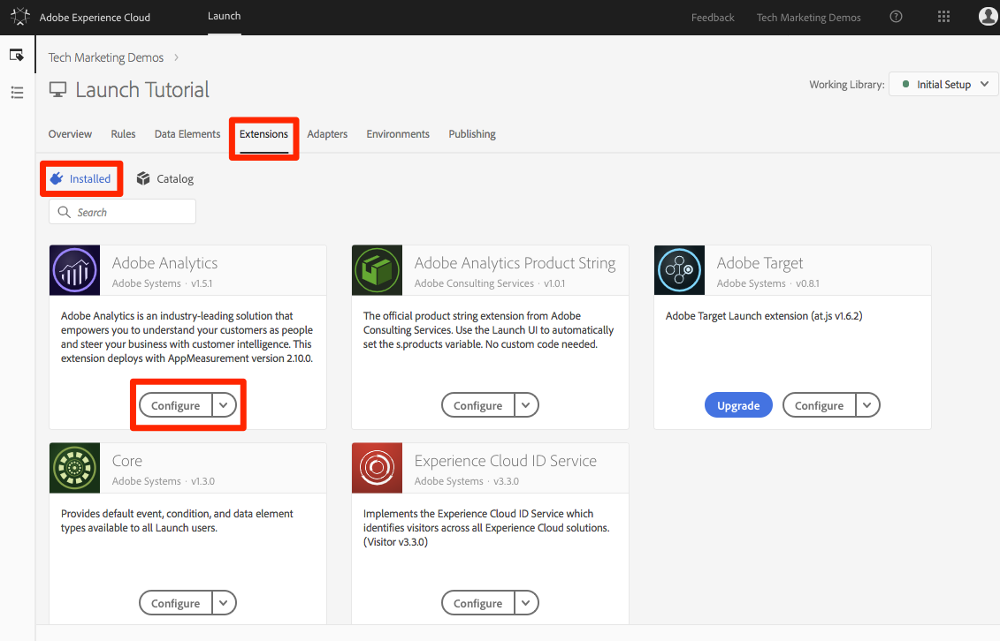
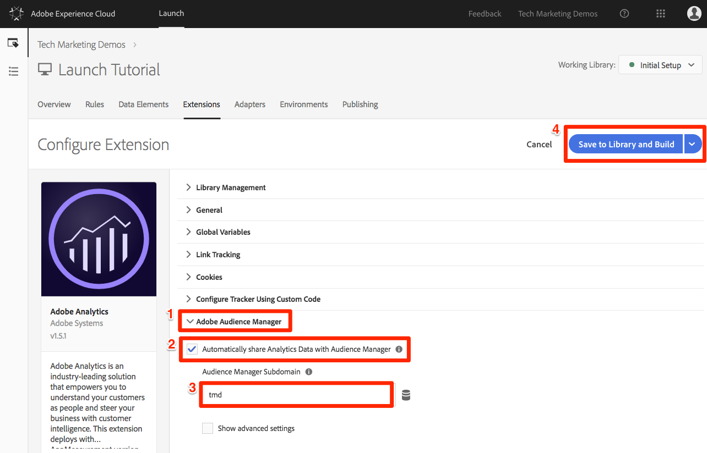
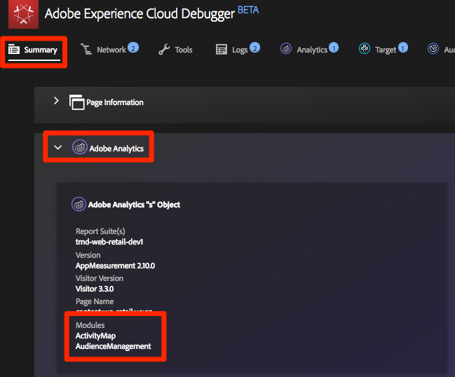
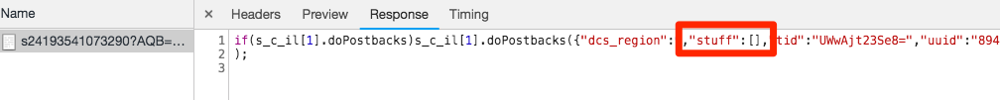

# Add Adobe Audience Manager

This lesson will guide you through the steps to enable Adobe Audience Manager using Server-Side Forwarding.

[Adobe Audience Manager](https://marketing.adobe.com/resources/help/en_US/aam/) (AAM) provides industry-leading services for online audience data management, giving digital advertisers and publishers the tools they need to control and leverage their data assets to help drive sales success.

## Learning Objectives

At the end of this lesson, you will be able to:

1. Describe the two main ways to implement Audience Manager in a website
1. Add Audience Manager using Server-Side Forwarding of the Analytics beacon
1. Validate the Audience Manager implementation

## Prerequisites

In order to complete this lesson, you will need:

1. To have completed the lessons in [Configure Launch](launch-create-a-property.md), [Add Adobe Analytics](analytics.md), and [Add the ID Service](id-service.md).

1. Admin access to Adobe Analytics so that you can enable Server-Side Forwarding for the report suite you are using for this tutorial. Alternatively, you can ask an existing admin at your organization to do this for you, following the instructions below.

1. Your “Audience Manager Subdomain” (also known as the “Partner Name” “Partner ID,” or “Partner Subdomain”). If you already have Audience Manager implemented on your actual website, the easiest way to obtain it is to go to your actual website and open the Debugger. The subdomain is available on the Summary tab, in the Audience Manager section:

   

## Implementation Options

There are two ways to implement Audience Manager in a website:

* **Server-Side Forwarding (SSF)**&mdash;for customers with Adobe Analytics, this is the easiest and recommended way to implement. Adobe Analytics forwards data to AAM on Adobe's backend, allowing for one less request on the page. This also enables key integration features and conforms with our best practices for Audience Manager code implementation and deployment.

* **Client-Side DIL**&mdash;This approach is for customers who do not have Adobe Analytics. DIL code (Data Integration Library Code, the AAM JavaScript configuration code) sends data directly from the web page into Audience Manager.

Since you have already deployed Adobe Analytics in this tutorial, you will deploy Audience Manager using Server-Side Forwarding. For a complete description and requirements list for Server-Side forwarding, please review the [documentation](https://marketing.adobe.com/resources/help/en_US/reference/ssf.html), so that you are familiar with how it works, what is required, and how to validate.

## Enable Server-Side Forwarding

There are two main steps in doing a SSF implementation:

1. Turning on a "switch" in the Analytics Admin Console to forward data from Analytics to Audience Manager *per report suite*.
1. Putting the code in place, which is done via Launch. In order for this to work correctly, you will need to have the Experience Cloud ID Service extension installed, as well as the Analytics extension (You will actually *not* need the AAM extension, which is explained below).

### Enable Server-Side Forwarding in the Analytics Admin Console

A configuration in the Adobe Analytics Admin Console is required to start forwarding  data from Adobe Analytics to Adobe Audience Manager. Since it can take up to four hours to start forwarding the data, you should do this step first.

#### To Enable SSF in the Analytics Admin Console

1. Log into Analytics via the Experience Cloud UI. If you don't have Admin access to Analytics, you will need to talk to your Experience Cloud or Analytics admin to assign you access or complete these steps for you.

  

1. From the top navigation in Analytics, choose **[!UICONTROL Admin > Report Suites]**, and from the list, select (multi-select) the report suite(s) that you want to forward to Audience Manager.

   

1. From the Report Suites screen and with the report suite(s) selected, choose **[!UICONTROL Edit Settings > General > Server-Side Forwarding]**.

    

    >[!WARNING] As stated above, you will need to have administrator privileges to see this menu item.

1. Once on the Server-Side Forwarding page, read the info and check the box to **[!UICONTROL Enable Server-Side Forwarding]** for the report suite(s).

1. Click **[!UICONTROL Save]**

    

>[!NOTE] Since SSF needs to be enabled per report suite, don't forget to repeat this step for your real report suites when you are deploying SSF on your actual site's report suite.
>
>Also, if the SSF option is grayed out, you will need to "map the report suite(s) to your Experience Cloud Org in order to enable the option. This is explained in [the documentation](https://marketing.adobe.com/resources/help/en_US/mcloud/map-report-suite.html).

Once this step has been completed, and if you have the Experience Cloud ID Service enabled, data will be forwarded from Analytics to AAM. However, to complete the process so that the response comes back correctly from AAM to the page (and also to Analytics via the Audience Analytics feature), you must complete the following step in Launch as well. Don't worry, it's super easy.

### Enable Server-Side Forwarding in Launch

This is the second of two steps for enabling SSF. You have already flipped the switch in the Analytics Admin Console, and now you just need to add the code, which Launch will do for you if you simply check the right box.

>[!NOTE] To implement Server-Side Forwarding of Analytics data into AAM, we will actually edit/configure the Analytics extension in Launch, **not** the AAM extension. The AAM extension is used exclusively for Client-Side DIL implementations, for those who do not have Adobe Analytics. So the following steps are correct when they send you into the Analytics extension to set this up.

#### To enable SSF in Launch

1. Go to **[!UICONTROL Extensions > Installed]** and click to configure the Analytics extension.

    

1. Expand the `Adobe Audience Manager` section

1. Check the box to **[!UICONTROL Automatically share Analytics Data with Audience Manager]**. This will add the Audience Manager "Module" (code) to the Analytics `AppMeasurement.js` implementation.

1. Add your “Audience Manager Subdomain” (also known as the “Partner Name,” “Partner ID,” or “Partner Subdomain”)

1. Click **[!UICONTROL Save to Library and Build]**

    

Server-Side Forwarding code is now implemented!

### Validate the Server-Side Forwarding

The main way to validate that the Server-Side Forwarding is up and running is by looking at the response to any of your Adobe Analytics hits. We'll get to that in a minute. In the mean time, let's check a couple of other things that can help us make sure that it is working the way we want it to.

#### Verify that the Code is Loading Correctly

The code that Adobe Launch installs to handle the forwarding, and especially the response from AAM to the page, is called the Audience Manager
"Module." We can use the Experience Cloud Debugger to ensure that it has loaded.

1. Open the We.Retail site
1. Click the debugger icon in your browser to open the Experience Cloud debugger
1. Staying on the Summary tab, scroll down to the Analytics section
1. Verify that **AudienceManagement** is listed under the Modules section

#### Verify the Partner ID in the Debugger

Next, we can also verify that the debugger is picking up the right "partner ID" (AKA Partner subdomain, etc.) from the code.

1. While still in the debugger, and still on the Summary tab, scroll down to the Audience Manager section
1. Verify your Partner ID/Subdomain under "Partner"

>[!WARNING] You may notice that the Audience Manager section of the debugger refers to "DIL", which is the "Data Integration Library," and typically refers to a client-side implementation, as opposed to the server-side approach that have here. The truth is that the AAM "Module" (used in this SSF approach) uses a lot of the same code as the client-side DIL library, and so this debugger is currently reporting it as such. If you have followed the steps in this tutorial, and the rest of the items in this validation section are correct, you may rest assured that server-side forwarding is working.

#### Verify the Analytics Request and Response

OK, this is the biggie. If you are not doing server-side forwarding of data from Analytics to Audience Manager, then there is really no response to the Analytics beacon (besides a 2x2 pixel). However, if you are doing SSF, then there are items that you can verify in the Analytics request and response that will let you know that it is working correctly.
Unfortunately, at this time, the Experience Cloud debugger does not support showing the response to the beacons. Therefore, you should use another debugger/packet sniffer, like Charles Proxy or the browser's JavaScript console.
In one of these debuggers, look for the following:

* In the Analytics beacon (request), look for a "callback" parameter. It will be set to something like this: `s_c_il[1].doPostbacks`

* You will have a response to the Analytics beacon. It will contain references to doPostbacks, as called in the request, and most importantly, it should have a "stuff" object. This is where AAM segment IDs will be sent back to the browser. If you have the "stuff" object, SSF is working!

* Beware the False "Success" - If there is a response, and everything seems to be working, make **sure** that you have that "stuff" object. If you don't, you may see a message in the response that says "status":"SUCCESS". As crazy as this sounds, this is actually proof that it is **NOT** working correctly. If you see this, it means that you have completed this second step (the code in Launch), but that the forwarding in the Analytics Admin Console (first step of this section) has not yet completed. In this case you need to verify that you have enabled SSF in the Analytics Admin Console. If you have, and it hasn't been 4 hours yet, be patient. It should fix itself in a little while. :)

[Next "Experience Cloud Integrations" >](integrations.md)