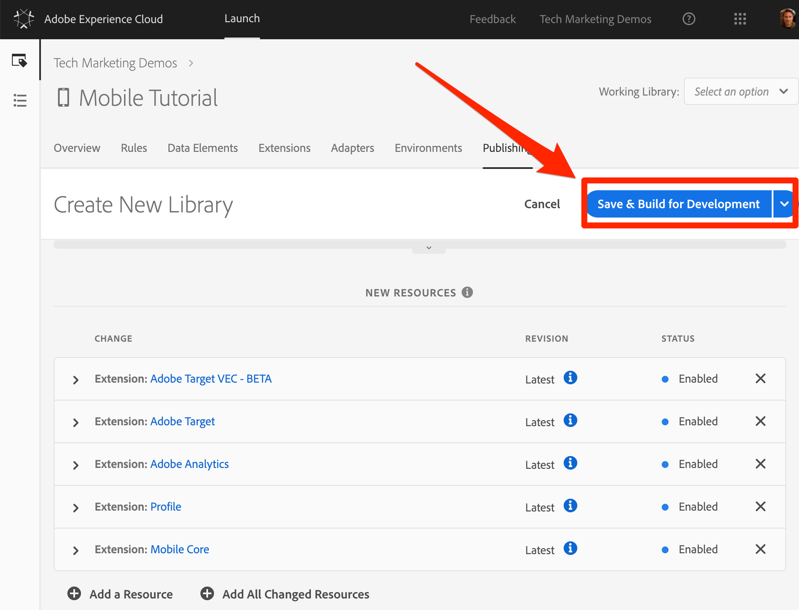
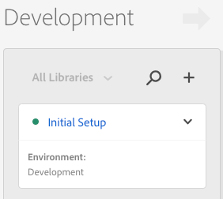

# Add a Library

In this lesson, you will create your first Library.

## Learning Objectives

At the end of this lesson, you will be able to:

* Create a library
* Add changes to a library
* Build a Library

## Save Your Changes to a Library

After configuring your extensions, you need to package them into a library that you can deploy in your app so you can leverage your marketing solutions.

**To add and build a library**

1. Go to the **[!UICONTROL Publishing]** tab

1. Click **[!UICONTROL Add New Library]**

   

1. Name the Library `Initial Setup`

1. Select **[!UICONTROL Environment > Development]**

1. Click **[!UICONTROL Add All Changed Resources]**

   

1. Note that after clicking **[!UICONTROL Add All Changed Resources]** Launch summarizes the changes you just made.

1. Click **[!UICONTROL Save & Build for Development]**

   

After a few moments, the status dot will turn green indicating the library successfully built.

[Next "Install the Launch Property and the SDK" >](launch-install-the-mobile-sdk.md)
