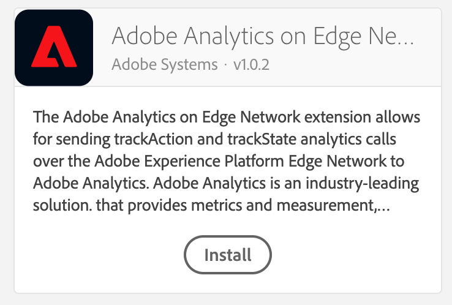
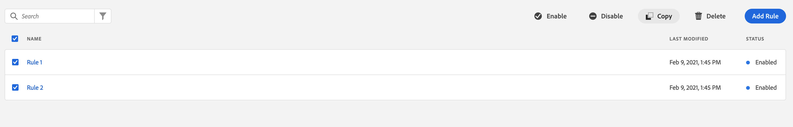
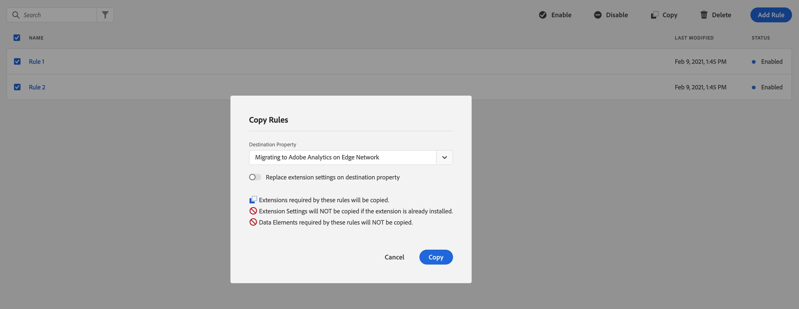
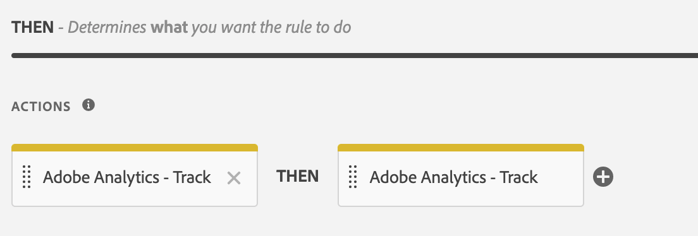
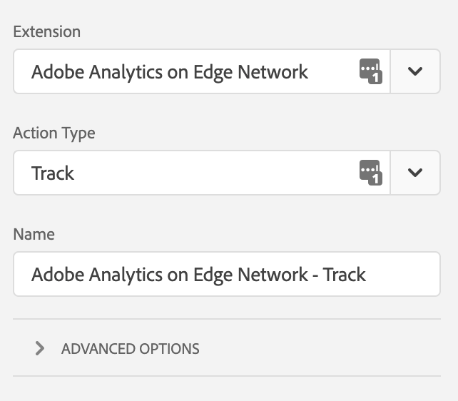
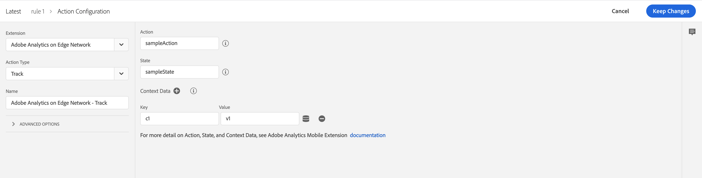
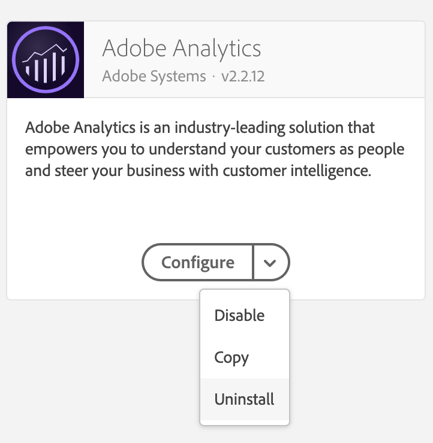

# Migrating to Adobe Analytics on Edge Network in Adobe Experience Platform Launch

This guide illustrates how you may migrate from Adobe Analytics direct to Adobe Analytics on Edge Network. You can find the API documentation for Adobe Analytics on Edge Network [here.](./analytics-edge-api-reference.md)

## Prerequisites

* Access to Adobe Experience Platform
* Access to Adobe Experience Launch dashboard
* Minimal Swift / Android development knowledge 
* General knowledge about the Adobe Experience Platform Mobile SDKs

## Migrate to Adobe Analytics on Edge Network in Experience Platform Launch

### Install Adobe Analytics on Edge Network Extension in Experience Platform Launch

1. In Experience Platform Launch, click **New Property**. Type a name for the property and select **Mobile** as the platform. Click **Save** to create the mobile property.
2. In your newly created mobile property, click the **Extensions** tab and [configure the Adobe Experience Platform Edge extension.](./README.md#configure-the-adobe-experience-platform-edge-extension-in-experience-platform-launch)
3. On the **Catalog** tab, locate or search for the **Adobe Analytics on Edge Network** extension, and click **Install**.

### Copying existing rules from a property that uses Adobe Analytics

1. In your mobile property, which needs to be migrated from Adobe Analytics direct to Adobe Analytics on the Edge Network, click the **Rules** tab.
2. Select all the rules from your property and copy them to the newly created property.

### Reconfiguring existing rules to use track configuration from Adobe Analytics on Edge Network

1. In your newly created mobile property, click the **Rules** tab.
2. For each copied rule which has **Adobe Analytics Track action**, 
    * Select the rule from the rules list.
    * Select each **Adobe Analytics - Track** action from the **Actions** section in the rule.
    
    
    
    * Write down the values for **Action**, **State** and **Context Data** present on the right pane. It will be used in the next steps.
    * From the **Extension** drop-down list on the left pane, select **Adobe Analytics on Edge Network**.
    * From the **Action Type** drop-down list, select **Track**
    
    
    
    * On the right pane, re-enter the previously noted values for **Action** and **State**. Add each of the key-value pair(s) that was previouly noted in the **Context Data**.
    * Click **Keep Changes**
    
    

    * Click **Save** after all the track actions for the rule have been changed.
3. When all the rules have been changed to use Adobe Analytics on Edge Network, click the **Extensions** tab. Select the drop-down menu in the **Adobe Analytics** extension card and click **Uninstall**.

4. Publish the configuration to a new library by following [these steps.](https://github.com/Adobe-Marketing-Cloud/aep-sdks-documentation/blob/master/getting-started/create-a-mobile-property.md#publish-the-configuration)

### Next steps

1. [Add the Analytics Edge extension to your app](./README.md#add-the-analytics-edge-extension-to-your-app)
2. [Send app states and actions to Analytics](./README.md#send-app-states-and-actions-to-analytics)
