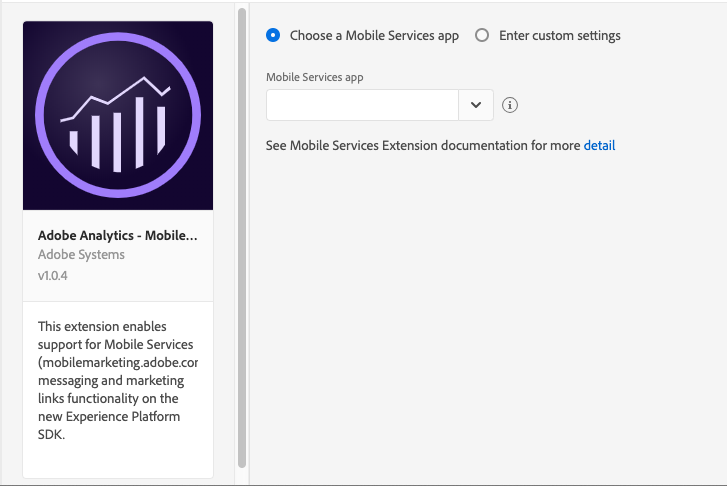
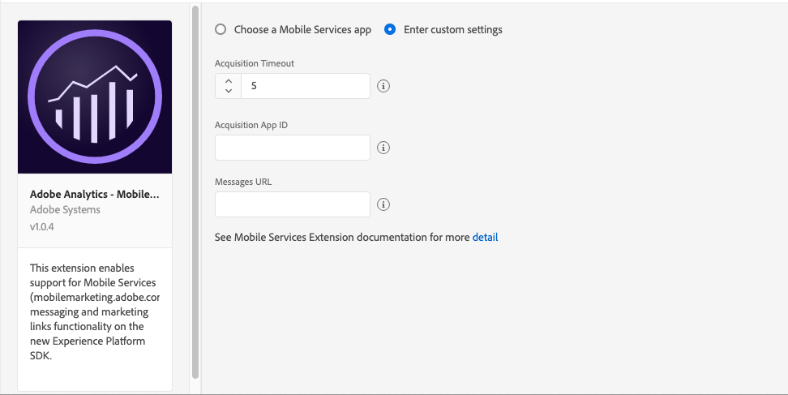

# Adobe Analytics - Mobile Services

This extension enables in-app messaging, push notifications, and marketing links functionality from Mobile Services on the Experience Platform SDKs.


The following steps assume that you have previously created apps in Mobile Services \([mobilemarketing.adobe.com](https://mobilemarketing.adobe.com/)\).


To use the Mobile Services extension:

1. Configure and implement Core and Analytics extensions and APIs.
2. Configure the Adobe Analytics – Mobile Services Launch extension.
3. Implement Mobile Services extension and APIs in your app.

## Configure the Adobe Analytics – Mobile Services extension in Launch

1. In Launch, click the Extensions tab.
2. On the **Catalog** tab, locate the **Adobe Analytics – Mobile Services** extension, and click **Install**.
3. Select one of the following options:
   * **Choose a Mobile Services app** and complete the following tasks:

     a. In **Mobile Services app**, select app from the drop-down list.

     b. Click **Save**.

   * **Enter Custom settings** and complete the following tasks:

     a. Enter an Acquisition time out, recommended time out is 5 seconds.

     b. Provide the Acquisition App ID, for example, `0eb9f2791f0880623f91e41e5309d2ae25066e513054a4cb59168dc886b526da`.

     c. Provide the messages URL, for example, `https://assets.adobedtm.com/b213090c5204bf94318f4ef0539a38b487d10368/scripts/satellite-5c7711bc64746d7f5800036e.json`
4. Click **Save**.
5. Follow the publishing process to update your SDK configuration.

## Configure the Adobe Analytics - Mobile Services extension

You can configure the extension in one of the following ways:

* By selecting your Mobile Services app



* By providing custom settings

  




## Add Adobe Analytics-Mobile Services to your app

### Android

1. Add the library to your project.
2. Import the library:

```java
import com.adobe.marketing.mobileservices.*; 
```


The Adobe Analytics – Mobile Services extension depends on the Core extension, which includes the Identity and Lifecycle frameworks and the Analytics extension. When you manually install the Adobe Analytics – Mobile Services extension, ensure that you add the `mobileservices-1.x.x.aar` library to your project.


### iOS

1. Add the library to your project via your Podfile by adding the `ACPMobileServices` pod.
2. Import the Core, Identity, Lifecycle, & Analytics libraries:

```objectivec
#import "ACPCore.h"
#import “ACPIdentity.h”
#import “ACPLifecycle.h”
#import "ACPAnalytics.h"
#import "ACPMobileServices.h"
```

## Register Adobe Analytics – Mobile Services with Mobile Core

### Android

Call the `setApplication()` method once in the `onCreate()` method of your main activity.

For example, your code might look like the following:

```java
public class MobileServicesApp extends Application {

@Override
public void onCreate() {
     super.onCreate();
     MobileCore.setApplication(this);

     try {
         	Analytics.registerExtension();
MobileServices.registerExtension(); //Register Mobile Services with Mobile Core
Lifecycle.registerExtension();
         	Identity.registerExtension();
         	MobileCore.start(null);
     } catch (Exception e) {
     //Log the exception
     }
  }
}
```

### iOS

In your app's `application:didFinishLaunchingWithOptions` function, register the Mobile Services extension with the Mobile Core:

```objectivec
- (BOOL)application:(UIApplication *)application didFinishLaunchingWithOptions:(NSDictionary *)launchOptions {
   [ACPAnalytics registerExtension];
   [ACPLifecycle registerExtension];
   [ACPIdentity registerExtension];
   [ACPMobileServices registerExtension];
   [ACPCore start:nil]
   // Override point for customization after application launch.
   return YES;
}
```

## Implement Mobile Services APIs

To use your Android or iOS extension with the Experience Platform SDKs, implement the following APIs:

### Push tracking

#### Android

#### iOS

```objectivec
[ACPCore collectLaunchInfo:userInfo];
```

### In-app messaging

#### Android

If you are using Fullscreen message or local notification, update the Manifest:

```java
<activity android:name="com.adobe.mobile.MessageFullScreenActivity">
</activity>
<receiver android:name="com.adobe.mobile.MessageNotificationHandler" />
To 
<activity
    android:name="com.adobe.marketing.mobile.MessageFullScreenActivity"
    android:windowSoftInputMode="adjustUnspecified|stateHidden" >
</activity>
<receiver android:name="com.adobe.marketing.mobile.MessageNotificationHandler" />
If you were using the Referral receiver provided by Adobe, then update
<receiver
    android:name="com.adobe.mobile.ReferralReceiver"
    android:exported="true">
    <intent-filter>
        <action android:name="com.android.vending.INSTALL_REFERRER" />
    </intent-filter>
</receiver>
To 
<receiver
    android:name="com.adobe.marketing.mobile.ReferralReceiver"
    android:exported="true">
    <intent-filter>
        <action android:name="com.android.vending.INSTALL_REFERRER" />
    </intent-filter>
</receiver>

```

#### iOS


### Marketing Links

#### Android

```markup
com.adobe.marketing.mobile.MobileServices.processReferrer
```

#### iOS

```text

```

### Deep link tracking

#### Android

```java
MobileServices.trackAdobeDeepLink
```

#### iOS

```objectivec
[ACPMobileServices trackAdobeDeepLink:]
```


Remember the following information:

* The lifetime value is not supported by v5, so it cannot be used in Messages.
* Neither `a.internalaction eq Lifecycle` nor `Action eq Lifecycle` can be used as a trigger.  We recommend that you use LaunchEvent instead.
* `ce` is no longer supported as a trigger.
* Local notifications do not support Android 8.0 or higher.  This remains unchanged from the v4 SDKs.


### Configuration keys

### Additional information

* To see the Adobe Mobile Services documentation, go to [https://marketing.adobe.com/resources/help/en\_US/mobile/home.html](https://marketing.adobe.com/resources/help/en_US/mobile/home.html)
* To see the Adobe Mobile Services UI, go to [https://mobilemarketing.adobe.com/](https://mobilemarketing.adobe.com/).


