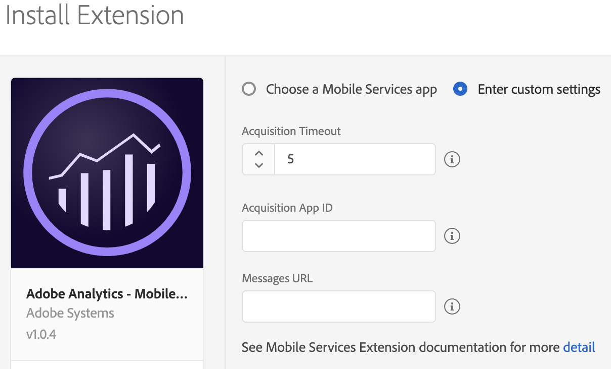
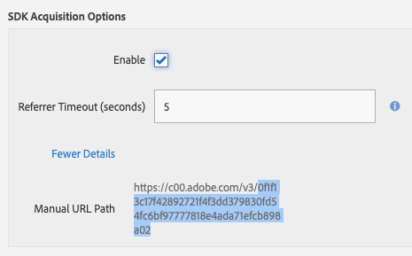
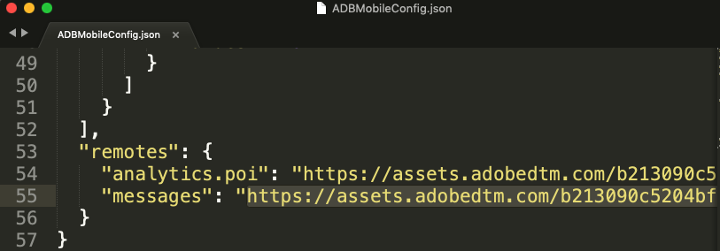
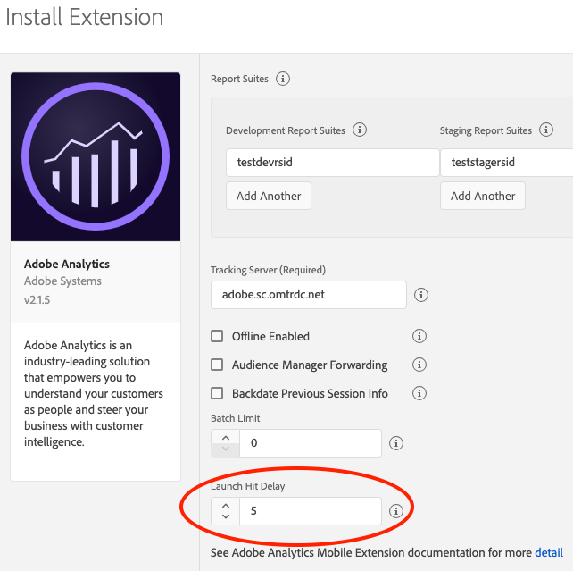

# Adobe Analytics - Mobile Services

This extension enables in-app messaging, push notifications, and marketing links functionality from [Mobile Services ](https://mobilemarketing.adobe.com)on the Experience Platform SDK.


The Adobe Analytics Mobile Marketing Add-on SKU is required to enable Mobile Services access to mobile acquisition, deep linking, geolocation, and mobile messaging capabilities.


Review the following Mobile Services functionality documentation for context and set up before implementation at these links:

* [Getting started with Mobile Services](https://marketing.adobe.com/resources/help/en_US/mobile/gs.html)
* [Create and managing apps](https://marketing.adobe.com/resources/help/en_US/mobile/manage_apps.html)
* [Acquisition and marketing links](https://marketing.adobe.com/resources/help/en_US/mobile/acquisition_main.html)
* [Push and in-app messaging](https://marketing.adobe.com/resources/help/en_US/mobile/in_app_messaging.html)


Before you configure the Mobile Services extension, ensure that you previously created apps in [Mobile Services](https://mobilemarketing.adobe.com). To create an app in Mobile Services, see [Add a new App](https://marketing.adobe.com/resources/help/en_US/mobile/t_new_app.html).



Looking for location functionality from Mobile Services? Try out our new and enhanced, location points of interest management services - [Places extensions \(Beta\)](places-extension-1/).


To use the Mobile Services extension, complete these steps:

1. Configure the Mobile Services extension in Launch.
2. If using acquisition and marketing links, update your configuration in the Analytics extension.
3. Add Mobile Services extension to your app.
4. Implement Mobile Services APIs in your app.

## Configure the Mobile Services extension in Launch


The Mobile Services extension also requires the Analytics extension for reporting.


### Automatic Configuration \(Recommended\)

1. In Launch, click the **Extensions** tab.
2. Choose **Catalog**, locate the **Adobe Analytics – Mobile Services** extension, and click **Install**.
3. **\*\*Select** Choose a Mobile Services app\*\* and complete the following tasks:
   1. In **Mobile Services app**, select app from the drop-down list.
   2. Click **Save**.
   3. Follow the publishing process to update the SDK configuration.


### Manual Configuration


The following instructions only apply if you do not see your app listed or need to manually configure your Mobile Services app.



If you are sending data to multiple Analytics report suites, use the Acquisition App ID from the app that is associated with the first report suite in your list of report suite IDs.




Select **Enter Custom settings** and complete the following tasks

1. Enter an Acquisition time out.  
   The recommended time out is 5 seconds. To enable app acquisition,

   this value must be set to a value that is higher than 0.

2. Provide the **Acquisition App ID** \(sample value: `0eb9f2791f0880623f91e41e5309d2ae25066e513054a4cb59168dc886b526da)`\).

You can find the Acquisition App ID in Mobile Services. Select your app, navigate to Manage App Settings and under SDK Acquisition Options, copy the hashed string similar to the highlighted value:



1. Provide the **Messages URL** \(sample value: `https://assets.adobedtm.com/b213432c5204bf94318f4ef0539a38b487d10368/scripts/satellite-5c7711bc64746d7f5800036e.json`\).

You can find the Messages URL from your `ADBMobileConfig.json` file typically near the bottom of the file.



1. Click **Save**.
2. Follow the publishing process to update your SDK configuration.

## Configure Adobe Analytics extension

Follow the steps listed in the [Adobe Analytics extension](adobe-analytics/) to ensure that this extension is correctly configured and implemented.

In **Launch Hit Delay**, type a value of 5s or more to ensure that the acquisition context is sent to Analytics with your Lifecycle information.



## Add Mobile Services extension to your app


The Mobile Services extension depends on the Core extension, which includes the Identity and Lifecycle frameworks and the Analytics extension.




Add the Mobile Services extension to your project using the app's Gradle file.

#### Java

Import the Mobile Services extension in your application's main activity.

```java
import com.adobe.marketing.mobileservices.*;
```



Add the library to your project via your Podfile by adding the `ACPMobileServices`pod.

#### Objective-C

Import the library into your project:

```objectivec
#import "ACPCore.h"
#import “ACPIdentity.h”
#import “ACPLifecycle.h”
#import "ACPAnalytics.h"
#import "ACPMobileServices.h"
```



### Register Mobile Services with Mobile Core



#### Java

Call the `setApplication()` method once in the `onCreate()` method of your main activity. For example, your code might look like the following:

```java
public class MobileServicesApp extends Application {

@Override
public void onCreate() {
     super.onCreate();
     MobileCore.setApplication(this);

     try {
             Analytics.registerExtension();
MobileServices.registerExtension(); //Register Mobile Services with Mobile Core
Lifecycle.registerExtension();
             Identity.registerExtension();
             MobileCore.start(null);
     } catch (Exception e) {
     //Log the exception
     }
  }
}
```



#### Objective-C

In your app's `application:didFinishLaunchingWithOptions` function, register the Mobile Services extension with the Mobile Core:

```objectivec
- (BOOL)application:(UIApplication *)application didFinishLaunchingWithOptions:(NSDictionary *)launchOptions {
   [ACPAnalytics registerExtension];
   [ACPLifecycle registerExtension];
   [ACPIdentity registerExtension];
   [ACPMobileServices registerExtension];
   [ACPCore start:nil]
   // Override point for customization after application launch.
   return YES;
}
```



## Implement Mobile Services APIs in your app

To use your Android or iOS extension with the Experience Platform SDKs, implement the following APIs:

### Set up push messaging



Obtain the registration ID/token by using the [Firebase Cloud Messaging \(FCM\) APIs](https://firebase.google.com/docs/cloud-messaging/android/client).

### setPushIdentifier  <a id="setpushidentifier"></a>

#### Syntax  <a id="syntax"></a>

```java
void setPushIdentifier(final String registrationID)
```

#### Example  <a id="example"></a>

```java
MobileCore.setPushIdentifier(registrationID);
```




iOS simulators do not support push messaging.


After you complete [Apple's instructions](https://developer.apple.com/library/archive/documentation/NetworkingInternet/Conceptual/RemoteNotificationsPG/HandlingRemoteNotifications.html#//apple_ref/doc/uid/TP40008194-CH6-SW1) to get your app ready to handle push notifications, set the push token by using the [`setPushIdentifier`](https://aep-sdks.gitbook.io/docs/using-mobile-extensions/mobile-core/identity/identity-api-reference#set-the-push-identifier) API:

### setPushIdentifier

#### Objective-C

#### Syntax

```objectivec
+ (void) setPushIdentifier: (nullable NSData*) deviceToken;
```

#### Example

```objectivec
- (void) application:(UIApplication *)application didRegisterForRemoteNotificationsWithDeviceToken:(NSData *)deviceToken {
  // Set the deviceToken that the APNS has assigned to the device
  [ACPCore setPushIdentifier:deviceToken];
  //...
}
```

#### Swift

```swift
ACPCore.setPushIdentifier(deviceToken)
```



### Debugging the push set up

If everything is configured correctly, after installing your app on a mobile device, verify that the following SDK debug log is displayed:

Request to `demdex.net` containing device push token has been sent:

```text
2019-01-31 18:22:35.261676-0800 DemoApp[935:156015] [AMSDK DEBUG <com.adobe.module.identity>]: Sending request (https://dpm.demdex.net/id?d_rtbd=json&d_ver=2&d_orgid=B1F855165B4C9EA50A495E06@AdobeOrg&d_mid=43583282444503123217621782542046274680&d_blob=j8Odv6LonN4r3an7LhD3WZrU1bUpAkFkkiY1ncBR96t2PTI&dcs_region=9)
```

### Set up push tracking

Use the following API to track a push messaging click through in Adobe Analytics.


Using the following API does not increment page views.




No setup required. SDK handles push tracking to Analytics, out of the box, for Android.



Use the following API to track a push messaging click through in Adobe Analytics.

### collectLaunchInfo

#### Syntax

```objectivec
+ (void) collectLaunchInfo:(NSDictionary *)userInfo;
```

#### Objective-C

```objectivec
- (void)application:(UIApplication *)application didReceiveRemoteNotification:(NSDictionary *)userInfo fetchCompletionHandler:(void (^)(UIBackgroundFetchResult))completionHandler {
    // only send the hit if the app is not active
    if (application.applicationState != UIApplicationStateActive) {
        [ACPCore collectLaunchInfo:userInfo];
    }
    completionHandler(UIBackgroundFetchResultNoData);
}
```



### Troubleshooting push messaging

For more information, see the following:

* [Android Troubleshooting guide](https://marketing.adobe.com/resources/help/en_US/mobile/android/c_troubleshooting-push-messaging.html)
* [iOS Troubleshooting guide](https://marketing.adobe.com/resources/help/en_US/mobile/ios/c_troubleshooting-push-messaging.html)

### Set up in-app messaging

This feature allows you to deliver in-app messages that are triggered from any analytics data or event. After the implementation, messages are dynamically delivered to the app and do not require a code update. In-app messages are created in Mobile Services. For more information, see [Create an in-app message](https://marketing.adobe.com/resources/help/en_US/mobile/?f=t_in_app_message).

To set up your app for in-app messages, implement the following instructions. You can complete these steps even if you have not yet defined any messages in Mobile Services. After you define messages, they are delivered dynamically to your app and displayed without an app store update.



1. Update the `AndroidManifest.xml` file to declare the full screen activity and enable the Message Notification Handler.

#### Java

If you are using Fullscreen message or local notification, update the `AndroidManifest.xml` with:

```markup
<activity
    android:name="com.adobe.marketing.mobile.MessageFullScreenActivity"
    android:windowSoftInputMode="adjustUnspecified|stateHidden" >
</activity>
<receiver android:name="com.adobe.marketing.mobile.MessageNotificationHandler" />
```

If you selected a modal layout, select one of the following themes for the message:

* `Theme.Translucent.NoTitleBar.Fullscreen`
* `Theme.Translucent.NoTitleBar`
* `Theme.Translucent`

#### Example

```markup
<activity
android:name="com.adobe.marketing.mobile.MessageFullScreenActivity"
android:theme="@android:style/Theme.Translucent.NoTitleBar.Fullscreen"
android:windowSoftInputMode="adjustUnspecified|stateHidden" >
</activity>
<receiver android:name="com.adobe.marketing.mobile.MessageNotificationHandler" />
```



No setup required for iOS. SDK handles in-app message support out of the box.



#### Fallback images

When creating a full-screen message, you can optionally specify a fallback image. If your message cannot retrieve its intended image from the web, the SDK attempts to load the image with the same name from your application’s assets folder. This allows you to show your message in its original form, even if the user is offline, or the predetermined image is unreachable.


The fallback image asset name is specified when you configure the message in Mobile Services. You need to ensure that the specified resource is available.


#### Configuring notification icons

The following methods allow you to configure the small and large icons that appear in the notification area, and the large icon that is displayed when notifications appear in the notification drawer.



### Config.setSmallIconResourceId\(int resourceId\)

This API sets the small icon that is used for notifications that are created by the SDK. This icon appears in the status bar and is the secondary image that is displayed shown when the user sees the complete notification in the notification center.

#### Syntax

```java
public static void setSmallIconResourceId(final int resourceId);
```

#### Example

```java
MobileCore.setSmallIconResourceID(R.drawable.appIcon);
```



No setup required. Icons are automatically handled by the SDK for iOS.





### Config.setLargeIconResourceId\(int resourceId\)

Set the large icon that is used for notifications that are created by the SDK. This icon is the primary image that is displayed when the user sees the complete notification in the notification center.

#### Syntax

```java
public static void setLargeIconResourceId(final int resourceId);
```

#### Example

```java
MobileCore.setLargeIconResourceId(R.drawable.appIcon);
```



No setup required. Icons are automatically handled by the SDK for iOS.



### Tracking in-app messages

The SDK automatically tracks the following metrics for your in-app messages:

For full screen and alert style in-app messages:

* **Impressions**: when user triggers an in-app message.
* **Click throughs**: when user clicks the **Click through** button.
* **Cancels**: when user clicks the **Cancel** button.

For custom, full screen in-app messages, the HTML content in the message needs to include the correct code to notify the SDK tracking about the following buttons:

* **Click-through** \(redirect\) example tracking: `adbinapp://confirm/?url=http://www.yoursite.com`
* **Cancel** \(close\) example tracking: `adbinapp://cancel`

For local \(remote\) notifications:

* **Impressions**: when user triggers the notification.
* **Opens**: when user opens app from the notification.

Here is an example about how to include open tracking:



```objectivec
- (BOOL) application:(UIApplication *)application didFinishLaunchingWithOptions:(NSDictionary *)launchOptions {

  // handle local notification click-throughs for iOS 10 and older
  NSDictionary *localNotificationDictionary = launchOptions[UIApplicationLaunchOptionsLocalNotificationKey];
  if ([localNotificationDictionary isKindOfClass:[NSDictionary class]]) {
       [ACPCore collectLaunchInfo:localNotificationDictionary];
  }

}
- (void) application:(UIApplication *)application didReceiveLocalNotification:(UILocalNotification *)notification {
   [ACPCore collectLaunchInfo:notification.userInfo];
}
```



### Troubleshooting in-app messaging

For more information, see the following:

* [Android Troubleshooting guide](https://marketing.adobe.com/resources/help/en_US/mobile/android/in_apps_ts.html)
* [iOS Troubleshooting guide](https://marketing.adobe.com/resources/help/en_US/mobile/ios/in_apps_ts.html)

### Acquisition and marketing Links

Acquisition and marketing links must be created in Adobe Mobile services. For more information, see [Mobile Services acquisition](https://marketing.adobe.com/resources/help/en_US/mobile/acquisition_main.html).


The following set up collects Acquisition link context from links that were created in Mobile Services and collects referrer data from the Google Play store.


When the user downloads and runs an app as the result of a Google Play store acquisition, the data from the referrer is collected and sent to Adobe Mobile Services. Custom keys that were part of the acquisition data from Google Play are name-spaced with `a.acquisition.custom`.



#### Java

1. Implement the `BroadcastReceiver` for the referrer.

```java
package com.your.package.name;  // replace with your app package name

import android.content.BroadcastReceiver;
import android.content.Context;
import android.content.Intent;

public class GPBroadcastReceiver extends BroadcastReceiver {
  @Override
  public void onReceive(Context c, Intent i) {
      com.adobe.marketing.mobile.MobileServices.processReferrer(c, i);
  }
}
```

1. Update `AndroidManifest.xml` to enable the above created `BroadcastReceiver`

```markup
<receiver android:name="com.your.package.name.GPBroadcastReceiver" android:exported="true">
    <intent-filter>
        <action android:name="com.android.vending.INSTALL_REFERRER" />
    </intent-filter>
</receiver>
```



No setup required. Acquisition context is automatically collected and tracked by the SDK for iOS.



### Deep link tracking

The SDK can parse key-value pairs of data that are appended to any deep or universal link, provided the link contains a key `a.deeplink.id` and a corresponding non-null and user generated value. All key-value pairs of data that are appended to the URL string are parsed, attached to a lifecycle hit as context data, and sent to Adobe Analytics.

You can also append one or more of the following reserved keys, with user-generated values, to the deep or universal link:

* `a.launch.campaign.trackingcode`
* `a.launch.campaign.source`
* `a.launch.campaign.medium`
* `a.launch.campaign.medium`
* `a.launch.campaign.content`


Ensure the deep link URL has the `a.deeplink.id` key in the URL string. If `a.deeplink.id` is not found, none of the appended URL parameters are sent to Analytics via context data.




#### Java

#### Syntax

```java
public static void trackAdobeDeepLink(final Uri uri)
```

#### Example

```java
MobileServices.trackAdobeDeepLink
```



### trackAdobeDeepLink

#### Objective-C

#### Syntax

```objectivec
+ (void) trackAdobeDeepLink: (NSURL* _Nonnull) deeplink;
```

#### Examples

```objectivec
- (BOOL)application:(UIApplication *)application handleOpenURL:(NSURL *)url {
    [ACPMobileServices trackAdobeDeepLink:url]
    /*
     Handle deep link
     */
    return YES;
}
```

```objectivec
- (BOOL)application:(UIApplication *)app openURL:(NSURL *)url options:(NSDictionary<NSString *, id> *)options {
    [ACPMobileServices trackAdobeDeepLink:url];
    /*
     Handle deep link
     */
    return YES;
}
```



## Migration Notes

To prepare for your migration, remember the following information:

* Lifetime value is not supported on the Experience Platform SDK, so it might not be used to trigger in-app messages or local notifications.
* `ce` is no longer supported as a trigger for in-app messages or local notifications.
* `a.internalaction` or `action` \(from Lifecycle\) can be used to trigger in-app messages or local notifications.  We suggest using `LaunchEvent` instead.
* Local notifications do not support Android 8.0 or higher.

### Configuration keys

| Key | Description |
| :--- | :--- |
| mobile.acquisitionTimeout | Amount of time, in seconds, to wait for acquisition information from the Mobile Services acquisition server. |
| mobile.acquisitionAppId | App ID uniquely identifies the app on the Mobile Services acquisition server. |
| mobile.messagesUrl | Messages URL from your configuration \(`ADBMobileConfig.json`\) file's remotes section. |

## Watch the Video



### Additional information

* Visit [Mobile Services documentation](https://marketing.adobe.com/resources/help/en_US/mobile/home.html)
* Visit [Mobile Services \(mobilemarketing.adobe.com\)](https://mobilemarketing.adobe.com)

