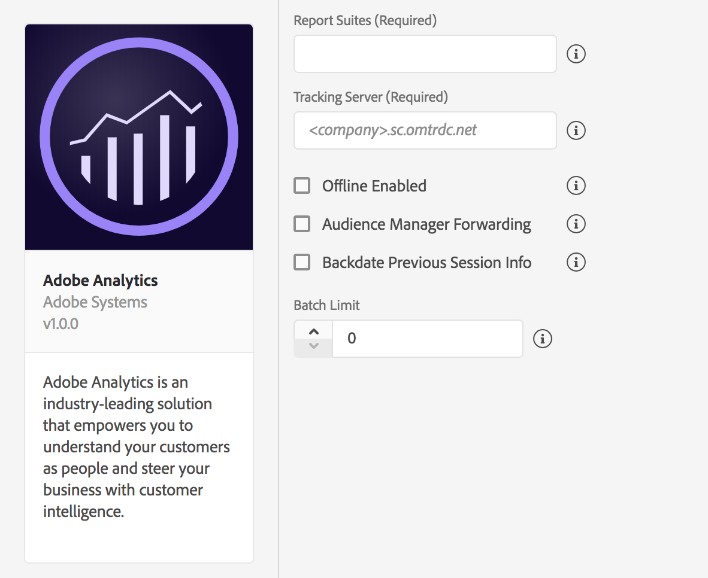

# Adobe Analytics

## **Configure Analytics Extension in Launch**

1. In Launch, click the **Extensions** tab.
2. On the **Catalog** tab, locate the **Adobe Analytics** extension and click **Install**.
3. Provide extension settings \(see [Configure Analytics Extension](./#configure-analytics-extension)\)
4. Click **Save**.
5. Follow the publishing process, to update SDK configuration

### **Configure Analytics Extension**



#### **Report Suites**


How to find report suite IDs? See [Report Suites](https://marketing.adobe.com/resources/help/en_US/reference/report_suites_admin.html).


Provide one or more report suite identifiers to which the Analytics data should be sent. Multiple report suite IDs should be comma-separated with no space between. _For example: rsid1,rsid2_.

#### **Tracking Server**


What's a tracking server and where to find it? See [populating Tracking Servers](https://helpx.adobe.com/analytics/kb/determining-data-center.html).


Provide the tracking domain to which all Analytics requests should be made.

#### **Offline Enabled**


Do you need offline tracking? See [Offline Tracking](https://marketing.adobe.com/resources/help/en_US/sc/implement/offline_tracking.html).


When checked, Analytics hits are queued while the device is offline and sent later when the device is online. Your report suite must be timestamp-enabled to use offline tracking.


If your report suite is timestamp enabled, this setting must be checked. If not, this setting must remain unchecked. If this setting is not configured correctly, data will be lost. If you're not sure that your report suite is timestamp enabled, contact Customer Care**.**



If you currently send mobile SDK data to a report suite that also collects data from web JavaScript, you might need to set up a separate report suite for mobile data or include a custom timestamp on all JavaScript hits that use the`s.timestamp`variable. Please contact Customer Care for more information.


#### Audience Manager Forwarding


Learn more about [Analytics sever-side forwarding](./#server-side-forwarding-with-audience-manager) to Audience Manager.


If you set up Analytics server-side forwarding to Audience Manager, check this setting. When this setting is enabled, all SDK requests to Analytics servers are sent with an expected response code of **10**. This step ensures \_\*\*\_Analytics traffic is forwarded to Audience Manager and that the Audience Manager User Profile is correctly updated in the SDK.

#### Backdate Previous Session Info


Enable this setting only with report suite\(s\) that are timestamp enabled.


Enabling this setting will cause the SDK to backdate end-of-session lifecycle information so it can be attributed into its correct session. Session information currently consist of crashes and session length.

When enabled, the SDK will backdate the session information hit to 1 second after the last hit of the previous session. This means that crashes and session data will correlate with the correct date in which they happened. One hit will be backdated on every new launch of the application.

For instance, if this setting is checked, Lifecycle session information or crash events will be backdated to one second after the last hit was sent. If unchecked, Lifecycle data will be attached to the first hit of the subsequent session.

When disabled, the Adobe SDK will attach the session info to the current lifecycle.

#### Batch Limit

This setting creates a threshold number of hits to be sent in consecutive calls. For example, this setting is set to 10, each Analytics hit before the 10th hit will be stored in the queue. When the 10th hit comes in, all 10 hits will be sent to Analytics, consecutively.


If you're batching hits \(that is, you're setting a value greater than 0\) then ensure that [Offline Enabled](./#offline-enabled) is also checked.


The default value for this setting is 0, which means that hit batching is disabled and all hits will be immediately sent to Analytics as they are generated.

## Add Analytics to your app



Add the Analytics extension to your project using the app's Gradle file.

#### Java

1. Import the Analytics extension in your application's main activity.

```java
import com.adobe.marketing.mobile.*;
```



​ 1. Add the library to your project via your Cocoapods `Podfile` by adding `pod 'ACPAnalytics'` ​ 2. Import the Analytics and Identity libraries:

#### Objective-C

```objectivec
#import "ACPCore.h"
#import "ACPAnalytics.h"
#import "ACPIdentity.h"
```

#### Swift

```swift
import ACPCore
import ACPAnalytics
```



### Register Analytics with Mobile Core



#### Java

You may do the following after calling the `setApplication()` method in the `onCreate()` method. Here is code sample which calls these setup methods:

```java
public class MobileApp extends Application {

    @Override
    public void onCreate() {
        super.onCreate();
        MobileCore.setApplication(this);
        MobileCore.ConfigureWithAppId("yourAppId");
        try {
            Analytics.registerExtension(); //Register Analytics with Mobile Core
            Identity.registerExtension();
            MobileCore.start(null);
        } catch (Exception e) {
            //Log the exception
         }
    }
}
```

**Important**: Analytics depends on the Identity extension and is automatically included in Core via Maven. When installing the Analytics extension manually, ensure that you added the `identity-1.x.x.aar` library to your project.



In your app's`application:didFinishLaunchingWithOptions`, register Analytics with Mobile Core:

#### Objective-C

```objectivec
- (BOOL)application:(UIApplication *)application didFinishLaunchingWithOptions:(NSDictionary *)launchOptions {
    [ACPCore configureWithAppId:@"yourAppId"];
    [ACPAnalytics registerExtension];
    [ACPIdentity registerExtension];
    [ACPCore start:nil];
    // Override point for customization after application launch.
    return YES;
 }
```

#### Swift

```swift
func application(_ application: UIApplication, didFinishLaunchingWithOptions launchOptions: [UIApplication.LaunchOptionsKey: Any]?) -> Bool {
     ACPCore.configure(withAppId: "yourAppId")   
     ACPAnalytics.registerExtension()
     ACPIdentity.registerExtension()
     ACPCore.start(nil)
     // Override point for customization after application launch. 
     return true;
}
```

**Important**: Analytics depends on the Identity extension and is automatically included in the Core pod. When installing the Analytics extension manually, ensure that you added the `libACPIdentity_iOS.a` library to your project.



## Send Lifecycle Metrics to Analytics

In order to automatically report on the application lifecycle details in Analytics, you need to properly configure the lifecycle data collection. For more detail, see [Lifecycle Metrics.](../mobile-core/lifecycle/)

## Send app states and actions to Analytics

To track mobile app states and actions in Adobe Analytics, implement the [track app actions](../mobile-core/configuration-reference/mobile-core-api-reference.md#track-app-actions) and [track app states](../mobile-core/configuration-reference/mobile-core-api-reference.md#track-app-states-and-views) APIs from the Mobile Core.


trackState API will report the View State as **Page Name**, and state views are reported as **Page View** in Analytics.



trackAction API will report the Action as an **event**, and will not increment your page views in Analytics.


## Integrations with Experience Platform solutions and services

### Analytics for Target \(A4T\)

To see the performance of your Target activities for certain segments you can set up the Analytics for Target \(A4T\) cross-solution integration by enabling the A4T campaigns. This integration allows you to use Analytics reports to examine your results. If you use Analytics as the reporting source for an activity, all reporting and segmentation for that activity is based on Analytics data collection. For more information, see [Target](https://marketing.adobe.com/resources/help/en_US/target/a4t/a4t.html).

### Server-side forwarding with Audience Manager

To enable the ability to share Analytics data with Audience Manager, in the Launch UI, select **Audience Manager Forwarding** and install the Audience Manager extension. For more information, go to the [Audience Manager](https://aep-sdks.gitbook.io/docs/using-mobile-extensions/adobe-audience-manager) section.

### Video Analytics

For more information on collecting video analytics, see [Media Analytics for Audio and Video](https://aep-sdks.gitbook.io/docs/using-mobile-extensions/adobe-media-analytics/).

## Set Products Variable

As _products_ variable cannot be set by processing rules, you'll need the following syntax in context data parameters to set serialized events directly on the hits sent to Analytics.

To set the products variable, set a context data key to `&&products`, and set the value by using the syntax that is defined for the products or merchandising variable - see [Implementing a Merchandising Variable](https://marketing.adobe.com/resources/help/en_US/sc/implement/var_merchandising_impl.html) for more detail on this variable.



#### Java

#### Syntax

```java
cdata.put("&&products", "Category;Product;Quantity;Price[,Category;Product;Quantity;Price]");
```

#### Example

```java
//create a context data dictionary
HashMap cdata = new HashMap<String, Object>();

// add products, a purchase id, a purchase context data key, and any other data you want to collect.
// Note the special syntax for products
cdata.put("&&products", ";Running Shoes;1;69.95,;Running Socks;10;29.99");
cdata.put("myapp.purchase", "1");
cdata.put("myapp.purchaseid", "1234567890");

// send the tracking call - use either a trackAction or TrackState call.
// trackAction example:
MobileCore.trackAction("purchase", cdata);
// trackState example:
MobileCore.trackState("Order Confirmation", cdata);
```



#### Objective-C

#### Syntax

```objectivec
[contextData setObject:@"Category;Product;Quantity;Price[,Category;Product;Quantity;Price]" forKey:@"&&products"];
```

#### Example

```objectivec
//create a context data dictionary
NSMutableDictionary *contextData = [NSMutableDictionary dictionary];

// add products, a purchase id, a purchase context data key, and any other data you want to collect.
// Note the special syntax for products
[contextData setObject:@";Running Shoes;1;69.95,;Running Socks;10;29.99" forKey:@"&&products"];
[contextData setObject:@"1234567890" forKey:@"m.purchaseid"];
[contextData setObject:@"1" forKey:@"m.purchase"];

// send the tracking call - use either a trackAction or TrackState call.
// trackAction example:
[ACPCore trackAction:@"purchase" data:contextData];
// trackState example:
[ACPCore trackState:@"Order Confirmation" data:contextData];
```





You do not need to map the products variable with processing rules as it will be set directly on the image request by the SDK.


### Set Products variable with merchandising eVars and product-specific events

Here is an example of the products variable with Merchandising eVars and product-specific events.


If you trigger a product-specific event by using the `&&products` variable, you must also set that event in the `&&events` variable. If you do not set that event, it is filtered out during processing.




#### Java

#### Example

```java
//create a context data dictionary
HashMap cdata = new HashMap<String, Object>();

// add products, a purchase id, a purchase context data key, and any other data you want to collect.
// Note the special syntax for products
cdata.put("&&events", "event1");
cdata.put("&&products", ";Running Shoes;1;69.95;event1=5.5;eVar1=Merchandising,;Running Socks;10;29.99");
cdata.put("myapp.purchase", "1");
cdata.put("myapp.purchaseid", "1234567890");

// send the tracking call - use either a trackAction or TrackState call.
// trackAction example:
MobileCore.trackAction("purchase", cdata);
// trackState example:
MobileCore.trackState("Order Confirmation", cdata);
```



#### Objective-C

#### Example

```objectivec
//create a context data dictionary
NSMutableDictionary *contextData = [NSMutableDictionary dictionary];

// add products, a purchase id, a purchase context data key, and any other data you want to collect.
// Note the special syntax for products
[contextData setObject:@"event1" forKey:@"&&events"];
[contextData setObject:@";Running Shoes;1;69.95;event1=5.5;eVar1=Merchandising,;Running Socks;10;29.99" forKey:@"&&products"];
[contextData setObject:@"1234567890" forKey:@"m.purchaseid"];
[contextData setObject:@"1" forKey:@"m.purchase"];

// send the tracking call - use either a trackAction or TrackState call.
// trackAction example:
[ACPCore trackAction:@"purchase" data:contextData];
// trackState example:
[ACPCore trackState:@"Order Confirmation" data:contextData];
```



## Event Serialization

As event serialization is not supported by processing rules, you'll need the following syntax in context data parameters to set serialized events directly on the hits sent to Analytics.



#### Java

#### Syntax

```java
cdata.put("&&events", "event1:12341234");
```

#### Example

```java
//create a context data dictionary
HashMap cdata = new HashMap<String, Object>();

// add events
cdata.put("&&events", "event1:12341234");

// send a tracking call - use either a trackAction or TrackState call.
// trackAction example:
MobileCore.trackAction("Action Name", cdata);
// trackState example:
MobileCore.trackState("State Name", cdata);
```



#### Objective-C

#### Syntax

```objectivec
[contextData setObject:@"eventN:serial number" forKey:@"&&events"];
```

#### Example

```objectivec
//create a context data dictionary
NSMutableDictionary *contextData = [NSMutableDictionary dictionary];

// add events
[contextData setObject:@"event1:12341234" forKey:@"&&events"];

// send the tracking call - use either a trackAction or trackState call.
// trackAction example:
[ACPCore trackAction:@"Action Name" data:contextData];
// trackState example:
[ACPCore trackState:@"State Name" data:contextData];
```



## Configuration Keys

If you need to update SDK configuration, programmatically, please use the following information to change your Analytics configuration values. For more information, [Configuration Methods Reference](../mobile-core/configuration-reference/#update-configuration).

<table>
  <thead>
    <tr>
      <th style="text-align:left">Key</th>
      <th style="text-align:left">Required</th>
      <th style="text-align:left">Description</th>
    </tr>
  </thead>
  <tbody>
    <tr>
      <td style="text-align:left">analytics.server</td>
      <td style="text-align:left">Yes</td>
      <td style="text-align:left">See <a href="./#tracking-server">Tracking Server</a>
      </td>
    </tr>
    <tr>
      <td style="text-align:left">analytics.rsids</td>
      <td style="text-align:left">Yes</td>
      <td style="text-align:left">
        <p>See <a href="./#report-suites">Report Suites</a>
        </p>
        <p>Multiple report suite IDs may be comma-separated with no space in- between.
          For example:
          <br /><code>&quot;rsids&quot; : &quot;rsid&quot; &quot;rsids&quot; : &quot;rsid1,rsid2&quot;</code>
        </p>
      </td>
    </tr>
    <tr>
      <td style="text-align:left">analytics.batchLimit</td>
      <td style="text-align:left">No</td>
      <td style="text-align:left">See <a href="./#batch-limit">Batch Limit</a>
      </td>
    </tr>
    <tr>
      <td style="text-align:left">analytics.aamForwardingEnabled</td>
      <td style="text-align:left">No</td>
      <td style="text-align:left">See <a href="./#audience-manager-forwarding">Audience Manager Forwarding</a>
      </td>
    </tr>
    <tr>
      <td style="text-align:left">analytics.offlineEnabled</td>
      <td style="text-align:left">No</td>
      <td style="text-align:left">See <a href="./#offline-enabled">Offline Enabled</a>
      </td>
    </tr>
    <tr>
      <td style="text-align:left">analytics.backdatePreviousSessionInfo</td>
      <td style="text-align:left">No</td>
      <td style="text-align:left">See <a href="./#backdate-previous-session-info">Backdate Previous Session Info.</a>
      </td>
    </tr>
  </tbody>
</table>