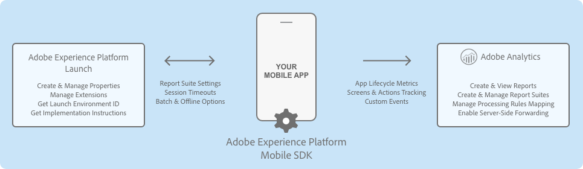
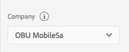

# Adobe Analytics

## **Configure the Analytics extension in** Experience Platform **Launch**

1. In Experience Platform Launch, click the **Extensions** tab.
2. On the **Catalog** tab, locate the **Adobe Analytics** extension, and click **Install**.
3. Type the extension settings. For more information, see [Configure the Analytics Extension](./#configure-analytics-extension).
4. Click **Save**.
5. Follow the publishing process to update SDK configuration.



### **Configure the Analytics Extension**


#### **Analytics Company**



No select menu will appear for the analytics company if the user only has access to a single company. On the other hand, a select menu will appear for users that have access to more than one analytics company. The list of report suites associated with the selected company will appear in the combo box in the report suites section.

#### **Report Suites**


Want to know how to find report suite IDs? See [Report Suites](https://docs.adobe.com/content/help/en/analytics/admin/manage-report-suites/report-suites-admin.html).


Select one or more mobile-enabled report suite identifiers from the combo box to which the Analytics data should be sent. Only report suite identifiers that belong to a company and that are enabled for mobile can be selected. For information on how to enable mobile for your report suite, see [Mobile Management](https://docs.adobe.com/content/help/en/analytics/admin/admin-tools/mobile-management.html).

To narrow the search for a report suite identifier, type a string in the combo box text field. After a valid report suite identifier has been selected, this identifier appears in a tag below the combo box \(shown above\). To remove a report suite ID, click on the X next to the ID you want to remove. Report suite IDs can also be configured for the Development and Staging environments.

#### **Tracking server**


Want to know what a tracking server is and where to find it? For more information, see [Correctly populate the trackingServer and trackingServerSecure variable](https://helpx.adobe.com/analytics/kb/determining-data-center.html).


Type the tracking domain to which all Analytics requests should be made.

#### **Offline enabled**


Do you need offline tracking? For more information, see [Offline tracking](https://docs.adobe.com/content/help/en/analytics/implementation/javascript-implementation/offline-tracking.html).


When the **Offline Enabled** checkbox is selected, Analytics hits are queued when your device is offline and are sent later when your device is back online. To use offline tracking, ensure that your report suite is timestamp enabled.


If your report suite is timestamp enabled, the checkbox must be selected. If your report suite is not timestamped enabled, leave the checkbox deselected. If this setting is not configured correctly, data will be lost.

If you are not sure whether your report suite is timestamp enabled, contact Customer Care**.**



If you currently send mobile SDK data to a report suite that also collects data from web JavaScript, you might need to set up a separate report suite for mobile data or include a custom timestamp on all JavaScript hits that use the`s.timestamp`variable. For more information, contact Customer Care.


#### Audience Manager forwarding


For more information about Analytics server-side forwarding to Audience Manager, see [Analytics sever-side forwarding](./#server-side-forwarding-with-audience-manager).


If you set up Analytics server-side forwarding to Audience Manager, select the **Audience Manager Forwarding** checkbox. When this checkbox is selected, all SDK requests to Analytics servers are sent with an expected response code of **10**. This step ensures that Analytics traffic is forwarded to Audience Manager and that the Audience Manager User Profile is correctly updated in the SDK.

#### Backdate previous session info


Select the **Backdate Previous Session Info** checkbox **only** if you have timestamp-enabled report report suites.


When you select this checkbox, the SDK backdates the end-of-session lifecycle information so that this information can be attributed into its correct session. Session information currently consists of crashes and session length. The SDK also backdates the session information hit to 1 second after the last hit of the previous session. This means that crashes and session data will correlate with the correct date on which they occurred. One hit is backdated each time a new launch of the application is occurs.

For example, if you select the checkbox, Lifecycle session information or crash events are backdated to one second after the last hit was sent. If you do not select the checkbox, Lifecycle data is attached to the first hit of the subsequent session.

If this option is disabled, the Adobe SDK attaches the session information to the current lifecycle.

#### Batch limit

This setting creates a threshold number of hits to be sent in consecutive calls. For example, if you type or select **10**, each Analytics hit before the 10th hit is stored in the queue. When the 10th hit comes in, all 10 hits are sent to Analytics in the order in which they were generated.


If you set a value greater than 0, ensure that the **Offline Enabled** checkbox is also selected.


The default value for this setting is 0, which means that hit batching is disabled, and all hits are immediately sent to Analytics as they are generated.

#### Launch hit delay

Number of seconds to wait before Analytics launch hits are sent from the SDK. Ensure that this setting is set at 5s or greater when using acquisition functionality from the [Mobile Services](../adobe-analytics-mobile-services/) extension.

## Add Analytics to your app



**Java**

1. Add the [Mobile Core](https://aep-sdks.gitbook.io/docs/using-mobile-extensions/mobile-core) and Analytics extensions to your project using the app's Gradle file.

   ```java
    implementation 'com.adobe.marketing.mobile:sdk-core:1.+'
    implementation 'com.adobe.marketing.mobile:analytics:1.+'
   ```

2. Import the Analytics extension in your application's main activity.

   ```java
    import com.adobe.marketing.mobile.*;
   ```



1. Add the [Mobile Core](https://aep-sdks.gitbook.io/docs/using-mobile-extensions/mobile-core) and Analytics extensions to your project using Cocoapods.
2. Add following pods in your `Podfile`:

   ```ruby
    pod 'ACPCore'
    pod 'ACPAnalytics'
   ```

3. Import the Analytics and Identity libraries:

   **Objective-C**

   ```text
    #import "ACPCore.h"
    #import "ACPAnalytics.h"
    #import "ACPIdentity.h"
   ```

   **Swift**

   ```swift
    import ACPCore
    import ACPAnalytics
    import ACPIdentity
   ```



#### JavaScript

1. Install Analytics.

   ```bash
   npm install @adobe/react-native-acpanalytics
   ```

   1.1 Link

   * **React Native 0.60+**

[CLI autolink feature](https://github.com/react-native-community/cli/blob/master/docs/autolinking.md) links the module while building the app.

* **React Native &lt;= 0.59**

```bash
   react-native link @adobe/react-native-acpanalytics
```

_Note_ For `iOS` using `cocoapods`, run:

```bash
   cd ios/ && pod install
```

1. Import the extension.

   ```jsx
    import {ACPAnalytics} from '@adobe/react-native-acpanalytics';
   ```

2. Get the extension version.

   ```jsx
    ACPAnalytics.extensionVersion().then(version => console.log("AdobeExperienceSDK: ACPAnalytics version: " + version));
   ```



#### Flutter

1. Install Analytics.

   Instructions on installing the Analytics SDK in Flutter can be found [here](https://pub.dev/packages/flutter_acpanalytics#-installing-tab-).

2. Import the extension.

   ```dart
   import 'package:flutter_acpanalytics/flutter_acpanalytics.dart';
   ```

3. Get the extension version.

   ```dart
   String version = await FlutterACPAnalytics.extensionVersion;
   ```



#### Cordova

1. After creating your Cordova app and adding the Android and iOS platforms, the Analytics extension for Cordova can be added with this command:

   ```text
   cordova plugin add https://github.com/adobe/cordova-acpanalytics.git
   ```

2. Get the extension version.

   ```jsx
   ACPAnalytics.extensionVersion(function(version) {  
      console.log("ACPAnalytics version: " + version);
   }, function(error) {  
      console.log(error);  
   });
   ```



#### C\#

1. After importing the [ACPAnalytics.unitypackage](https://github.com/adobe/unity-acpanalytics/blob/master/bin/ACPAnalytics-0.0.1-Unity.zip), the Analytics extension for Unity can be added with following code in the MainScript

   ```csharp
   using com.adobe.marketing.mobile;
   ```

2. Get the extension version.

   ```csharp
   ACPAnalytics.extensionVersion();
   ```
   

   
#### C#

1. After adding the iOS or Android ACPAnalytics NuGet package, the Analytics extension can be added by this import statement

   ```c#
   using Com.Adobe.Marketing.Mobile;
   ```

2. Get the extension version.

   ```c#
   ACPAnalytics.ExtensionVersion();
   ```



### Register Analytics with Mobile Core



#### Java

To call the set up methods that call the [setApplication\(\)](https://aep-sdks.gitbook.io/docs/using-mobile-extensions/mobile-core/mobile-core-api-reference#setapplication) method in the `onCreate()` method:

```java
public class MobileApp extends Application {

    @Override
    public void onCreate() {
        super.onCreate();
        MobileCore.setApplication(this);
        MobileCore.configureWithAppID("yourAppId");
        try {
            Analytics.registerExtension(); //Register Analytics with Mobile Core
            Identity.registerExtension();
            MobileCore.start(null);
        } catch (Exception e) {
            //Log the exception
         }
    }
}
```

**Important**: Analytics depends on the Identity extension and is automatically included in Core by Maven. When manually installing the Analytics extension, ensure that you add the `identity-1.x.x.aar` library to your project.



In your app's`application:didFinishLaunchingWithOptions`, register Analytics with Mobile Core:

#### Objective C

```objectivec
- (BOOL)application:(UIApplication *)application didFinishLaunchingWithOptions:(NSDictionary *)launchOptions {
    [ACPCore configureWithAppId:@"yourAppId"];
    [ACPAnalytics registerExtension];
    [ACPIdentity registerExtension];
    [ACPCore start:nil];
    // Override point for customization after application launch.
    return YES;
 }
```

#### Swift

```swift
func application(_ application: UIApplication, didFinishLaunchingWithOptions launchOptions: [UIApplication.LaunchOptionsKey: Any]?) -> Bool {
     ACPCore.configure(withAppId: "yourAppId")   
     ACPAnalytics.registerExtension()
     ACPIdentity.registerExtension()
     ACPCore.start(nil)
     // Override point for customization after application launch.
     return true;
}
```

**Important**: Analytics depends on the Identity extension and is automatically included in the Core pod. When installing the Analytics extension manually, ensure that you added the `libACPIdentity_iOS.a` library to your project.



#### JavaScript

When using React Native, registering Analytics with Mobile Core should be done in native code which is shown under the Android and iOS tabs.



#### Dart

When using Flutter, registering Analytics with Mobile Core should be done in native code which is shown under the Android and iOS tabs.



#### Cordova

When using Cordova, registering Analytics with Mobile Core must be done in native code which is shown under the Android and iOS tabs.



#### C\#

Register the extension in the `start()` function:

```csharp
using com.adobe.marketing.mobile;
using using AOT;

public class MainScript : MonoBehaviour
{
    [MonoPInvokeCallback(typeof(AdobeStartCallback))]
    public static void HandleStartAdobeCallback()
    {   
        ACPCore.ConfigureWithAppID("1423ae38-8385-8963-8693-28375403491d"); 
    }

    // Start is called before the first frame update
    void Start()
    {   
        ACPAnalytics.registerExtension();
        ACPCore.Start(HandleStartAdobeCallback);
    }
}
```




#### C#

**iOS**

Register the Analytics extension in your app's `FinishedLaunching()` function:

```c#
public override bool FinishedLaunching(UIApplication app, NSDictionary options)
{
  global::Xamarin.Forms.Forms.Init();
  LoadApplication(new App());
	ACPAnalytics.RegisterExtension();
  // start core
  ACPCore.Start(startCallback);
  return base.FinishedLaunching(app, options);
}

private void startCallback()
{
  // set launch config
  ACPCore.ConfigureWithAppID("yourAppId");
}
```

**Android**

Register the Analytics extension in your app's `OnCreate()` function:

```c#
protected override void OnCreate(Bundle savedInstanceState)
{
  base.OnCreate(savedInstanceState);
  global::Xamarin.Forms.Forms.Init(this, savedInstanceState);
  LoadApplication(new App());
  ACPAnalytics.RegisterExtension();
  
  // start core
  ACPCore.Start(new CoreStartCompletionCallback());
}

class CoreStartCompletionCallback : Java.Lang.Object, IAdobeCallback
{
  public void Call(Java.Lang.Object callback)
  {
    // set launch config
    ACPCore.ConfigureWithAppID("yourAppId");
  }
}
```




## Send Lifecycle Metrics to Analytics

To automatically report on the application lifecycle details in Analytics, ensure that you properly configure the lifecycle data collection. For more information, see [Lifecycle Metrics.](../mobile-core/lifecycle/)

## Send app states and actions to Analytics

To track mobile app states and actions in Adobe Analytics, implement the [trackAction](https://aep-sdks.gitbook.io/docs/using-mobile-extensions/mobile-core/mobile-core-api-reference#trackaction) and [trackState](https://aep-sdks.gitbook.io/docs/using-mobile-extensions/mobile-core/mobile-core-api-reference#trackstate) APIs from the Mobile Core extension. For more information, see [Track app actions](../mobile-core/mobile-core-api-reference.md#track-app-actions) and [Track app states](../mobile-core/mobile-core-api-reference.md#track-app-states-and-views).


[trackState](https://aep-sdks.gitbook.io/docs/using-mobile-extensions/mobile-core/mobile-core-api-reference#trackstate) reports the View State as **Page Name**, and state views are reported as **Page View** in Analytics. The value is sent to Analytics by using the page name variable \(`pagename=value`\).

[trackAction](https://aep-sdks.gitbook.io/docs/using-mobile-extensions/mobile-core/mobile-core-api-reference#trackaction) reports the Action as an **event** and does not increment your page views in Analytics. The value is sent to Analytics by using the action variable \(`action=value`\).


## Integrations with Experience Platform solutions and services

### Analytics for Target \(A4T\)

To see the performance of your Target activities for some segments, you can set up the Analytics extension for Target \(A4T\) cross-solution integration by enabling the A4T campaigns. This integration allows you to use Analytics reports to examine your results. If you use Analytics as the reporting source for an activity, all reporting and segmentation for that activity is based on Analytics data collection. For more information, see [Target](https://docs.adobe.com/content/help/en/target/using/integrate/a4t/a4t.html).

### Server-side forwarding with Audience Manager

To enable the ability to share Analytics data with Audience Manager, in the Experience Platform Launch UI, select the **Audience Manager Forwarding** checkbox. For more information, go to [Audience Manager](https://aep-sdks.gitbook.io/docs/using-mobile-extensions/adobe-audience-manager).

### Audio and Video Analytics

For more information about collecting audio and video analytics, see [Media Analytics for Audio and Video](https://aep-sdks.gitbook.io/docs/using-mobile-extensions/adobe-media-analytics/).

## Event serialization

Event serialization is not supported by processing rules. To set serialized events directly on the hits sent to Analytics, use the following syntax in context data parameters:



#### Java

#### Syntax

```java
cdata.put("&&events", "event1:12341234");
```

#### Example

```java
//create a context data dictionary
HashMap cdata = new HashMap<String, Object>();

// add events
cdata.put("&&events", "event1:12341234");

// send a tracking call - use either a trackAction or TrackState call.
// trackAction example:
MobileCore.trackAction("Action Name", cdata);
// trackState example:
MobileCore.trackState("State Name", cdata);
```



#### Objective C

#### Syntax

```objectivec
[contextData setObject:@"eventN:serial number" forKey:@"&&events"];
```

#### Example

```objectivec
//create a context data dictionary
NSMutableDictionary *contextData = [NSMutableDictionary dictionary];

// add events
[contextData setObject:@"event1:12341234" forKey:@"&&events"];

// send the tracking call - use either a trackAction or trackState call.
// trackAction example:
[ACPCore trackAction:@"Action Name" data:contextData];
// trackState example:
[ACPCore trackState:@"State Name" data:contextData];
```



#### JavaScript

#### Syntax

```jsx
var contextData = {"eventN:serial number": "&&events"};
```

#### Example

```jsx
// create a context data dictionary and add events
var contextData = {"event1:12341234": "&&events"};

// send the tracking call - use either a trackAction or trackState call.
// trackAction example:
ACPCore.trackAction("Action Name", contextData);
// trackState example:
ACPCore.trackState("State Name", contextData);
```



#### Dart

#### Syntax

```dart
var contextData = {"eventN:serial number": "&&events"};
```

#### Example

```dart
// create a context data dictionary and add events
var contextData = {"event1:12341234": "&&events"};

// send the tracking call - use either a trackAction or trackState call.
// trackAction example:
FlutterACPCore.trackAction("Action Name",  data: contextData);
// trackState example:
FlutterACPCore.trackState("State Name",  data: contextData);
```



#### Cordova

#### Syntax

```jsx
var contextData = {"eventN:serial number": "&&events"};
```

#### Example

```jsx
// create a context data dictionary and add events
var contextData = {"event1:12341234": "&&events"};

// send the tracking call - use either a trackAction or trackState call.
// trackAction example:
ACPCore.trackAction("Action Name", contextData, function(handleCallback) {
  console.log("AdobeExperenceSDK: Track action success: " + handleCallback);
}, function(handleError) {
  console.log("AdobeExperenceSDK: Failed to track action: " + handleError);
});
// trackState example:
ACPCore.trackState("State Name", contextData, function(handleCallback) {
  console.log("AdobeExperenceSDK: Track state success: " + handleCallback);
}, function(handleError) {
  console.log("AdobeExperenceSDK: Failed to track state: " + handleError);
});
```



#### C\#

#### Syntax

```csharp
var contextData = new Dictionary<string, string>();
contextData.Add("key", "trackAction");
```

#### Example

```csharp
// create a context data dictionary and add events
var contextData = new Dictionary<string, string>();
contextData.Add("key", "trackAction");

// send the tracking call - use either a trackAction or trackState call.
// trackAction example:
ACPCore.TrackAction("Action Name", contextData);

// trackState example:
ACPCore.TrackState("State Name", contextData);
```




#### C#

#### iOS Syntax

```c#
var contextData = new NSMutableDictionary<NSString, NSString>
{
  ["&&events"] = new NSString("eventN:serial number")
};
```

#### iOS Example

```c#
// create a context data dictionary and add events
var contextData = new NSMutableDictionary<NSString, NSString>
{
  ["&&events"] = new NSString("event1:12341234")
};

// send the tracking call - use either a trackAction or trackState call.
// trackAction example:
ACPCore.TrackAction("Action Name", contextData);

// trackState example:
ACPCore.TrackState("State Name", contextData);
```

#### Android Syntax

```c#
var contextData = new Dictionary<string, string>();
contextData.Add("&&events", "event1:12341234");
```

#### Android Example

```c#
// create a context data dictionary and add events
var contextData = new Dictionary<string, string>();
contextData.Add("&&events", "event1:12341234");

// send the tracking call - use either a trackAction or trackState call.
// trackAction example:
ACPCore.TrackAction("Action Name", contextData);

// trackState example:
ACPCore.TrackState("State Name", contextData);
```





## Videos

### Using [trackState](../mobile-core/mobile-core-api-reference.md#track-app-states-and-views) APIs to send data to Adobe Analytics



## Configuration keys

To update the SDK configuration programmatically, use the following information to change your Analytics configuration values.

| Key | Required | Description |
| :--- | :--- | :--- |


| `analytics.server` | Yes | See [Tracking Server](./#tracking-server) |
| :--- | :--- | :--- |


<table>
  <thead>
    <tr>
      <th style="text-align:left"><code>analytics.rsids</code>
      </th>
      <th style="text-align:left">Yes</th>
      <th style="text-align:left">
        <p>See <a href="./#report-suites">Report Suites</a>
        </p>
        <p>Multiple report suite IDs can be comma separated with no space in- between.
          For example:
          <br /><code>&quot;rsids&quot; : &quot;rsid&quot; &quot;rsids&quot; : &quot;rsid1,rsid2&quot;</code>
        </p>
      </th>
    </tr>
  </thead>
  <tbody></tbody>
</table>

### Update Analytics Configuration

#### Example

```java
HashMap<String, Object> data = new HashMap<String, Object>();
data.put("analytics.server", "sample.analytics.tracking.server");
data.put("analytics.rsids", "rsid1,rsid2");
data.put("analytics.batchLimit", 10);
data.put("analytics.offlineEnabled", true);

MobileCore.updateConfiguration(data);
```



### Update Analytics Configuration

#### Example

**Objective-C**

```objectivec
NSDictionary *updatedConfig = @{@"analytics.server":@"sample.analytics.tracking.server",
                                @"analytics.rsids":@"rsid1,rsid2",
                                @"analytics.batchLimit":@(10),
                                @"analytics.offlineEnabled":@YES};
[ACPCore updateConfiguration:updatedConfig];
```

**Swift**

```swift
let updatedConfig = ["analytics.server":"sample.analytics.tracking.server", 
                     "analytics.rsids":"rsid1,rsid2", 
                     "analytics.batchLimit":10, 
                     "analytics.offlineEnabled":true]
ACPCore.updateConfiguration(updatedConfig)
```



#### JavaScript

### Update Analytics Configuration

```jsx
ACPCore.updateConfiguration({"analytics.server": "sample.analytics.tracking.server",
                             "analytics.rsids": "rsid1,rsid2",
                             "analytics.batchLimit": 10,
                             "analytics.offlineEnabled": true});
```



#### Dart

### Update Analytics Configuration

```dart
FlutterACPCore.updateConfiguration({"analytics.server": "sample.analytics.tracking.server",
                                    "analytics.rsids": "rsid1,rsid2",
                                    "analytics.batchLimit": 10,
                                    "analytics.offlineEnabled": true});
```



#### Cordova

### Update Analytics Configuration

```jsx
ACPCore.updateConfiguration({"analytics.server": "sample.analytics.tracking.server",
                             "analytics.rsids": "rsid1,rsid2",
                             "analytics.batchLimit": 10,
                             "analytics.offlineEnabled": true}, function(handleCallback) {
  console.log("AdobeExperenceSDK: Analytics configuration update success: " + handleCallback);
}, function(handleError) {
  console.log("AdobeExperenceSDK: Failed to update analytics configuration: " + handleError);
});
```



#### C\#

### Update Analytics Configuration

```csharp
var dict = new Dictionary<string, object>();
dict.Add("analytics.server": "sample.analytics.tracking.server");
dict.Add("analytics.rsids": "rsid1,rsid2");
dict.Add("analytics.batchLimit": 10);
dict.Add("analytics.offlineEnabled": true);
ACPCore.UpdateConfiguration(dict);
```




#### C\#

### Update Analytics Configuration

**iOS**

```c#
var config = new NSMutableDictionary<NSString, NSObject>
{
  ["analytics.server"] = new NSString("sample.analytics.tracking.server"),
  ["analytics.rsids"] = new NSString("rsid1,rsid2"),
  ["analytics.batchLimit"] = new NSNumber(10),
  ["analytics.offlineEnabled"] = new NSNumber(true)
};
ACPCore.UpdateConfiguration(config);
```

**Android**

```c#
var config = new Dictionary<string, Java.Lang.Object>();
config.Add("analytics.server", "sample.analytics.tracking.server");
config.Add("analytics.rsids", "rsid1,rsid2");
config.Add("analytics.batchLimit", 10);
config.Add("analytics.offlineEnabled", true);
ACPCore.UpdateConfiguration(config);
```





For more information, see [Configuration API Reference](https://aep-sdks.gitbook.io/docs/using-mobile-extensions/mobile-core/configuration/configuration-api-reference).

