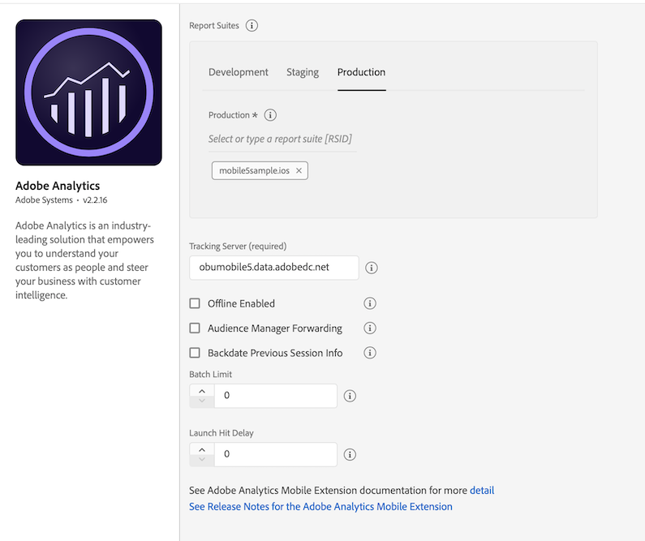

# Adobe Analytics

## Configure the Analytics extension in the Data Collection UI

1. In the Data Collection UI, select the **Extensions** tab.
2. On the **Catalog** tab, locate the **Adobe Analytics** extension, and select **Install**.
3. Type the extension settings. For more information, please read the [configure the Analytics Extension section](./#configure-the-analytics-extension).
4. Select **Save**.
5. Follow the publishing process to update SDK configuration.


### Configure the Analytics extension



#### Analytics company


If you have access to more than one Analytics company, a select menu will appear, allowing you to choose which company you want to use. If you only have access to one Analytics company, this select menu will not appear.

Once you select an Analytics company, the list of report suites associated with that company will appear in the report suites section.

#### Report suites


To learn how to find report suite IDs, please read the documentation on [report suites](https://experienceleague.adobe.com/docs/analytics/admin/manage-report-suites/report-suites-admin.html).


Select one or more mobile-enabled report suite identifiers from the combo box to which the Analytics data should be sent. Only report suite identifiers that belong to a company and that are enabled for mobile can be selected. For information on how to enable mobile for your report suite, see the [mobile management documentation](https://experienceleague.adobe.com/docs/analytics/admin/admin-tools/mobile-management.html).

To narrow the search for a report suite identifier, type a string in the combo box text field. After a valid report suite identifier has been selected, this identifier appears in a tag below the combo box. To remove a report suite ID, click on the X next to the ID you want to remove. Report suite IDs can also be configured for the Development and Staging environments.

#### Tracking server


To learn what a tracking server is and how to find it, please read the documentation on [tracking servers](https://experienceleague.adobe.com/docs/analytics/implementation/vars/config-vars/trackingserver.html).


The tracking server is the tracking domain that all the Analytics requests should be made.

#### **Offline enabled**


To learn more about offline tracking, please read the documentation on [offline tracking](https://experienceleague.adobe.com/docs/analytics/implementation/vars/config-vars/trackoffline.html).


When the **Offline Enabled** checkbox is selected, Analytics hits are queued when your device is offline and are sent later when your device is back online. To use offline tracking, ensure that your report suite is timestamp enabled.


If your report suite is timestamp enabled, the checkbox must be selected. If your report suite is not timestamped enabled, leave the checkbox unselected. If this setting is not configured correctly, data will be lost.

If you are not sure whether your report suite is timestamp enabled, contact Customer Care.



If you currently send Mobile SDK data to a report suite that also collects data from web JavaScript, you may need to set up a separate report suite for mobile data or include a custom timestamp on all JavaScript hits that use the `s.timestamp` variable. For more information, please contact Customer Care.


#### Audience Manager forwarding


For more information about Analytics server-side forwarding to Audience Manager, see the documentation on [Analytics server-side forwarding](#server-side-forwarding-with-audience-manager).


If you set up Analytics server-side forwarding to Audience Manager, select the **Audience Manager Forwarding** checkbox. When this checkbox is selected, all SDK requests to Analytics servers are sent with an expected response code of **10**. This step ensures that Analytics traffic is forwarded to Audience Manager and that the Audience Manager User Profile is correctly updated in the SDK.

#### Backdate previous session info


Select the **Backdate Previous Session Info** checkbox **only** if you have timestamp-enabled report report suites.


When you select this checkbox, the SDK backdates the end-of-session lifecycle information so that this information can be attributed into its correct session. Session information currently consists of crashes and session length.

The SDK also backdates the session information hit to one second after the last hit of the previous session. This means that crashes and session data will correlate with the correct date on which they occurred. One hit is backdated each time a new launch of the application is occurs.

For example, if you select the checkbox, Lifecycle session information or crash events are backdated to one second after the last hit was sent. If you do not select the checkbox, Lifecycle data is attached to the first hit of the subsequent session.

If this option is disabled, Mobile SDK attaches the session information to the current lifecycle.

#### Batch limit

This setting creates a threshold number of hits to be sent in consecutive calls. For example, if you type or select "10", each Analytics hit before the 10th hit is stored in the queue. When the 10th hit comes in, all 10 hits are sent to Analytics in the order in which they were generated.


If you set a value greater than 0, ensure that the **Offline Enabled** checkbox is also selected.


The default value for this setting is 0, which means that hit batching is disabled, and all hits are immediately sent to Analytics as they are generated.

#### Launch hit delay

The number of seconds to wait before Analytics launch hits are sent from the SDK. Ensure that this setting is set at 5 seconds or greater when using acquisition functionality from the [Mobile Services](../adobe-analytics-mobile-services/) extension.

## Add Analytics to your application



### Java

1. Add the [Mobile Core](../../foundation-extensions/mobile-core) and Analytics extensions to your project using the app's Gradle file.

   ```java
    implementation 'com.adobe.marketing.mobile:sdk-core:1.+'
    implementation 'com.adobe.marketing.mobile:analytics:1.+'
   ```

2. Import the Analytics extension in your application's main activity.

   ```java
    import com.adobe.marketing.mobile.MobileCore;
    import com.adobe.marketing.mobile.Analytics;
   ```



1. Add the [Mobile Core](../../foundation-extensions/mobile-core) and Analytics extensions to your project using Cocoapods.
2. Add the following pods in your `Podfile`:

   ```ruby
    pod 'AEPCore'
    pod 'AEPAnalytics'
    pod 'AEPIdentity'
   ```

3. Import the Analytics and Identity libraries:

   **Swift**

   ```swift
    import AEPCore
    import AEPAnalytics
    import AEPIdentity
   ```

   **Objective-C**

   ```objectivec
    @import AEPCore;
    @import AEPAnalytics;
    @import AEPIdentity;
   ``` 



1. Add the [Mobile Core](../../foundation-extensions/mobile-core) and Analytics extensions to your project using Cocoapods.
2. Add the following pods in your `Podfile`:

   ```ruby
    pod 'ACPCore'
    pod 'ACPAnalytics'
   ```

3. Import the Analytics and Identity libraries:

   **Swift**

   ```swift
    import ACPCore
    import ACPAnalytics
    import ACPIdentity
   ```
   **Objective-C**

   ```objectivec
    #import "ACPCore.h"
    #import "ACPAnalytics.h"
    #import "ACPIdentity.h"
   ```



#### JavaScript

1. Install Adobe Analytics.

   ```bash
   npm install @adobe/react-native-acpanalytics
   ```

2. Link the module and the application.

   For React Native versions 0.6 and above, you can use the [CLI autolink feature](https://github.com/react-native-community/cli/blob/master/docs/autolinking.md) to link the module while building the app.

   For React Native versions less than or equal to 0.59, you can use the following scripts:

   ```bash
    react-native link @adobe/react-native-acpanalytics
   ```

   If you are using iOS and `cocoapods`, run:

   ```bash
    cd ios/ && pod install
   ```

3. Import the extension.

   ```jsx
    import {ACPAnalytics} from '@adobe/react-native-acpanalytics';
   ```

4. Get the extension version.

   ```jsx
    ACPAnalytics.extensionVersion().then(version => console.log("AdobeExperienceSDK: ACPAnalytics version: " + version));
   ```



### Flutter

1. Install Analytics.

   Instructions on installing the Analytics SDK in Flutter can be found in the [official Flutter documentation](https://pub.dev/packages/flutter_acpanalytics#-installing-tab-).

2. Import the extension.

   ```dart
   import 'package:flutter_acpanalytics/flutter_acpanalytics.dart';
   ```

3. Get the extension version.

   ```dart
   String version = await FlutterACPAnalytics.extensionVersion;
   ```



### Cordova

1. After creating your Cordova app and adding the Android and iOS platforms, add the Analytics extension.

   ```text
   cordova plugin add https://github.com/adobe/cordova-acpanalytics.git
   ```

2. Get the extension version.

   ```jsx
   ACPAnalytics.extensionVersion(function(version) {  
      console.log("ACPAnalytics version: " + version);
   }, function(error) {  
      console.log(error);  
   });
   ```



### C\#

1. After importing the [ACPAnalytics.unitypackage](https://github.com/adobe/unity-acpanalytics/blob/master/bin/ACPAnalytics-0.0.1-Unity.zip), add the Analytics extension for Unity.

   ```csharp
   using com.adobe.marketing.mobile;
   ```

2. Get the extension version.

   ```csharp
   ACPAnalytics.extensionVersion();
   ```



### **C\#**

1. After adding the iOS or Android ACPAnalytics NuGet package, add the Analytics extension.

   ```csharp
   using Com.Adobe.Marketing.Mobile;
   ```

2. Get the extension version.

   ```csharp
   ACPAnalytics.ExtensionVersion();
   ```



## Register Analytics with Mobile Core



### Java

The following sample shows how to set up methods that call the [setApplication\(\)](../../foundation-extensions/mobile-core/mobile-core-api-reference#setapplication-android-only) method in the `onCreate()` method:

```java
public class MobileApp extends Application {

    @Override
    public void onCreate() {
        super.onCreate();
        MobileCore.setApplication(this);
        MobileCore.configureWithAppID("yourAppId");
        try {
            Analytics.registerExtension(); //Register Analytics with Mobile Core
            Identity.registerExtension();
            MobileCore.start(null);
        } catch (Exception e) {
            //Log the exception
         }
    }
}
```


Analytics depends on the Identity extension and is automatically included in Core by Maven. When manually installing the Analytics extension, ensure that you add the `identity-1.x.x.aar` library to your project.





### Swift

In your app's `_:didFinishLaunchingWithOptions` function, register the Audience Manager extension with the Mobile Core:

```swift
func application(_ application: UIApplication, didFinishLaunchingWithOptions launchOptions: [UIApplication.LaunchOptionsKey: Any]?) -> Bool {
   MobileCore.registerExtensions([Analytics.self, Identity.self], {
   MobileCore.configureWith(appId: "yourAppId") 
 })  
 ...
}
```
### Objective-C

In your app's `application:didFinishLaunchingWithOptions`, register Media with Mobile Core:

```objectivec
- (BOOL)application:(UIApplication *)application didFinishLaunchingWithOptions:(NSDictionary *)launchOptions {
    [AEPMobileCore registerExtensions:@[AEPMobileAnalytics.class, AEPMobileIdentity.class] completion:^{
    [AEPMobileCore configureWithAppId: @"yourAppId"];
  }];
  ...
}
```




### Swift

In your app's `_:didFinishLaunchingWithOptions` function, register the Audience Manager extension with the Mobile Core:

```swift
func application(_ application: UIApplication, didFinishLaunchingWithOptions launchOptions: [UIApplication.LaunchOptionsKey: Any]?) -> Bool {
     ACPCore.configure(withAppId: "yourAppId")   
     ACPAnalytics.registerExtension()
     ACPIdentity.registerExtension()
     ACPCore.start(nil)
     // Override point for customization after application launch.
     return true;
}
```

### Objective-C

In your app's `application:didFinishLaunchingWithOptions`, register Analytics with Mobile Core:

```objectivec
- (BOOL)application:(UIApplication *)application didFinishLaunchingWithOptions:(NSDictionary *)launchOptions {
    [ACPCore configureWithAppId:@"yourAppId"];
    [ACPAnalytics registerExtension];
    [ACPIdentity registerExtension];
    [ACPCore start:nil];
    // Override point for customization after application launch.
    return YES;
 }
```


Analytics depends on the Identity extension and is automatically included in the Core pod. When installing the Analytics extension manually, ensure that you added the `libACPIdentity_iOS.a` library to your project.




### JavaScript

When using React Native, register AEP Assurance with Mobile Core in native code as shown on the Android and iOS tabs.



### Dart

When using Flutter, register AEP Assurance with Mobile Core in native code as shown on the Android and iOS tabs.



### Cordova

When using Cordova, register AEP Assurance with Mobile Core in native code as shown on the Android and iOS tabs.



### C\#

Register the extension in the `start()` function:

```csharp
using com.adobe.marketing.mobile;
using using AOT;

public class MainScript : MonoBehaviour
{
    [MonoPInvokeCallback(typeof(AdobeStartCallback))]
    public static void HandleStartAdobeCallback()
    {   
        ACPCore.ConfigureWithAppID("1423ae38-8385-8963-8693-28375403491d"); 
    }

    // Start is called before the first frame update
    void Start()
    {   
        ACPAnalytics.registerExtension();
        ACPCore.Start(HandleStartAdobeCallback);
    }
}
```



### C\#

**iOS**

Register the Analytics extension in your app's `FinishedLaunching()` function:

```csharp
public override bool FinishedLaunching(UIApplication app, NSDictionary options)
{
  global::Xamarin.Forms.Forms.Init();
  LoadApplication(new App());
    ACPAnalytics.RegisterExtension();
  // start core
  ACPCore.Start(startCallback);
  return base.FinishedLaunching(app, options);
}

private void startCallback()
{
  // set launch config
  ACPCore.ConfigureWithAppID("yourAppId");
}
```

**Android**

Register the Analytics extension in your app's `OnCreate()` function:

```csharp
protected override void OnCreate(Bundle savedInstanceState)
{
  base.OnCreate(savedInstanceState);
  global::Xamarin.Forms.Forms.Init(this, savedInstanceState);
  LoadApplication(new App());
  ACPAnalytics.RegisterExtension();

  // start core
  ACPCore.Start(new CoreStartCompletionCallback());
}

class CoreStartCompletionCallback : Java.Lang.Object, IAdobeCallback
{
  public void Call(Java.Lang.Object callback)
  {
    // set launch config
    ACPCore.ConfigureWithAppID("yourAppId");
  }
}
```



## Send Lifecycle metrics to Analytics

To automatically report on the application lifecycle details in Analytics, ensure that you properly configure the lifecycle data collection. For more information, see the documentation on [Lifecycle metrics](../../foundation-extensions/mobile-core/lifecycle/).

## Send app states and actions to Analytics

To track mobile app states and actions in Adobe Analytics, implement the [trackAction](../../foundation-extensions/mobile-core/mobile-core-api-reference.md#trackaction) and [trackState](../../foundation-extensions/mobile-core/mobile-core-api-reference.md#trackstate) APIs from the Mobile Core extension.


[trackState](../../foundation-extensions/mobile-core/mobile-core-api-reference.md#trackstate) reports the view state as the **Page Name**, and state views are reported as **Page View** in Analytics. The value is sent to Analytics by using the page name variable \(`pagename=value`\).

[trackAction](../../foundation-extensions/mobile-core/mobile-core-api-reference.md#trackaction) reports the Action as an **event** and does not increment your page views in Analytics. The value is sent to Analytics by using the action variable \(`action=value`\).


## Integrations with Adobe Experience Platform solutions and services

### Analytics for Adobe Target \(A4T\)

To see the performance of your Target activities for some segments, you can set up the Analytics extension for Target \(A4T\) cross-solution integration by enabling the A4T campaigns. This integration allows you to use Analytics reports to examine your results. If you use Analytics as the reporting source for an activity, all reporting and segmentation for that activity is based on Analytics data collection. For more information, see [Target](https://experienceleague.adobe.com/docs/target/using/integrate/a4t/a4t.html).

### Server-side forwarding with Audience Manager

To enable the ability to share Analytics data with Audience Manager, in the Data Collection UI, select the **Audience Manager Forwarding** checkbox. For more information, go to [Audience Manager](https://experienceleague.adobe.com/docs/audience-manager/user-guide/implementation-integration-guides/integration-other-solutions/audience-management-module.html?lang=en).

### Audio and video analytics

For more information about collecting audio and video analytics, please read the documentation on [Media Analytics for audio and video](../../using-mobile-extensions/adobe-media-analytics/).

## Event serialization

[Event serialization](https://experienceleague.adobe.com/docs/analytics/implementation/vars/page-vars/events/event-serialization.html?lang=en) is not supported by processing rules. To set serialized events directly on the hits sent to Analytics, use the following syntax in context data parameters:



### Java

**Syntax**

```java
cdata.put("&&events", "event1:12341234");
```

**Example**

```java
//create a context data dictionary
HashMap cdata = new HashMap<String, Object>();

// add events
cdata.put("&&events", "event1:12341234");

// send a tracking call - use either a trackAction or TrackState call.
// trackAction example:
MobileCore.trackAction("Action Name", cdata);
// trackState example:
MobileCore.trackState("State Name", cdata);
```



### Swift

**Syntax**

```swift
contextdata["&&events"] = "event1:12341234"
```

**Example**

```swift
//create a context data dictionary
var contextData = [String: Any]()

// add events
contextData["&&events"] = "event1:12341234"

// send the tracking call - use either a trackAction or trackState call.
// trackAction example:
MobileCore.track(action: "Action Name" as String, data: contextData)

// trackState example:
MobileCore.track(state: "State Name" as String, data: contextData)
```
### Objective-C

**Syntax**

```objectivec
[contextData setObject:@"eventN:serial number" forKey:@"&&events"];
```

**Example**

```objectivec
//create a context data dictionary
NSMutableDictionary *contextData = [NSMutableDictionary dictionary];

// add events
[contextData setObject:@"event1:12341234" forKey:@"&&events"];

// send the tracking call - use either a trackAction or trackState call.
// trackAction example:
[AEPMobileCore trackAction:@"Action Name" data:contextData];
// trackState example:
[AEPMobileCore trackState:@"State Name" data:contextData];
```



### Objective-C

**Syntax**

```objectivec
[contextData setObject:@"eventN:serial number" forKey:@"&&events"];
```

**Example**

```objectivec
//create a context data dictionary
NSMutableDictionary *contextData = [NSMutableDictionary dictionary];

// add events
[contextData setObject:@"event1:12341234" forKey:@"&&events"];

// send the tracking call - use either a trackAction or trackState call.
// trackAction example:
[ACPCore trackAction:@"Action Name" data:contextData];
// trackState example:
[ACPCore trackState:@"State Name" data:contextData];
```



### JavaScript

**Syntax**

```jsx
var contextData = {"eventN:serial number": "&&events"};
```

**Example**

```jsx
// create a context data dictionary and add events
var contextData = {"event1:12341234": "&&events"};

// send the tracking call - use either a trackAction or trackState call.
// trackAction example:
ACPCore.trackAction("Action Name", contextData);
// trackState example:
ACPCore.trackState("State Name", contextData);
```



### Dart

**Syntax**

```dart
var contextData = {"eventN:serial number": "&&events"};
```

**Example**

```dart
// create a context data dictionary and add events
var contextData = {"event1:12341234": "&&events"};

// send the tracking call - use either a trackAction or trackState call.
// trackAction example:
FlutterACPCore.trackAction("Action Name",  data: contextData);
// trackState example:
FlutterACPCore.trackState("State Name",  data: contextData);
```



### Cordova

**Syntax**

```jsx
var contextData = {"eventN:serial number": "&&events"};
```

**Example**

```jsx
// create a context data dictionary and add events
var contextData = {"event1:12341234": "&&events"};

// send the tracking call - use either a trackAction or trackState call.
// trackAction example:
ACPCore.trackAction("Action Name", contextData, function(handleCallback) {
  console.log("AdobeExperenceSDK: Track action success: " + handleCallback);
}, function(handleError) {
  console.log("AdobeExperenceSDK: Failed to track action: " + handleError);
});
// trackState example:
ACPCore.trackState("State Name", contextData, function(handleCallback) {
  console.log("AdobeExperenceSDK: Track state success: " + handleCallback);
}, function(handleError) {
  console.log("AdobeExperenceSDK: Failed to track state: " + handleError);
});
```



### C\#

**Syntax**

```csharp
var contextData = new Dictionary<string, string>();
contextData.Add("key", "trackAction");
```

**Example**

```csharp
// create a context data dictionary and add events
var contextData = new Dictionary<string, string>();
contextData.Add("key", "trackAction");

// send the tracking call - use either a trackAction or trackState call.
// trackAction example:
ACPCore.TrackAction("Action Name", contextData);

// trackState example:
ACPCore.TrackState("State Name", contextData);
```



### C\#

**iOS syntax**

```csharp
var contextData = new NSMutableDictionary<NSString, NSString>
{
  ["&&events"] = new NSString("eventN:serial number")
};
```

**iOS example**

```csharp
// create a context data dictionary and add events
var contextData = new NSMutableDictionary<NSString, NSString>
{
  ["&&events"] = new NSString("event1:12341234")
};

// send the tracking call - use either a trackAction or trackState call.
// trackAction example:
ACPCore.TrackAction("Action Name", contextData);

// trackState example:
ACPCore.TrackState("State Name", contextData);
```

**Android syntax**

```csharp
var contextData = new Dictionary<string, string>();
contextData.Add("&&events", "event1:12341234");
```

**Android example**

```csharp
// create a context data dictionary and add events
var contextData = new Dictionary<string, string>();
contextData.Add("&&events", "event1:12341234");

// send the tracking call - use either a trackAction or trackState call.
// trackAction example:
ACPCore.TrackAction("Action Name", contextData);

// trackState example:
ACPCore.TrackState("State Name", contextData);
```



The following video shows you how to use [trackState](../../foundation-extensions/mobile-core/mobile-core-api-reference.md#trackstate) APIs to send data to Adobe Analytics. 



 This video is demonstrated with ACP 2.x. Please note that the latest iOS version is AEP 3.x.


## Configuration keys

To update the SDK configuration programmatically, use the following information to change your Analytics configuration values.

| Key | Required | Description | Data Type |
| :--- | :--- | :--- | :--- |
| analytics.server | Yes | See [Tracking Server](#tracking-server) | String |
| analytics.rsids | Yes | See [Report Suites](#report-suites). Multiple report suite IDs can be comma separated with no space in- between. For example: "rsids" : "rsid" "rsids" : "rsid1,rsid2" | String |
| analytics.batchLimit | No | See [Batch Limit](#batch-limit) | Integer |
| analytics.aamForwardingEnabled | No | See [Audience Manager Forwarding](#audience-manager-forwarding) | Boolean |
| analytics.offlineEnabled | No | See [Offline Enabled](#offline-enabled) | Boolean |
| analytics.backdatePreviousSessionInfo | No | See [Backdate Previous Session Info](#backdate-previous-session-info). | Boolean |

### Update Analytics configuration



#### Java

**Example**

```java
HashMap<String, Object> data = new HashMap<String, Object>();
data.put("analytics.server", "sample.analytics.tracking.server");
data.put("analytics.rsids", "rsid1,rsid2");
data.put("analytics.batchLimit", 10);
data.put("analytics.offlineEnabled", true);

MobileCore.updateConfiguration(data);
```



#### Swift

**Example**

```swift
let updatedConfig = ["analytics.server":"sample.analytics.tracking.server",
                     "analytics.rsids":"rsid1,rsid2",
                     "analytics.batchLimit":10,
                     "analytics.offlineEnabled":true] as [String: Any]
MobileCore.updateConfigurationWith(configDict: updatedConfig)
```

#### Objective-C

**Example**

```objectivec
NSDictionary *updatedConfig = @{@"analytics.server":@"sample.analytics.tracking.server",
                                @"analytics.rsids":@"rsid1,rsid2",
                                @"analytics.batchLimit":@(10),
                                @"analytics.offlineEnabled":@YES};
[AEPMobileCore updateConfiguration:updatedConfig];
```





#### Swift

**Example**

```swift
let updatedConfig = ["analytics.server":"sample.analytics.tracking.server", 
                     "analytics.rsids":"rsid1,rsid2", 
                     "analytics.batchLimit":10, 
                     "analytics.offlineEnabled":true]
ACPCore.updateConfiguration(updatedConfig)
```
#### Objective-C

**Example**

```objectivec
NSDictionary *updatedConfig = @{@"analytics.server":@"sample.analytics.tracking.server",
                                @"analytics.rsids":@"rsid1,rsid2",
                                @"analytics.batchLimit":@(10),
                                @"analytics.offlineEnabled":@YES};
[ACPCore updateConfiguration:updatedConfig];
```



#### JavaScript

**Example**

```jsx
ACPCore.updateConfiguration({"analytics.server": "sample.analytics.tracking.server",
                             "analytics.rsids": "rsid1,rsid2",
                             "analytics.batchLimit": 10,
                             "analytics.offlineEnabled": true});
```



#### Dart

**Example**

```dart
FlutterACPCore.updateConfiguration({"analytics.server": "sample.analytics.tracking.server",
                                    "analytics.rsids": "rsid1,rsid2",
                                    "analytics.batchLimit": 10,
                                    "analytics.offlineEnabled": true});
```



#### Cordova

**Example**

```jsx
ACPCore.updateConfiguration({"analytics.server": "sample.analytics.tracking.server",
                             "analytics.rsids": "rsid1,rsid2",
                             "analytics.batchLimit": 10,
                             "analytics.offlineEnabled": true}, function(handleCallback) {
  console.log("AdobeExperenceSDK: Analytics configuration update success: " + handleCallback);
}, function(handleError) {
  console.log("AdobeExperenceSDK: Failed to update analytics configuration: " + handleError);
});
```



#### C\#

**Example**

```csharp
var dict = new Dictionary<string, object>();
dict.Add("analytics.server": "sample.analytics.tracking.server");
dict.Add("analytics.rsids": "rsid1,rsid2");
dict.Add("analytics.batchLimit": 10);
dict.Add("analytics.offlineEnabled": true);
ACPCore.UpdateConfiguration(dict);
```



#### C\#

**iOS example**

```csharp
var config = new NSMutableDictionary<NSString, NSObject>
{
  ["analytics.server"] = new NSString("sample.analytics.tracking.server"),
  ["analytics.rsids"] = new NSString("rsid1,rsid2"),
  ["analytics.batchLimit"] = new NSNumber(10),
  ["analytics.offlineEnabled"] = new NSNumber(true)
};
ACPCore.UpdateConfiguration(config);
```

**Android example**

```csharp
var config = new Dictionary<string, Java.Lang.Object>();
config.Add("analytics.server", "sample.analytics.tracking.server");
config.Add("analytics.rsids", "rsid1,rsid2");
config.Add("analytics.batchLimit", 10);
config.Add("analytics.offlineEnabled", true);
ACPCore.UpdateConfiguration(config);
```



For more information, see the [configuration API reference](https://aep-sdks.gitbook.io/docs/using-mobile-extensions/mobile-core/configuration/configuration-api-reference).
