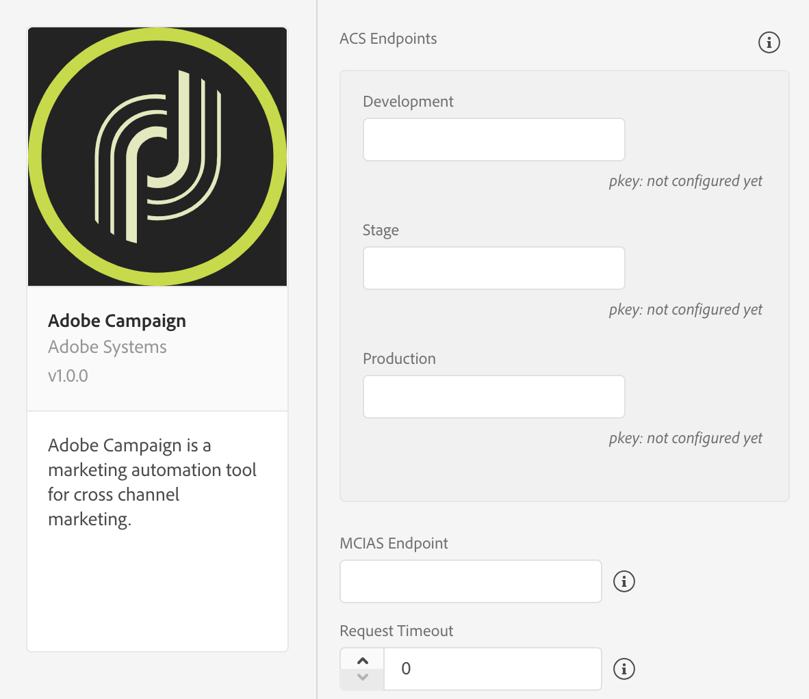
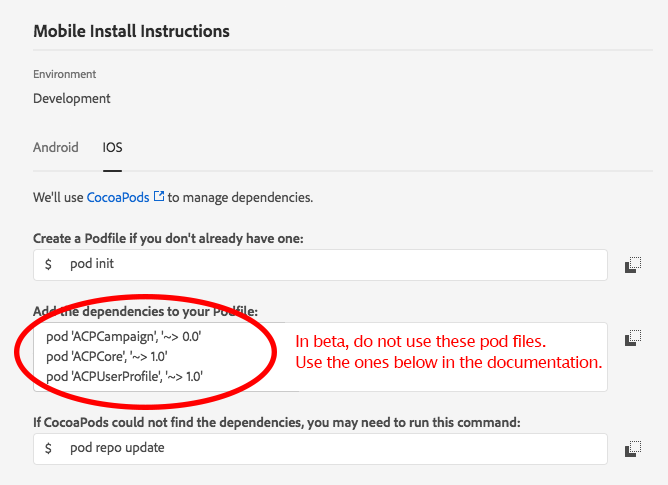

# Adobe Campaign Standard \(Beta\)


**Before** you install or configure the Adobe Campaign Standard beta extension, we recommend that you read the [_Getting Started_](../getting-started/create-a-mobile-property.md) section and in [Configuring a mobile application using Adobe Experience Platform SDKs](https://helpx-internal.corp.adobe.com/content/help/en/campaign/kb/configuring-app-sdk.html). 



This extension is considered beta functionality and is available only in Launch's [Integration](http://launch-integration.adobe.com) environment. For more information, see [Configuring a mobile application using Adobe Experience Platform SDKs](https://helpx-internal.corp.adobe.com/content/help/en/campaign/kb/configuring-app-sdk.html) or contact your beta program manager.


## Configure Campaign Standard Extension in Launch

1. In Launch's Integration environment, click the **Extensions** tab.
2. On the **Catalog** tab, locate the **Adobe Campaign Standard** extension and click **Install**.
3. Provide extension settings \(see [Configure Campaign Standard Extension](adobe-campaign-standard-beta.md#configure-campaign-standard-extension)\).
4. Click **Save**.
5. Follow the publishing process to update SDK configuration

### Configure Campaign Standard Extension



#### ACS Endpoints


Trying to find your ACS endpoint URLs? Contact your beta manager.


Provide endpoint URL\(s\) for your Adobe Campaign Standard instances. You may specify up to three unique endpoints for your development, staging, and production environments. 


For this beta extension, these endpoints URLs should be entered in **without** a prefixing  `http://` or `https://.`


#### pKey

A unique, auto-generated identifier for a mobile app configured in Adobe Campaign Standard. After you've configured this extension in Launch, you will need to configure your Launch mobile property in Adobe Campaign Standard. When the configuration in Campaign is successful, pKeys will be automatically generated, per Campaign Standard instance, and configured in Launch Campaign extension for successful validation.


Need help connecting your Launch mobile property with your Campaign Standard mobile app? For more information, see [Configuring a mobile application using Adobe Experience Platform SDKs](https://helpx-internal.corp.adobe.com/content/help/en/campaign/kb/configuring-app-sdk.html).


#### MCIAS Endpoint


Trying to find your MCIAS endpoint URL? Contact your beta manager.


Provide your in-app messaging service URL endpoint. The SDK retrieves all in-app messaging rules and definition payloads from this endpoint.


For this beta extension, the MCIAS endpoint URL should be provided **with** a prefixing`http://` or `https://` and **must** end with a forward slash. For example, `https://mcias-va7.cloud.adobe.io/mcias/`.


#### Request Timeout

Time in seconds to wait for a response from the in-app messaging service, before timing out. The SDK default timeout value is 5 seconds.

## Add Campaign Standard to your app


This beta extension is currently available only for iOS development.





This **beta** Campaign Standard extension requires [Mobile Core](mobile-core/) and [Profile](profile/) **beta** extensions. If you are using other versions of Mobile Core and Profile libraries, use the beta version instead, as the instructions below indicate.




Add the Campaign Standard, [Mobile Core](mobile-core/), and [Profile](profile/) beta libraries to your project. You'll need to add the following pods to your `Podfile`:

```text
pod 'ACPCoreBeta', '1.0.2beta'
pod 'ACPCampaignBeta', '1.0.2beta'
pod 'ACPUserProfileBeta', '1.0.1beta'
```

or you can manually include the [Mobile Core](https://github.com/Adobe-Marketing-Cloud/acp-sdks/releases/tag/v1.0.2beta-ACPCore), [Campaign Standard](https://github.com/Adobe-Marketing-Cloud/acp-sdks/releases/tag/v1.0.2beta-ACPCampaign), and [Profile](https://github.com/Adobe-Marketing-Cloud/acp-sdks/releases/tag/v1.0.1beta-ACPUserProfile) beta extensions found in Github.

In Xcode, import the Mobile Core beta, Campaign Standard beta, and Profile extensions:

#### Objective-C

```objectivec
#import "ACPCore.h"
#import "ACPCampaign.h"
#import "ACPIdentity.h"
#import "ACPSignal.h"
#import "ACPLifecycle.h"
#import "ACPUserProfile.h"
```

#### Swift

```swift
import ACPCore
import ACPCampaign
import ACPIdentity
import ACPLifecycle
import ACPSignal
import ACPUserProfile
```



### Register Campaign Standard with Mobile Core



In your app's`application:didFinishLaunchingWithOptions:` method, register the Campaign Standard extension:

#### Objective-C <a id="objective-c-1"></a>

```objectivec
- (BOOL)application:(UIApplication *)application didFinishLaunchingWithOptions:(NSDictionary *)launchOptions {
    [ACPCampaign registerExtension];
    [ACPIdentity registerExtension];
    [ACPLifecycle registerExtension];
    [ACPSignal registerExtension];
    [ACPUserProfile registerExtension];
  // Override point for customization after application launch.
  return YES;
}
```

#### Swift

```swift
func application(_ application: UIApplication, didFinishLaunchingWithOptions launchOptions: [UIApplication.LaunchOptionsKey: Any]?) -> Bool {
   ACPCampaign.registerExtension();
   ACPIdentity.registerExtension();
   ACPLifecycle.registerExtension();
   ACPSignal.registerExtension();   
   ACPUserProfile.registerExtension();
  // Override point for customization after application launch.
  return true;
}
```



### Set up push messaging

After you follow [Apple's instructions](https://developer.apple.com/library/archive/documentation/NetworkingInternet/Conceptual/RemoteNotificationsPG/HandlingRemoteNotifications.html#//apple_ref/doc/uid/TP40008194-CH6-SW1) to get your app ready to handle push notifications, you will need to set the push token using the [`setPushIdentifier`](https://aep-sdks.gitbook.io/docs/using-mobile-extensions/mobile-core/identity/identity-api-reference#set-the-push-identifier) API:



### setPushIdentifier

#### Objective-C

#### Syntax

```objectivec
+ (void) setPushIdentifier: (nullable NSData*) deviceToken;
```

#### Example

```objectivec
- (void) application:(UIApplication *)application didRegisterForRemoteNotificationsWithDeviceToken:(NSData *)deviceToken {
  // Set the deviceToken that the APNS has assigned to the device
  [ACPCore setPushIdentifier:deviceToken];
  //...
}
```

#### Swift

```swift
ACPCore.setPushIdentifier(deviceToken)
```



### Tracking for push and in-app messaging

For more information about setting up tracking postbacks for push and in-app messaging, see [Create rules for In-App tracking postback](https://helpx.adobe.com/campaign/standard/administration/using/configuring-a-mobile-application-using-sdk-v5.html#step-3--create-rules-for-in-app-tracking-postback) and [Create rules for push notifications tracking postback](https://helpx.adobe.com/campaign/standard/administration/using/configuring-a-mobile-application-using-sdk-v5.html#step-4--create-rules-for-push-notifications-tracking-postback).

## Deleting mobile properties in Launch


Deleting your property in Launch may cause disruption to any recurring push and in-app messaging activities.


If you [delete](https://docs.adobelaunch.com/administration/companies-and-properties#delete-a-property) your mobile property in Launch, you might review your mobile property status in Campaign Standard and ensure that the property displays an updated status of **Deleted in Launch**. You may choose to remove the corresponding mobile app in Campaign Standard by clicking the **Remove from ACS** button. For more information, see [Configuring a mobile application using Adobe Experience Platform SDKs](https://helpx-internal.corp.adobe.com/content/help/en/campaign/kb/configuring-app-sdk.html)


Deleting your mobile property in Launch does not automatically delete your Campaign Standard mobile app.


