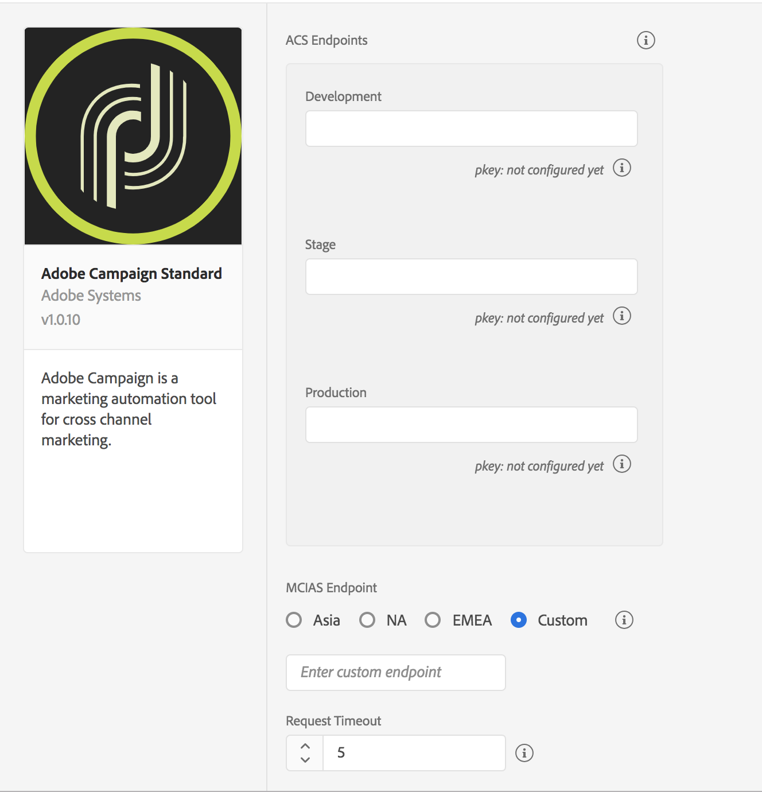

# Adobe Campaign Standard


**Before** you install or configure the Adobe Campaign Standard extension, read [_Getting Started_](../getting-started/create-a-mobile-property.md) and [Configuring a mobile application using Adobe Experience Platform SDKs](https://helpx.adobe.com/campaign/kb/configuring-app-sdk.html).



## Configure Campaign Standard Extension in Launch

1. In Launch's Integration environment, click the **Extensions** tab.
2. On the **Catalog** tab, locate the **Adobe Campaign Standard** extension and click **Install**.
3. Provide extension settings \(see [Configure Campaign Standard Extension](adobe-campaign-standard-beta.md#configure-campaign-standard-extension)\).
4. Click **Save**.
5. Follow the publishing process to update SDK configuration

### Configure Campaign Standard Extension



#### ACS Endpoints

Provide endpoint URL\(s\) for your Adobe Campaign Standard instances. You may specify up to three unique endpoints for your development, staging, and production environments.



For this extension, these endpoint URLs should be typed in **without** the `http://` or `https://.`and **cannot** end with a forward slash.



#### pKey

A unique, auto-generated identifier for a mobile app configured in Adobe Campaign Standard. After you've configured this extension in Launch, you will need to configure your Launch mobile property in Adobe Campaign Standard. When the configuration in Campaign is successful, pKey will be automatically generated, per Campaign Standard instance, and configured in Launch Campaign extension for successful validation.


#### MCIAS Region

Select an MCIAS region based on where your customer is located or enter a custom endpoint. The SDK retrieves all in-app messaging rules and definition payloads from this endpoint.



For this extension, the custom MCIAS endpoint URL should be typed in **without** the `http://` or `https://` and **cannot** end with a forward slash. 



#### Request Timeout

Time in seconds to wait for a response from the in-app messaging service before timing out. The SDK default timeout value is 5 seconds, and the minimum timeout value is 1 second.


Request Timeout must be a non-zero number.


## Add Campaign Standard to your app


The Android version of this extension is coming in the future.





This Campaign Standard extension requires the [Mobile Core](mobile-core/) and [Profile](profile/) extensions.



Add the Campaign Standard, [Mobile Core](mobile-core/), and [Profile](profile/) libraries to your project. You'll need to add the following pods to your `Podfile`:

```text
use_frameworks!
pod 'ACPCampaign', '~> 1.0'
pod 'ACPUserProfile', '~> 2.0'
pod 'ACPCore', '~> 2.0'
```

or you can manually include the [Mobile Core](https://github.com/Adobe-Marketing-Cloud/acp-sdks/releases/tag/v2.0.1-ACPCore), [Campaign Standard](https://github.com/Adobe-Marketing-Cloud/acp-sdks/releases/tag/v1.0.2beta-ACPCampaign), and [Profile](https://github.com/Adobe-Marketing-Cloud/acp-sdks/releases/tag/v2.0.1-ACPUserProfile)  extensions found in Github.

In Xcode, import the Mobile Core, Campaign Standard, and Profile extensions:

#### Objective-C

```objectivec
#import "ACPCore.h"
#import "ACPCampaign.h"
#import "ACPUserProfile.h"
#import "ACPIdentity.h"
#import "ACPLifecycle.h"
#import "ACPSignal.h"
```

#### Swift

```swift
import ACPCore
import ACPCampaign
import ACPUserProfile
```



### Register Campaign Standard with Mobile Core



In your app's`application:didFinishLaunchingWithOptions:` method, register the Campaign Standard extension:

#### Objective-C  <a id="objective-c-1"></a>

```objectivec
- (BOOL)application:(UIApplication *)application didFinishLaunchingWithOptions:(NSDictionary *)launchOptions {
    [ACPCampaign registerExtension];
    [ACPIdentity registerExtension];
    [ACPLifecycle registerExtension];
    [ACPSignal registerExtension];
    [ACPUserProfile registerExtension];
  // Override point for customization after application launch.
  return YES;
}
```

#### Swift

```swift
func application(_ application: UIApplication, didFinishLaunchingWithOptions launchOptions: [UIApplication.LaunchOptionsKey: Any]?) -> Bool {
   ACPCampaign.registerExtension();
   ACPIdentity.registerExtension();
   ACPLifecycle.registerExtension();
   ACPSignal.registerExtension();   
   ACPUserProfile.registerExtension();
  // Override point for customization after application launch.
  return true;
}
```



### Set up push messaging


iOS simulators do not support push messaging.



Need help creating a push notification using Adobe Campaign? For more information, see [Preparing and sending a push notification](https://helpx.adobe.com/campaign/standard/channels/using/preparing-and-sending-a-push-notification.html).


After you follow [Apple's instructions](https://developer.apple.com/library/archive/documentation/NetworkingInternet/Conceptual/RemoteNotificationsPG/HandlingRemoteNotifications.html#//apple_ref/doc/uid/TP40008194-CH6-SW1) to get your app ready to handle push notifications, you will need to set the push token using the [`setPushIdentifier`](https://aep-sdks.gitbook.io/docs/using-mobile-extensions/mobile-core/identity/identity-api-reference#set-the-push-identifier) API:



### setPushIdentifier

#### Objective-C

#### Syntax

```objectivec
+ (void) setPushIdentifier: (nullable NSData*) deviceToken;
```

#### Example

```objectivec
- (void) application:(UIApplication *)application didRegisterForRemoteNotificationsWithDeviceToken:(NSData *)deviceToken {
  // Set the deviceToken that the APNS has assigned to the device
  [ACPCore setPushIdentifier:deviceToken];
  //...
}
```

#### Swift

```swift
ACPCore.setPushIdentifier(deviceToken)
```



If everyting is configured correctly, after installing your app on mobile device, your should see the following debug logs:

a\) Campaign rules have been downloaded

#### Example

```text
2019-01-31 18:22:35.980872-0800 CampaignDemoApp[935:156012] [AMSDK DEBUG <com.adobe.module.campaign>]: Successfully downloaded Rules from 'https://mcias-va7.cloud.adobe.io/mcias/mcias.campaign-demo.adobe.com/PR8fdd35ee6cc84aa8bbdea8f92db3f55a/43583282444503123217621782542046274680/rules.zip
```

b\) request to demdex has been sent

#### Example

```text
2019-01-31 18:22:35.261676-0800 CampaignDemoApp[935:156015] [AMSDK DEBUG <com.adobe.module.identity>]: Sending request (https://dpm.demdex.net/id?d_rtbd=json&d_ver=2&d_orgid=B1F855165B4C9EA50A495E06@AdobeOrg&d_mid=43583282444503123217621782542046274680&d_blob=j8Odv6LonN4r3an7LhD3WZrU1bUpAkFkkiY1ncBR96t2PTI&dcs_region=9)
```

c\) push token

#### Example

```text
2019-01-31 18:22:34.881855-0800 CampaignDemoApp[935:155847] Push Token: c201fc7cc33243800802850ae65856f64f0cebc439c891eee8939682075afe75
```

### Tracking for push and in-app messaging

To set up tracking postbacks for push and in-app messaging and create rules for in-app messaging tracking postbacks and push notifications tracking postbacks, contact your beta program manager.

For more information, go to [Create rules for push notifications tracking postback](https://helpx.adobe.com/campaign/kb/configuring-app-sdk.html#Step4Createrulesforpushnotificationstrackingpostback) and [Create rules for In-App tracking postback](https://helpx.adobe.com/campaign/kb/configuring-app-sdk.html#Step3CreaterulesforInApptrackingpostback) .

## Deleting mobile properties in Launch


Deleting your property in Launch may cause disruption to any recurring push and in-app messaging activities.


If you [delete](https://docs.adobelaunch.com/administration/companies-and-properties#delete-a-property) your mobile property in Launch, you might review your mobile property status in Campaign Standard and ensure that the property displays an updated status of **Deleted in Launch**. You may choose to remove the corresponding mobile app in Campaign Standard by clicking the **Remove from ACS** button. For more information, see [Configuring a mobile application using Adobe Experience Platform SDKs](https://helpx.adobe.com/campaign/kb/configuring-app-sdk.html).


Deleting your mobile property in Launch does not automatically delete your Campaign Standard mobile app.


