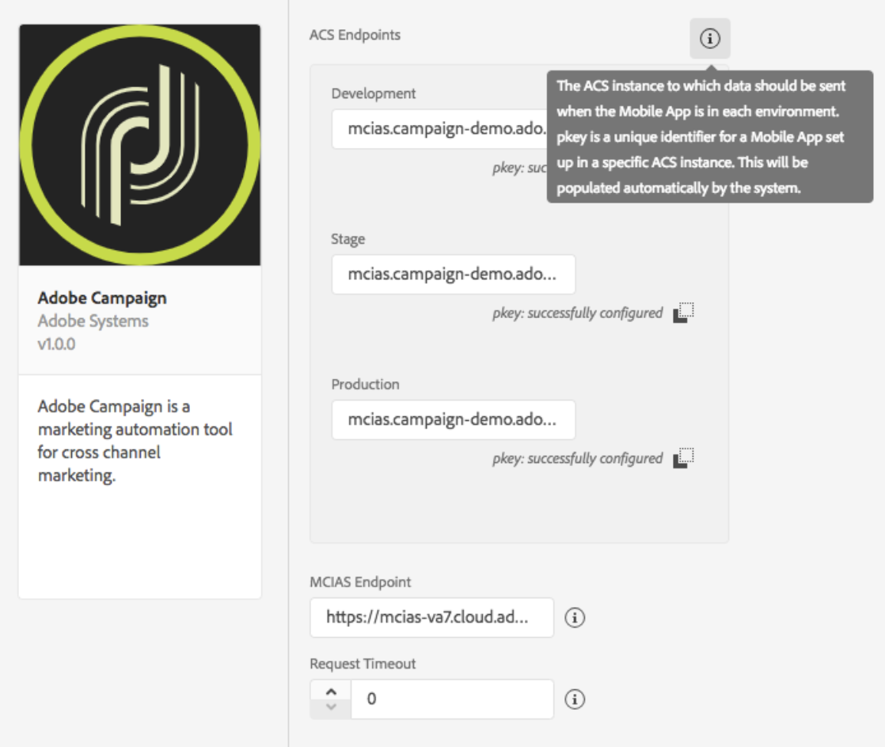

# Adobe Campaign Standard \(Beta\)


This extension is considered beta functionality and is available only in Launch's [Integration](http://launch-integration.adobe.com) environment. For more information, please see Campaign Standard's [user guide](https://helpx.adobe.com/campaign/standard/administration/using/configuring-a-mobile-application-using-sdk-v5.html) or contact your beta program manager.


## Configure Campaign Standard Extension in Launch

1. In Launch's Integration environment, click the **Extensions** tab.
2. On the **Catalog** tab, locate the **Adobe Campaign Standard** extension and click **Install**.
3. Provide extension settings \(see [Configure Analytics Extension](https://aep-sdks.gitbook.io/docs/using-mobile-extensions/adobe-analytics#configure-analytics-extension)\)
4. Click **Save**.
5. Follow the publishing process, to update SDK configuration

### Configure Campaign Standard Extension



#### ACS Endpoints


Trying to find your ACS endpoint URLs? Contact your beta program manager.


Provide endpoint URL\(s\) for your Adobe Campaign Standard instances. You may specify up to three unique endpoints for your development, staging, and production environments.

#### pKey

A unique, auto-generated identifier for a mobile app configured in Adobe Campaign Standard. After you've configured this extension in Launch, you will need to connect your Launch mobile property with an Adobe Campaign Standard mobile app. When the connection is made, pKeys will be automatically generated, per Campaign Standard instance, and configured here for successful validation.


How to connect Launch mobile property with your Campaign Standard mobile app? See Campaign Standard [user guide](https://helpx.adobe.com/campaign/standard/administration/using/configuring-a-mobile-application-using-sdk-v5.html#setting-up-your-adobe-launch-application-in-adobe-campaign) for more information.


#### MCIAS Endpoint

Provide your in-app messaging service URL endpoint. The SDK retrieves all in-app messaging rules and definition payloads from this endpoint.


How to find your MCIAS endpoint URL? Contact your beta program manager.


#### Request Timeout

Time in seconds to wait for a response from the in-app messaging service, before timing out.

## Add Campaign Standard to your app


This beta extension is currently available only for iOS development.




Add the library to your project via your [Cocoapods](https://cocoapods.org/pods/ACPCampaignBeta) `Podfile` by adding `pod 'ACPCampaignBeta'` or by manually including the framework found in [Github](https://github.com/Adobe-Marketing-Cloud/acp-sdks/releases/tag/v1.0.2beta-ACPCampaign).

#### Objective-C

Import the Campaign extension

```objectivec
#import <ACPCampaign_iOS/ACPCampaign_iOS.h>
```

#### Swift

```swift
import ACPCampaignBeta_iOS
```



### Register Campaign Standard with Mobile Core



In your app's`application:didFinishLaunchingWithOptions:` method, register the Campaign Standard extension:

#### Objective-C <a id="objective-c-1"></a>

```objectivec
- (BOOL)application:(UIApplication *)application didFinishLaunchingWithOptions:(NSDictionary *)launchOptions {
    [ACPCampaign registerExtension];
    [ACPSignal registerExtension];
  // Override point for customization after application launch.
  return YES;
}
```

#### Swift

```swift
func application(_ application: UIApplication, didFinishLaunchingWithOptions launchOptions: [UIApplication.LaunchOptionsKey: Any]?) -> Bool {
   ACPCampaign.registerExtension();
   ACPIdentity.registerExtension();
  // Override point for customization after application launch.
  return true;
}
```



### Setup push messaging


### Tracking for push & in-app messaging

See Campaign Standard [user guide](https://helpx.adobe.com/campaign/standard/administration/using/configuring-a-mobile-application-using-sdk-v5.html#configuring-your-application-in-adobe-launch) for more information on setting up tracking postbacks for push and in-app messaging.

## Deleting mobile properties in Launch


Deleting your mobile property in Launch does not automatically delete your Campaign Standard mobile app.


If you [delete](https://docs.adobelaunch.com/administration/companies-and-properties#delete-a-property) your mobile property in Launch, you may review your mobile property status in Adobe Campaign Standard and ensure that it shows an updated status of **Deleted in Launch**. You may choose to remove the corresponding mobile app in Campaign Standard by selecting the **Remove from ACS** button. See the [ACS user guide](https://helpx.adobe.com/campaign/standard/administration/using/configuring-a-mobile-application-using-sdk-v5.html#deleting-your-adobe-launch-application) for more information.

