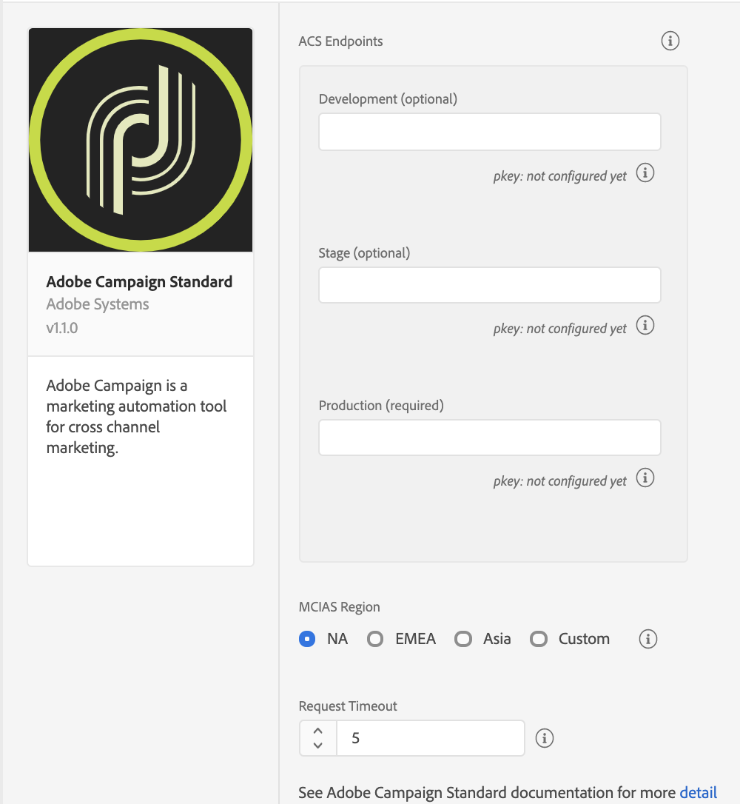
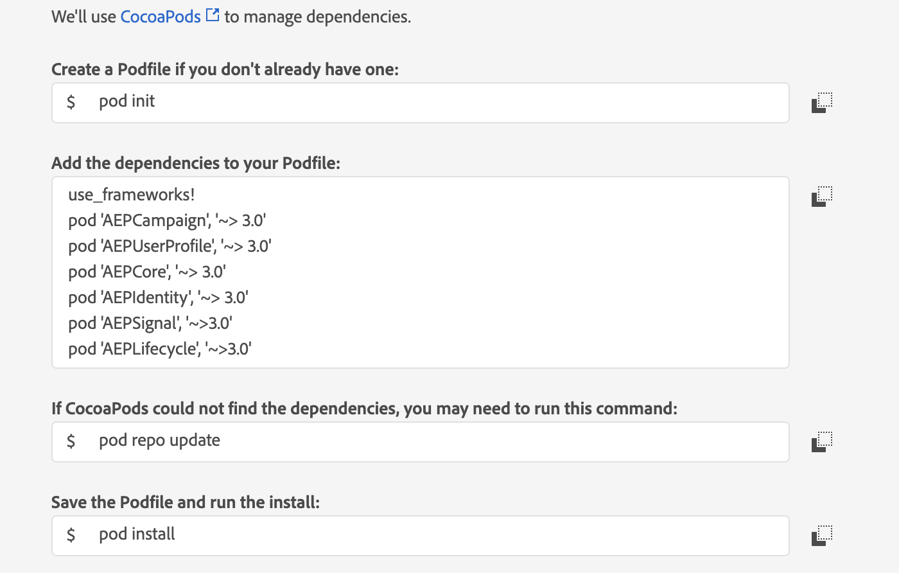
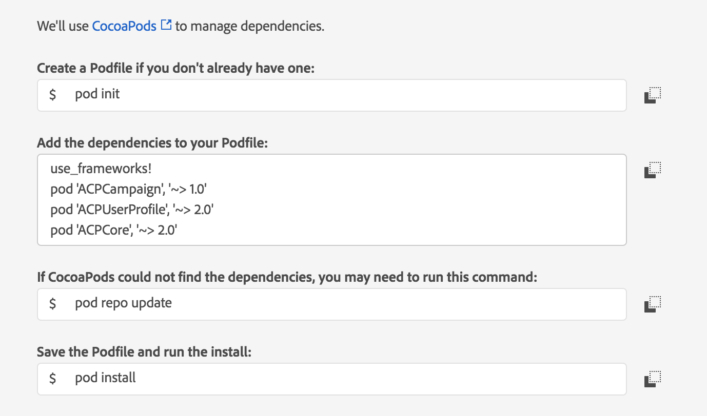

# Adobe Campaign Standard


**Before** you install or configure the Campaign Standard extension, please read the [getting started guide](../../getting-started/create-a-mobile-property.md) and the [configuring a mobile application using Adobe Experience Platform SDKs guide](https://experienceleague.adobe.com/docs/campaign-standard/using/administrating/configuring-channels/configuring-a-mobile-application.html).



If you participated in the Campaign Standard beta, to use the new Campaign Standard extension, go to the [Data Collection UI](https://experience.adobe.com/data-collection/), instead of the Data Collection integration environment.


## Configure the Campaign Standard extension in the Data Collection UI

1. In the Data Collection UI, click the **Extensions** tab.
2. On the **Catalog** tab, locate the **Adobe Campaign Standard** extension, and click **Install**.
3. Provide the extension settings.
4. Click **Save**.
5. Follow the publishing process to update SDK configuration.

### Configure the Campaign Standard extension



### Campaign Standard endpoints

Provide endpoint URL(s) for your Campaign Standard instances. You can specify up to three unique endpoints for your development, staging, and production environments. In most cases, the server endpoint is the root URL address, such as `companyname.campaign.adobe.com`.


For this extension, these endpoint URLs **do not** contain the `http://` or `https://` and **cannot** end with a forward slash.


#### pKey

A unique, automatically generated identifier for a mobile app that was configured in Adobe Campaign Standard. After you configure this extension in the Data Collection UI, configure your mobile property in Campaign Standard. For more information, please read the tutorial on [configuring a mobile application in Adobe Campaign](https://experienceleague.adobe.com/docs/campaign-standard/using/administrating/configuring-channels/configuring-a-mobile-application.html).

After the configuration is successful in Campaign, the pKey is automatically generated and configured in the Campaign extension for a successful validation.

#### MCIAS region

Select an MCIAS region based on your customer's location or enter a custom endpoint. The SDK retrieves all in-app messaging rules and definition payloads from this endpoint.


For this extension, the custom MCIAS endpoint URL **do not** contain the `http://` or `https://` and **cannot** end with a forward slash.


#### Request timeout

The request timeout is the time in seconds to wait for a response from the in-app messaging service before timing out. The default timeout value is 5 seconds, and the minimum timeout value is 1 second.


The request timeout value must be a non-zero number.


## Add the Campaign Standard extension to your app

Remember the following information when you add the Campaign extension to your app:

| Extension | Information |
| :--- | :--- |
| Campaign Standard | The Campaign Standard extension requires the [Mobile Core](https://aep-sdks.gitbook.io/docs/using-mobile-extensions/mobile-core), [Profile](https://aep-sdks.gitbook.io/docs/using-mobile-extensions/profile), [Lifecycle](https://aep-sdks.gitbook.io/docs/using-mobile-extensions/mobile-core/lifecycle), and [Signal](https://aep-sdks.gitbook.io/docs/using-mobile-extensions/mobile-core/signals) extensions. You should always ensure that you get the latest version of the extensions. |
| Profile | The Profile extension is required for in-app trigger frequencies to work accurately. For more information, see [Profile](https://aep-sdks.gitbook.io/docs/using-mobile-extensions/profile). |
| Signal | The Signal extension is required for all postback rules to work. For more information, see [Signal](https://aep-sdks.gitbook.io/docs/using-mobile-extensions/mobile-core/signals). |
| Lifecycle | The Lifecycle extension is required for a profile to be registered in Campaign. In order to do this, you will need to implement the Lifecycle APIs. For more information, please read either the [Lifecycle API \(Android\)](https://aep-sdks.gitbook.io/docs/foundation-extensions/mobile-core/lifecycle/lifecycle-extension-in-android) or the [Lifecycle API \(iOS\)](https://aep-sdks.gitbook.io/docs/foundation-extensions/mobile-core/lifecycle/lifecycle-extension-in-ios) documentation. |


The instructions to add these extensions to your mobile app are also available in the Data Collection UI. To access the installation dialog box, open your mobile property, click the **Environments** tab, and click **Install**.




1. Add the Campaign Standard, [Mobile Core](https://aep-sdks.gitbook.io/docs/using-mobile-extensions/mobile-core) and [Profile](https://aep-sdks.gitbook.io/docs/using-mobile-extensions/profile) extensions to your project using the app's Gradle file.

   ```java
    implementation 'com.adobe.marketing.mobile:campaign:1.+'
    implementation 'com.adobe.marketing.mobile:userprofile:1.+'
    implementation 'com.adobe.marketing.mobile:sdk-core:1.+'
   ```

2. Import the Campaign Standard, [Mobile Core](https://aep-sdks.gitbook.io/docs/using-mobile-extensions/mobile-core), [Profile](https://aep-sdks.gitbook.io/docs/using-mobile-extensions/profile), [Lifecycle](https://aep-sdks.gitbook.io/docs/using-mobile-extensions/mobile-core/lifecycle), and [Signal](https://aep-sdks.gitbook.io/docs/using-mobile-extensions/mobile-core/signals) extensions in your application's main activity.

   ```java
    import com.adobe.marketing.mobile.AdobeCallback;
    import com.adobe.marketing.mobile.Campaign;
    import com.adobe.marketing.mobile.Identity;
    import com.adobe.marketing.mobile.Lifecycle;
    import com.adobe.marketing.mobile.MobileCore;
    import com.adobe.marketing.mobile.Signal;
    import com.adobe.marketing.mobile.UserProfile;
   ```


To complete a manual installation, go to the [Adobe Experience Platform SDKs for Android GitHub](https://github.com/Adobe-Marketing-Cloud/acp-sdks/tree/master/android) repo, fetch the Mobile Core, Campaign Standard, Profile, Lifecycle, and Signal artifacts, and complete the steps in the [manual installation](https://github.com/Adobe-Marketing-Cloud/acp-sdks/blob/master/README.md#manual-installation) section.




1. Add the Campaign Standard, [Mobile Core](https://aep-sdks.gitbook.io/docs/using-mobile-extensions/mobile-core), and [Profile](https://aep-sdks.gitbook.io/docs/using-mobile-extensions/profile) extensions to your project using Cocoapods.

   

2. In Xcode, import the Mobile Core, Campaign Standard, Profile, Lifecycle, Identity, Signal, and Services extensions:

   **Swift**

   ```swift
   import AEPCore
   import AEPCampaign
   import AEPUserProfile
   import AEPIdentity
   import AEPLifecycle
   import AEPSignal
   import AEPServices
   ```

   **Objective-C**

   ```objective-c
   @import AEPCore;
   @import AEPCampaign;
   @import AEPUserProfile;
   @import AEPIdentity;
   @import AEPLifecycle;
   @import AEPSignal;
   @import AEPServices;
   ```

   



1. Add the Campaign Standard, [Mobile Core](https://aep-sdks.gitbook.io/docs/using-mobile-extensions/mobile-core) and [Profile](https://aep-sdks.gitbook.io/docs/using-mobile-extensions/profile) extensions to your project using Cocoapods.

   

   To complete a manual installation, go to the [Adobe Experience Platform SDKs for iOS GitHub](https://github.com/Adobe-Marketing-Cloud/acp-sdks/tree/master/iOS) repo, fetch the Mobile Core, Campaign Standard, Profile, Lifecycle, and Signal artifacts, and complete the steps in the [manual installation](https://github.com/Adobe-Marketing-Cloud/acp-sdks/blob/master/README.md#manual-installation-1) section.

2. In Xcode, import the Mobile Core, Campaign Standard, Profile, Lifecycle, and Signal extensions:

   **Swift**

   ```swift
    import ACPCore
    import ACPCampaign
    import ACPUserProfile
   ```

   **Objective-C**

   ```objective-c
    #import "ACPCore.h"
    #import "ACPCampaign.h"
    #import "ACPUserProfile.h"
    #import "ACPIdentity.h"
    #import "ACPLifecycle.h"
    #import "ACPSignal.h"
   ```

   


You'll need to install the SDK with [npm](https://www.npmjs.com/) and configure the native Android/iOS project in your react native project. Before installing the Campaign Standard extension, you'll need to install the [Core extension](../../foundation-extensions/mobile-core/). Follow these steps to get started:

1. Create a React Native project.

```bash
react-native init MyReactApp
```

1. Install and link the `@adobe/react-native-acpcampaign` package.

```bash
npm install @adobe/react-native-acpcampaign
react-native link @adobe/react-native-acpcampaign
```

1. Import the extension from `@adobe/react-native-acpcampaign`.

```bash
import {ACPCampaign} from '@adobe/react-native-acpcampaign';
```



## Register the Campaign Standard extension with Mobile Core



### Java

In your app's `OnCreate` method, register the Campaign, Identity, Signal, and Lifecycle extensions:

```java
    public class CampaignTestApp extends Application {

        @Override
        public void onCreate() {
        super.onCreate();
        MobileCore.setApplication(this);
        MobileCore.setLogLevel(LoggingMode.DEBUG);

        try {
            Campaign.registerExtension();
            UserProfile.registerExtension();
            Identity.registerExtension();
            Lifecycle.registerExtension();
            Signal.registerExtension();
            MobileCore.start(new AdobeCallback () {
            @Override
            public void call(Object o) {
                MobileCore.configureWithAppID("APP-ID");
            }
            });
        } catch (InvalidInitException e) {
            Log.e("CampaignTestApp", e.getMessage());
        }

        }
    }
```

For more information about starting Lifecycle, see the [Lifecycle extension in Android guide](https://aep-sdks.gitbook.io/docs/using-mobile-extensions/mobile-core/lifecycle/lifecycle-extension-in-android).



In your app's `application:didFinishLaunchingWithOptions:` method, register the Campaign, Identity, Signal, and Lifecycle extensions:

### Swift

```swift
func application(_ application: UIApplication, didFinishLaunchingWithOptions launchOptions: [UIApplication.LaunchOptionsKey: Any]?) -> Bool {
  MobileCore.setLogLevel(.debug)
  let appState = application.applicationState
  let extensions = [
    Campaign.self,
    UserProfile.self,
    Identity.self,
    Lifecycle.self,
    Signal.self
  ]
  MobileCore.registerExtensions(extensions, {
    MobileCore.configureWith(appId: "APP-ID")
    if appState != .background {
      MobileCore.lifecycleStart(additionalContextData: ["contextDataKey": "contextDataVal"])
    }
  })

  return true;
}
```

### Objective-C

```objective-c
- (BOOL)application:(UIApplication *)application didFinishLaunchingWithOptions:(NSDictionary *)launchOptions
{
  [AEPMobileCore setLogLevel: AEPLogLevelDebug];
  NSArray *extensionsToRegister = @[
    AEPMobileCampaign.class,
    AEPMobileUserProfile.class,
    AEPMobileIdentity.class,
    AEPMobileLifecycle.class,
    AEPMobileSignal.class
  ];
  [AEPMobileCore registerExtensions:extensionsToRegister completion:^{
  [AEPMobileCore lifecycleStart:@{@"contextDataKey": @"contextDataVal"}];
  }];
  [AEPMobileCore configureWithAppId: @"APP-ID"];
  // Override point for customization after application launch.
  return YES;
}
```

For more information about starting Lifecycle, see the [Lifecycle extension in iOS guide](https://aep-sdks.gitbook.io/docs/using-mobile-extensions/mobile-core/lifecycle/lifecycle-extension-in-ios).



In your app's `application:didFinishLaunchingWithOptions:` method, register the Campaign, Identity, Signal, and Lifecycle extensions:

### Swift

```swift
func application(_ application: UIApplication, didFinishLaunchingWithOptions launchOptions: [UIApplication.LaunchOptionsKey: Any]?) -> Bool {
  ACPCore.setLogLevel(.debug)
  ACPCore.configure(withAppId: "APP-ID")

  ACPCampaign.registerExtension()
  ACPUserProfile.registerExtension()
  ACPIdentity.registerExtension()
  ACPLifecycle.registerExtension()
  ACPSignal.registerExtension()
  ACPCore.start {
    ACPCore.lifecycleStart(nil)
  }

  return true;
}
```

### Objective-C

```objective-c
- (BOOL)application:(UIApplication *)application didFinishLaunchingWithOptions:(NSDictionary *)launchOptions {
  [ACPCore setLogLevel:ACPMobileLogLevelDebug];
  [ACPCore configureWithAppId:@"APP-ID"];

  [ACPCampaign registerExtension];
  [ACPUserProfile registerExtension];
  [ACPIdentity registerExtension];
  [ACPLifecycle registerExtension];
  [ACPSignal registerExtension];
  [ACPCore start:^{
    [ACPCore lifecycleStart:nil];
  }];
  // Override point for customization after application launch.
  return YES;
}
```

For more information about starting Lifecycle, see the [Lifecycle extension in iOS guide](https://aep-sdks.gitbook.io/docs/using-mobile-extensions/mobile-core/lifecycle/lifecycle-extension-in-ios).



To register the Campaign Standard with Core, use the following API:

### JavaScript

```javascript
ACPCampaign.registerExtension();
```



## Initialize the SDK and set up tracking

To initialize the SDK and set up tracking, see the [initialize the SDK and set up tracking tutorial](https://aep-sdks.gitbook.io/docs/getting-started/initialize-the-sdk).




## Set up in-app messaging

To learn how to create an in-app message using Adobe Campaign, see the [tutorial on preparing and sending an in-app message](https://experienceleague.adobe.com/docs/campaign-standard/using/communication-channels/in-app-messaging/preparing-and-sending-an-in-app-message.html).


If you are developing an Android application, to correctly display fullscreen in-app messages, add the Campaign Standard extension's `FullscreenMessageActivity` to your AndroidManifest.xml file:

```markup
<activity android:name="com.adobe.marketing.mobile.FullscreenMessageActivity" />
```

In addition to adding the `FullscreenMessageActivity`, a global lifecycle callback must be defined in your app's MainActivity to ensure the proper display of fullscreen in-app messages. To define the global lifecycle callback, see the [implementing global lifecycle callbacks section](https://aep-sdks.gitbook.io/docs/using-mobile-extensions/mobile-core/lifecycle/lifecycle-extension-in-android#implementing-global-lifecycle-callbacks) within the Lifecycle documentation.


## Set up local notifications

To set up local notifications in Android, update the AndroidManifest.xml file with `<receiver android:name="com.adobe.marketing.mobile.LocalNotificationHandler"/>`. To configure the notification icons that the local notification will use, see the [configuring notification icons section](https://aep-sdks.gitbook.io/docs/using-mobile-extensions/adobe-analytics-mobile-services#configuring-notification-icons) within the Adobe Analytics - Mobile Services documentation.



No additional setup is needed for iOS in-app messaging and local notifications.



No additional setup is needed for iOS in-app messaging and local notifications.




## Set up push messaging

To enable push messaging with Adobe Campaign, call `setPushIdentifer` to send the push identifier that is received from the Apple Push Notification Service \(APNS\) or Firebase Cloud Messaging Platform \(FCM\) to the Adobe Identity service. For more information about the `setPushIdentifer` API, see the [setPushIdentifier section of the Adobe Identity API guide](https://aep-sdks.gitbook.io/docs/foundation-extensions/mobile-core/identity/identity-api-reference#setpushidentifier).

For more information about setting up your iOS app to connect to APNS and retrieve a device token that will be used as a push identifier, see the tutorial on [registering your app with APNs](https://developer.apple.com/documentation/usernotifications/registering_your_app_with_apns?language=objc). For more information about setting up your Android app to connect to FCM and retrieve a device registration token that will be used as a push identifier, see the tutorial on [setting up a Firebase Cloud Messaging client app on Android](https://firebase.google.com/docs/cloud-messaging/android/client).


To learn more about creating a push notification using Adobe Campaign, see the tutorial on [preparing and sending a push notification](https://experienceleague.adobe.com/docs/campaign-standard/using/communication-channels/push-notifications/preparing-and-sending-a-push-notification.html).




### Java

**Example**

```java
FirebaseInstanceId.getInstance().getInstanceId()
        .addOnCompleteListener(new OnCompleteListener<InstanceIdResult>() {
            @Override
            public void onComplete(@NonNull Task<InstanceIdResult> task) {
                if (!task.isSuccessful()) {
                    return;
                }
                // Get new Instance ID token
                String registrationID = task.getResult().getToken();
                // Log and toast
                System.out.println("Received new registration token: " + registrationID);
                // invoke the API to send the push identifier to the Identity Service
                MobileCore.setPushIdentifier(registrationID);
            }
});
```




iOS simulators do **not** support push messaging.


### Swift

**Example**

```swift
func application(_ application: UIApplication, didRegisterForRemoteNotificationsWithDeviceToken deviceToken: Data) {
  // Set the deviceToken that the APNS has assigned to the device
  MobileCore.setPushIdentifier(deviceToken: deviceToken)
  //...
}
```

### Objective-C

**Example**

```objective-c
- (void) application:(UIApplication *)application didRegisterForRemoteNotificationsWithDeviceToken:(NSData *)deviceToken {
  // Set the deviceToken that the APNS has assigned to the device
  [AEPMobileCore setPushIdentifier:deviceToken];
  //...
}
```





iOS simulators do **not** support push messaging.


### Swift

**Example**

```swift
func application(_ application: UIApplication, didRegisterForRemoteNotificationsWithDeviceToken deviceToken: Data) {
  // Set the deviceToken that the APNS has assigned to the device
  ACPCore.setPushIdentifier(deviceToken)
  //...
}
```

### Objective-C

**Example**

```objective-c
- (void) application:(UIApplication *)application didRegisterForRemoteNotificationsWithDeviceToken:(NSData *)deviceToken {
  // Set the deviceToken that the APNS has assigned to the device
  [ACPCore setPushIdentifier:deviceToken];
  //...
}
```




Before you use the following API in your React Native project, complete the steps in the **Android** and **iOS** tabs to set up platform-specific push configuration.

#### Example

```javascript
ACPCore.setPushIdentifier("pushID");
```



## Tracking local and push notification message interactions

User interactions with local or push notifications can be tracked by invoking the `collectMessageInfo` API. After the API is invoked, a network request is made to Campaign that contains the message interaction event.


The code samples below are provided as examples on how to correctly invoke the `collectMessageInfo` API. For more specific details, please read the tutorials on [implementing local notification tracking](https://experienceleague.adobe.com/docs/campaign-standard/using/administrating/configuring-mobile/local-tracking.html) and [configuring push tracking](https://experienceleague.adobe.com/docs/campaign-standard/using/administrating/configuring-mobile/push-tracking.html) within the Adobe Campaign documentation.




### Java

**Syntax**

```java
public static void collectMessageInfo(final Map<String, Object> messageInfo)
```

* _messageInfo_ is a map that contains the delivery ID, message ID, and action type for a local or push notification for which there were interactions. The delivery and message IDs are extracted from the notification payload.

**Example**

```java
@Override
protected void onResume() {
  super.onResume();
  handleTracking();
}

// handle notification open and click tracking
private void handleTracking() {
  Intent intent = getIntent();
  Bundle data = intent.getExtras();
  HashMap<String, Object> userInfo = null;

  if (data != null) {
    userInfo = (HashMap)data.get("NOTIFICATION_USER_INFO");
  } else {
    return;
  }

  // Check if we have notification user info.
  // If it is present, this view was opened based on a notification.
  if (userInfo != null) {
    String deliveryId = (String)userInfo.get("deliveryId");
    String broadlogId = (String)userInfo.get("broadlogId");

    HashMap<String, Object> contextData = new HashMap<>();

    if (deliveryId != null && broadlogId != null) {
      contextData.put("deliveryId", deliveryId);
      contextData.put("broadlogId", broadlogId);

      // Send Click Tracking since the user did click on the notification
      contextData.put("action", "2");
      MobileCore.collectMessageInfo(contextData);

      // Send Open Tracking since the user opened the app
      contextData.put("action", "1");
      MobileCore.collectMessageInfo(contextData);
    }
  }
}
```




### Swift

**Syntax**

```swift
static func collectMessageInfo(_ messageInfo: [String: Any])
```

* _messageInfo_ is a dictionary that contains the delivery ID, message ID, and action type for a local or push notification for which there were interactions. The delivery and message IDs are extracted from the notification payload.

**Example**

```swift
// Handle notification interaction from background or closed
func userNotificationCenter(_ center: UNUserNotificationCenter, didReceive response: UNNotificationResponse, withCompletionHandler completionHandler: @escaping () -> Void) {
  DispatchQueue.main.async(execute: {
    let userInfo = response.notification.request.content.userInfo
    var broadlogId:String = (userInfo["_mId"] ?? userInfo["broadlogId"]) as! String
    var deliveryId:String = (userInfo["_dId"] ?? userInfo["deliveryId"]) as! String

    if (broadlogId.count == 0 || deliveryId.count == 0) {
      return
    }
    // Send Click Tracking since the user did click on the notification
    MobileCore.collectMessageInfo([
      "broadlogId": broadlogId,
      "deliveryId": deliveryId,
      "action": "2"
    ])
    // Send Open Tracking since the user opened the app
    MobileCore.collectMessageInfo([
      "broadlogId": broadlogId,
      "deliveryId": deliveryId,
      "action": "1"
    ])
  })
}
```

### Objective-C

**Syntax**

```objective-c
+ (void) collectMessageInfo:(NSDictionary<NSString *,id> * _Nonnull)
```

* _messageInfo_ is a dictionary that contains the delivery ID, message ID, and action type for a local or push notification for which there were interactions. The delivery and message IDs are extracted from the notification payload.

**Example**

```objective-c
// Handle notification interaction from background or closed
-(void)userNotificationCenter:(UNUserNotificationCenter *)center didReceiveNotificationResponse:(UNNotificationResponse *)response withCompletionHandler:(void(^)(void))completionHandler{
  dispatch_async(dispatch_get_main_queue(), ^{
    NSDictionary *userInfo = response.notification.request.content.userInfo;
    NSString *broadlogId = userInfo[@"_mId"] ?: userInfo[@"broadlogId"];
    NSString *deliveryId = userInfo[@"_dId"] ?: userInfo[@"deliveryId"];

    if(!broadlogId.length || !deliveryId.length){
      return;
    }
    
    // Send Click Tracking since the user did click on the notification
    [AEPMobileCore collectMessageInfo:@{
      @"broadlogId" : broadlogId,
      @"deliveryId": deliveryId,
      @"action": @"2"
    }];
    // Send Open Tracking since the user opened the app
    [AEPMobileCore collectMessageInfo:@{
      @"broadlogId" : broadlogId,
      @"deliveryId": deliveryId,
      @"action": @"1"
    }];
  });
}
```





### Swift

**Syntax**

```swift
+ (void) collectMessageInfo: (nonnull NSDictionary*) messageInfo;
```

* _messageInfo_ is a dictionary that contains the delivery ID, message ID, and action type for a local or push notification for which there were interactions. The delivery and message IDs are extracted from the notification payload.

**Example**

```swift
// Handle notification interaction from background or closed
func userNotificationCenter(_ center: UNUserNotificationCenter, didReceive response: UNNotificationResponse, withCompletionHandler completionHandler: @escaping () -> Void) {
  DispatchQueue.main.async(execute: {
    let userInfo = response.notification.request.content.userInfo
    var broadlogId:String = (userInfo["_mId"] ?? userInfo["broadlogId"]) as! String
    var deliveryId:String = (userInfo["_dId"] ?? userInfo["deliveryId"]) as! String

    if (broadlogId.count == 0 || deliveryId.count == 0) {
      return
    }
    // Send Click Tracking since the user did click on the notification
    ACPCore.collectMessageInfo([
      "broadlogId": broadlogId,
      "deliveryId": deliveryId,
      "action": "2"
    ])
    // Send Open Tracking since the user opened the app
    ACPCore.collectMessageInfo([
      "broadlogId": broadlogId,
      "deliveryId": deliveryId,
      "action": "1"
    ])
  })
}
```
### Objective-C

**Syntax**

```objective-c
+ (void) collectMessageInfo: (nonnull NSDictionary*) messageInfo;
```

* _messageInfo_ is a dictionary that contains the delivery ID, message ID, and action type for a local or push notification for which there were interactions. The delivery and message IDs are extracted from the notification payload.

**Example**

```objective-c
// Handle notification interaction from background or closed
-(void)userNotificationCenter:(UNUserNotificationCenter *)center didReceiveNotificationResponse:(UNNotificationResponse *)response withCompletionHandler:(void(^)(void))completionHandler{
  dispatch_async(dispatch_get_main_queue(), ^{
    NSDictionary *userInfo = response.notification.request.content.userInfo;
    NSString *broadlogId = userInfo[@"_mId"] ?: userInfo[@"broadlogId"];
    NSString *deliveryId = userInfo[@"_dId"] ?: userInfo[@"deliveryId"];

    if(!broadlogId.length || !deliveryId.length){
      return;
    }
    // Send Click Tracking since the user did click on the notification
    [ACPCore collectMessageInfo:@{
      @"broadlogId" : broadlogId,
      @"deliveryId": deliveryId,
      @"action": @"2"
    }];
    // Send Open Tracking since the user opened the app
    [ACPCore collectMessageInfo:@{
      @"broadlogId" : broadlogId,
      @"deliveryId": deliveryId,
      @"action": @"1"
    }];
  });
}
```




## Deleting mobile properties in the Data Collection UI


Deleting your property in the Experience Platform Data Connection UI might cause disruption to your recurring push and in-app messaging activities.


In the Data Collection UI, if you delete your mobile property, review your mobile property status in the Campaign Standard extension and ensure that the property displays an updated **Deleted in Launch** status. For more information about deleting a property, please read the [delete a property](https://experienceleague.adobe.com/docs/experience-platform/tags/admin/companies-and-properties.html?lang=en#delete-a-property) section within the Data Collection UI documentation.

To remove the corresponding mobile app in Campaign Standard, click **Remove from ACS**. For more information, see the section on [deleting your tags-enabled mobile application](https://experienceleague.adobe.com/docs/campaign-standard/using/administrating/configuring-channels/configuring-a-mobile-application.html?lang=en#delete-app).


Deleting your mobile property in the Data Collection UI does not automatically delete your Campaign Standard mobile app.


## Handling clickthrough destinations included in Campaign in-app messages

A destination URL can be added to in-app messages that are delivered from Adobe Campaign. The destination can be a website URL such as [https://www.adobe.com](https://www.adobe.com) or a deep link such as `campaigndemoapp://signupactivity?paidaccount=true` which can be used to direct the user to a specific area of your app.



## Handling in-app message website URLs on Android

Website URL's are handled without any additional action by the app developer. If an in-app message is clicked through and contains a valid URL, the device's default web browser will redirect to the URL contained in the in-app notification payload. The location of the URL differs for each notification type:

* The `url` key is present in the alert message payload
* The `url` is present in the query parameters of a fullscreen message button \(`data-destination-url`\)
* The `adb_deeplink` key is present in the local notification payload
* The `uri` key is present in the push notification payload

## Handling in-app message deep links on Android

To handle deep links in the notification payload, you need to set up URL schemes in the app. For more information about setting URL schemes for Android, please read the tutorial on [creating deep links to app content](https://developer.android.com/training/app-links/deep-linking). Once the desired activity is started by the newly added intent filter, the data present in the deep link can be retrieved. After that point, any further actions based on the data present in the deep link can be made.

### Java

```java
@Override
public void onCreate(Bundle savedInstanceState) {
    super.onCreate(savedInstanceState);
    setContentView(R.layout.main);

    Intent intent = getIntent();
    String action = intent.getAction();
    Uri data = intent.getData();
      // parse any data present in the deep link
}
```

## Handling in-app message app links on Android

Android app links were introduced with Android OS 6.0. They are similar to deep links in functionality, although they have the appearance of a standard website URL. The intent filter previously set up for deep links is modified to handle `http` schemes and verification of the app link needs to be set up on [Google Search Console](https://support.google.com/webmasters/answer/9008080).

For more information on the additional verification setup needed, please read the tutorial on [verifying Android app links](https://developer.android.com/training/app-links/verify-site-associations.html). The resulting app link can be used to redirect to specific areas of your app if the app is installed or redirect to your app's website if the app isn't installed. For more information on Android app links, please read the guide on [handling Android app links](https://developer.android.com/training/app-links/index.html#add-app-links).




## Handling alert or fullscreen notification website URLs on iOS

Website URL's included in alert or fullscreen messages are handled without any additional action by the app developer. If an alert of fullscreen message is clicked through and contains a valid URL, the Safari browser will be used to load the URL contained in the notification payload. The location of the URL differs for each notification type:

* The `url` key is present in the alert message payload
* The `url` is present in the query parameters of a fullscreen message button \(`data-destination-url`\)
* The `adb_deeplink` key is present in the local notification payload
* The `uri` key is present in the push notification payload

## Handling local notification website URLs on iOS

### Swift

The website URL in the local notification response can be loaded using the UrlService's `openUrl` method.

```swift
func userNotificationCenter(_ center: UNUserNotificationCenter, didReceive response: UNNotificationResponse, withCompletionHandler completionHandler: @escaping () -> Void) {
    DispatchQueue.main.async(execute: {
        let userInfo = response.notification.request.content.userInfo
        let urlString = userInfo["adb_deeplink"] as? String
        if (urlString?.count ?? 0) != 0 {
            if let url = URL(string: urlString ?? "") {
              ServiceProvider.shared.urlService.openUrl(url)
            }
        }
        completionHandler()
    })
}
```

### Objective-C

The website URL in the local notification response can be loaded using the [openURL:options:completionHandler:](https://developer.apple.com/documentation/uikit/uiapplication/1648685-openurl?language=objc) instance method.

```objective-c
-(void)userNotificationCenter:(UNUserNotificationCenter *)center didReceiveNotificationResponse:(UNNotificationResponse *)response withCompletionHandler:(void(^)(void))completionHandler{
    dispatch_async(dispatch_get_main_queue(), ^{
      NSDictionary *userInfo = response.notification.request.content.userInfo;
      NSString *urlString = userInfo[@"adb_deeplink"];
      if(urlString.length){
          [[UIApplication sharedApplication] openURL:[NSURL URLWithString: urlString] options:@{} completionHandler:^(BOOL success) {
            NSLog(@"Open %@: %d",urlString,success);
        }];
            }
        completionHandler();
        });   
}
```

## Handling push notification website URLs on iOS

### Swift

The website URL in the push notification response can be loaded using the UrlService's `openUrl` method.

```swift
func application(_ application: UIApplication, didReceiveRemoteNotification userInfo: [AnyHashable : Any], fetchCompletionHandler completionHandler: @escaping (UIBackgroundFetchResult) -> Void) {
    DispatchQueue.main.async(execute: {
        let urlString = userInfo["uri"] as? String
        if (urlString?.count ?? 0) != 0 {
            if let url = URL(string: urlString ?? "") {
                ServiceProvider.shared.urlService.openUrl(url)
            }
        }
        completionHandler(UIBackgroundFetchResultNoData)
    })
}
```

### Objective-C

The website URL in the push notification can be loaded using the [openURL:options:completionHandler:](https://developer.apple.com/documentation/uikit/uiapplication/1648685-openurl?language=objc) instance method.

```objective-c
- (void)application:(UIApplication *)application didReceiveRemoteNotification:(NSDictionary *)userInfo
fetchCompletionHandler:(void (^)(UIBackgroundFetchResult result))completionHandler {
    dispatch_async(dispatch_get_main_queue(), ^{
      NSString *urlString = userInfo[@"uri"];
      if(urlString.length){
          [[UIApplication sharedApplication] openURL:[NSURL URLWithString: urlString] options:@{} completionHandler:^(BOOL success) {
            NSLog(@"Open %@: %d",urlString,success);
        }];
            }
        completionHandler(UIBackgroundFetchResultNoData);
    });
}
```

## Handling local or push notification deep links on iOS

When a local or push notification is clicked through, the `didReceiveNotificationResponse` instance method is called with the notification response being passed in as a parameter. For more information, see the Apple developer docs at [userNotificationCenter:didReceiveNotificationResponse:withCompletionHandler:](https://developer.apple.com/documentation/usernotifications/unusernotificationcenterdelegate/1649501-usernotificationcenter?language=objc).

The deep link URL can be retrieved from the response object passed into the handler method. An example for retrieving the deep link URL and loading web links is provided below. The retrieved URL can then be parsed to aid with app navigation decision making. For more information about handling deep links and setting URL schemes for iOS, see the tutorial on [defining a custom URL scheme for your app](https://developer.apple.com/documentation/xcode/defining-a-custom-url-scheme-for-your-app).

### Swift

```swift
func userNotificationCenter(_ center: UNUserNotificationCenter, didReceive response: UNNotificationResponse, withCompletionHandler completionHandler: @escaping () -> Void) {
    DispatchQueue.main.async(execute: {
        let userInfo = response.notification.request.content.userInfo
        let urlString = userInfo["adb_deeplink"] as? String
        let urlString2 = userInfo["uri"] as? String
        if (urlString?.count ?? 0) != 0 {
            // handle the local notification deep link (parse any data present in the deep link and/or redirect to a desired area within the app)
        } else if (urlString2?.count ?? 0) != 0 {
            // handle the push notification deep link (parse any data present in the deep link and/or redirect to a desired area within the app)
        }
        completionHandler()
    })
}
```

### Objective-C

```objective-c
-(void)userNotificationCenter:(UNUserNotificationCenter *)center didReceiveNotificationResponse:(UNNotificationResponse *)response withCompletionHandler:(void(^)(void))completionHandler{
    dispatch_async(dispatch_get_main_queue(), ^{
      NSDictionary *userInfo = response.notification.request.content.userInfo;
      NSString *urlString = userInfo[@"adb_deeplink"];
      NSString *urlString2 = userInfo[@"uri"];
      if(urlString.length){
            // handle the local notification deep link (parse any data present in the deep link and/or redirect to a desired area within the app)
            }else if(urlString2.length){
        // handle the push notification deep link (parse any data present in the deep link and/or redirect to a desired area within the app)
      }
        completionHandler();
        });   
}
```

## Handling in-app message universal links on iOS

Universal links are available for devices on iOS 9.0 or later. They can be used to redirect to specific areas of your app if the app is installed or redirect to your app's website if the app isn't installed. For more information, see the guide on [allowing apps and websites to link to your content](https://developer.apple.com/documentation/xcode/allowing-apps-and-websites-to-link-to-your-content).

Universal links are typically used from outside your installed app. For example, a universal link would be used from a link present on a website or a link included in an email message. iOS will **not** open a universal link if it determines that the link is being opened from within the app it links to. For more information on this limitation, see the "Preparing Your App to Handle Universal Links" section within the documentation on [supporting universal links](https://developer.apple.com/library/archive/documentation/General/Conceptual/AppSearch/UniversalLinks.html#//apple_ref/doc/uid/TP40016308-CH12-SW2). If a universal link is included as a Campaign clickthrough destination, the link must be handled by the app developer in a similar fashion as a deep link. More information can be seen in the [handling alert or fullscreen notification deep links on iOS](./#handling-alert-or-fullscreen-notification-deep-links-on-ios) and [handling local or push notification deep links on iOS](./#handling-local-or-push-notification-deep-links-on-ios) sections.



## Handling alert or fullscreen notification website URLs on iOS

Website URL's included in alert or fullscreen messages are handled without any additional action by the app developer. If an alert of fullscreen message is clicked through and contains a valid URL, the Safari browser will be used to load the URL contained in the notification payload. The location of the URL differs for each notification type:

* The `url` key is present in the alert message payload
* The `url` is present in the query parameters of a fullscreen message button \(`data-destination-url`\)
* The `adb_deeplink` key is present in the local notification payload
* The `uri` key is present in the push notification payload

## Handling alert or fullscreen notification deep links on iOS

When a deep link is opened in Safari, this does not allow the app to directly handle the link. To provide a better customer experience, the Experience Platform SDK provides a URL handler that you can use with alert or fullscreen notification deep links.

### Swift

```swift
ACPCore.registerURLHandler({ url in
    print("Inside registerURLHandler callback, clickthrough url is: (url ?? "")")
    if url?.contains("campaigndemoapp://") ?? false {
        // handle the deep link (parse any data present in the deep link and/or redirect to a desired area within the app)
       return true
  }
  // false is returned when the URL should be opened in Safari
  return false
})
```

### Objective-C

```objective-c
[ACPCore registerURLHandler:^BOOL(NSString * _Nullable url) {
    NSLog(@"Inside registerURLHandler callback, clickthrough url is: %@", url);
  if([url containsString:@"campaigndemoapp://"]){
    // handle the deep link (parse any data present in the deep link and/or redirect to a desired area within the app)
    return true;
  }
  // false is returned when the URL should be opened in Safari
  return false;
}];
```

## Handling local notification website URLs on iOS

The website URL in the local notification response can be loaded using the [openURL:options:completionHandler:](https://developer.apple.com/documentation/uikit/uiapplication/1648685-openurl?language=objc) instance method.

### Swift

```swift
func userNotificationCenter(_ center: UNUserNotificationCenter, didReceive response: UNNotificationResponse, withCompletionHandler completionHandler: @escaping () -> Void) {
    DispatchQueue.main.async(execute: {
        let userInfo = response.notification.request.content.userInfo
        let urlString = userInfo["adb_deeplink"] as? String
        if (urlString?.count ?? 0) != 0 {
            if let url = URL(string: urlString ?? "") {
                UIApplication.shared.open(url, options: [:], completionHandler: { success in
                    print("Open (urlString ?? ""): (success)")
                })
            }
        }
        completionHandler()
    })
}
```

### Objective-C

```objective-c
-(void)userNotificationCenter:(UNUserNotificationCenter *)center didReceiveNotificationResponse:(UNNotificationResponse *)response withCompletionHandler:(void(^)(void))completionHandler{
    dispatch_async(dispatch_get_main_queue(), ^{
      NSDictionary *userInfo = response.notification.request.content.userInfo;
      NSString *urlString = userInfo[@"adb_deeplink"];
      if(urlString.length){
          [[UIApplication sharedApplication] openURL:[NSURL URLWithString: urlString] options:@{} completionHandler:^(BOOL success) {
            NSLog(@"Open %@: %d",urlString,success);
        }];
            }
        completionHandler();
        });   
}
```

## Handling push notification website URLs on iOS

The website URL in the push notification can be loaded using the [openURL:options:completionHandler:](https://developer.apple.com/documentation/uikit/uiapplication/1648685-openurl?language=objc) instance method.

### Swift

```swift
func application(_ application: UIApplication, didReceiveRemoteNotification userInfo: [AnyHashable : Any], fetchCompletionHandler completionHandler: @escaping (UIBackgroundFetchResult) -> Void) {
    DispatchQueue.main.async(execute: {
        let urlString = userInfo["uri"] as? String
        if (urlString?.count ?? 0) != 0 {
            if let url = URL(string: urlString ?? "") {
                UIApplication.shared.open(url, options: [:], completionHandler: { success in
                    print("Open (urlString ?? ""): (success)")
                })
            }
        }
        completionHandler(UIBackgroundFetchResultNoData)
    })
}
```

### Objective-C

```objective-c
- (void)application:(UIApplication *)application didReceiveRemoteNotification:(NSDictionary *)userInfo
fetchCompletionHandler:(void (^)(UIBackgroundFetchResult result))completionHandler {
    dispatch_async(dispatch_get_main_queue(), ^{
      NSString *urlString = userInfo[@"uri"];
      if(urlString.length){
          [[UIApplication sharedApplication] openURL:[NSURL URLWithString: urlString] options:@{} completionHandler:^(BOOL success) {
            NSLog(@"Open %@: %d",urlString,success);
        }];
            }
        completionHandler(UIBackgroundFetchResultNoData);
    });
}
```

## Handling local or push notification deep links on iOS

When a local or push notification is clicked through, the `didReceiveNotificationResponse` instance method is called with the notification response being passed in as a parameter. For more information, see the Apple developer docs at [userNotificationCenter:didReceiveNotificationResponse:withCompletionHandler:](https://developer.apple.com/documentation/usernotifications/unusernotificationcenterdelegate/1649501-usernotificationcenter?language=objc).

The deep link URL can be retrieved from the response object passed into the handler method. An example for retrieving the deep link URL and loading web links is provided below. The retrieved URL can then be parsed to aid with app navigation decision making. For more information about handling deep links and setting URL schemes for iOS, see the tutorial on [defining a custom URL scheme for your app](https://developer.apple.com/documentation/xcode/defining-a-custom-url-scheme-for-your-app).

### Swift

```swift
func userNotificationCenter(_ center: UNUserNotificationCenter, didReceive response: UNNotificationResponse, withCompletionHandler completionHandler: @escaping () -> Void) {
    DispatchQueue.main.async(execute: {
        let userInfo = response.notification.request.content.userInfo
        let urlString = userInfo["adb_deeplink"] as? String
        let urlString2 = userInfo["uri"] as? String
        if (urlString?.count ?? 0) != 0 {
            // handle the local notification deep link (parse any data present in the deep link and/or redirect to a desired area within the app)
        } else if (urlString2?.count ?? 0) != 0 {
            // handle the push notification deep link (parse any data present in the deep link and/or redirect to a desired area within the app)
        }
        completionHandler()
    })
}
```

### Objective-C

```objective-c
-(void)userNotificationCenter:(UNUserNotificationCenter *)center didReceiveNotificationResponse:(UNNotificationResponse *)response withCompletionHandler:(void(^)(void))completionHandler{
    dispatch_async(dispatch_get_main_queue(), ^{
      NSDictionary *userInfo = response.notification.request.content.userInfo;
      NSString *urlString = userInfo[@"adb_deeplink"];
      NSString *urlString2 = userInfo[@"uri"];
      if(urlString.length){
            // handle the local notification deep link (parse any data present in the deep link and/or redirect to a desired area within the app)
            }else if(urlString2.length){
        // handle the push notification deep link (parse any data present in the deep link and/or redirect to a desired area within the app)
      }
        completionHandler();
        });   
}
```

## Handling in-app message universal links on iOS

Universal links are available for devices on iOS 9.0 or later. They can be used to redirect to specific areas of your app if the app is installed or redirect to your app's website if the app isn't installed. For more information, see the guide on [allowing apps and websites to link to your content](https://developer.apple.com/documentation/xcode/allowing-apps-and-websites-to-link-to-your-content).

Universal links are typically used from outside your installed app. For example, a universal link would be used from a link present on a website or a link included in an email message. iOS will **not** open a universal link if it determines that the link is being opened from within the app it links to. For more information on this limitation, see the "Preparing Your App to Handle Universal Links" section within the documentation on [supporting universal links](https://developer.apple.com/library/archive/documentation/General/Conceptual/AppSearch/UniversalLinks.html#//apple_ref/doc/uid/TP40016308-CH12-SW2). If a universal link is included as a Campaign clickthrough destination, the link must be handled by the app developer in a similar fashion as a deep link. More information can be seen in the [handling alert or fullscreen notification deep links on iOS](./#handling-alert-or-fullscreen-notification-deep-links-on-ios) and [handling local or push notification deep links on iOS](./#handling-local-or-push-notification-deep-links-on-ios) sections.



## Customizing the frequency of registration requests sent to Campaign

The frequency of registration requests sent to Campaign are reduced starting with Campaign Standard Android extension version 1.0.7 and iOS extension version 1.0.6. The default registration delay is seven days since the last successful registration. This registration delay can be configured to provide more flexibility on when to send a registration request.


The configuration setting to pause registration requests is provided for specific use cases only. The use of this configuration setting should be **avoided** when possible.




### Java

**Example**

```java
MobileCore.updateConfiguration(new HashMap<String, Object>() {
  {
    put("campaign.registrationDelay", 30); // number of days to delay sending a registration request.
    put("campaign.registrationPaused", false); // boolean signaling if registration requests should be paused
  }
});
```




### Swift

**Example**

```swift
var config = [AnyHashable: Any]()
config["campaign.registrationDelay"] = 30 // number of days to delay sending a registration request.
config["campaign.registrationPaused"] = false // boolean signaling if registration requests should be paused
MobileCore.updateConfiguration(config)
```

### Objective-C

**Example**

```objective-c
NSMutableDictionary *config = [@{} mutableCopy];
config[@"campaign.registrationDelay"] = @30; // number of days to delay sending a registration request.
config[@"campaign.registrationPaused"] = [NSNumber numberWithBool:NO]; // boolean signaling if registration requests should be paused
[AEPMobileCore updateConfiguration:config];
```





### Swift

**Example**

```swift
var config = [AnyHashable: Any]()
config["campaign.registrationDelay"] = 30 // number of days to delay sending a registration request.
config["campaign.registrationPaused"] = false // boolean signaling if registration requests should be paused
ACPCore.updateConfiguration(config)
```

### Objective-C

**Example**

```objective-c
NSMutableDictionary *config = [@{} mutableCopy];
config[@"campaign.registrationDelay"] = @30; // number of days to delay sending a registration request.
config[@"campaign.registrationPaused"] = [NSNumber numberWithBool:NO]; // boolean signaling if registration requests should be paused
[ACPCore updateConfiguration:config];
```




Giving a value of `0` when setting `campaign.registrationDelay` will send a registration request on every launch event. This is the previous behavior seen before the registration request reduction enhancement was added.

## Configuration keys

To update SDK configuration programmatically, use the following information to change your Campaign Standard configuration values. For more information, see the [Configuration API reference](https://aep-sdks.gitbook.io/docs/using-mobile-extensions/mobile-core/configuration/configuration-api-reference).

| Key | Required | Description | Data Type |
| :--- | :--- | :--- | :--- |
| `campaign.timeout` | Yes | Sets the amount of time to wait for a response from the in-app messaging service. | Integer |
| `campaign.mcias` | Yes | Sets the in-app messaging service URL endpoint. | String |
| `campaign.server` | Yes | Sets the endpoint URL for the production environment in the Adobe Campaign Standard instance. | String |
| `campaign.pkey` | Yes | Sets the identifier for a mobile app that was configured in the production environment in the Adobe Campaign Standard. | String |
| `build.environment` | Yes | Specifies which environment to use \(prod, dev, or staging\) when sending registration information. | String |
| `__dev__campaign.pkey` | No | Sets the identifier for a mobile app that was configured in the development environment in Adobe Campaign Standard. | String |
| `__dev__campaign.server` | No | Sets the endpoint URL for the development environment in the Adobe Campaign Standard instance. | String |
| `__stage__campaign.pkey` | No | Sets the identifier for a mobile app that was configured in the staging environment in Adobe Campaign Standard. | String |
| `__stage__campaign.server` | No | Sets the endpoint URL for the staging environment in the Adobe Campaign Standard instance. | String |
| `campaign.registrationDelay` | No | Sets the number of days to delay the sending of the next Adobe Campaign Standard registration request. | Integer |
| `campaign.registrationPaused` | No | Sets the Adobe Campaign Standard registration request paused status. | Boolean |

