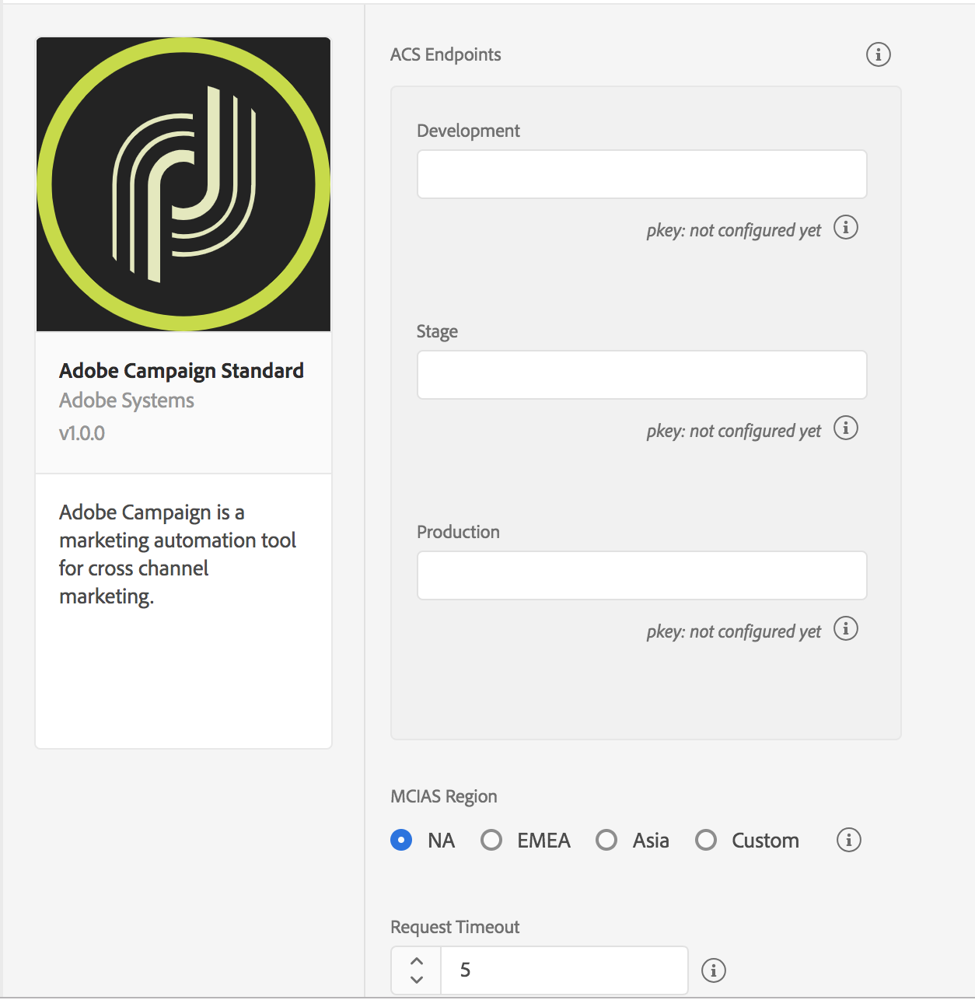

# Adobe Campaign Standard


**Before** you install or configure the Campaign Standard extension, read [_Getting Started_](../../getting-started/create-a-mobile-property.md) and [Configuring a mobile application using Adobe Experience Platform SDKs](https://helpx.adobe.com/campaign/kb/configuring-app-sdk.html).



If you participated in the Campaign Standard beta, to use the new Campaign Standard extension, go to [launch.adobe.com](https://launch.adobe.com), instead of the Experience Platform Launch integration environment, .


## Configure the Campaign Standard extension in Experience Platform Launch

1. In Experience Platform Launch, click the **Extensions** tab.
2. On the **Catalog** tab, locate the **Adobe Campaign Standard** extension, and click **Install**.
3. Provide the extension settings.
4. Click **Save**.
5. Follow the publishing process to update SDK configuration.

### Configure the Campaign Standard extension



#### Campaign Standard endpoints

Provide endpoint URL\(s\) for your Campaign Standard instances. You can specify up to three unique endpoints for your development, staging, and production environments. In most cases, the server endpoint is the root URL address, for example, `companyname.campaign.adobe.com`.


For this extension, these endpoint URLs should be typed in **without** the `http://` or `https://.`and **cannot** end with a forward slash.


#### pKey

A unique, auto-generated identifier for a mobile app that was configured in Adobe Campaign Standard. After you configured this extension in Experience Platform Launch, configure your Launch mobile property in Campaign Standard. For more information, see [Setting up your Adobe Launch application in Adobe Campaign](https://helpx.adobe.com/campaign/kb/configuring-app-sdk.html#SettingupyourAdobeLaunchapplicationinAdobeCampaign).

When the configuration in Campaign is successful, the pKey is automatically generated, as per the Campaign Standard instance and configured in Experience Platform Launch Campaign extension for successful validation.

#### MCIAS region

Select an MCIAS region based on your customer's location or enter a custom endpoint. The SDK retrieves all in-app messaging rules and definition payloads from this endpoint.


For this extension, the custom MCIAS endpoint URL should be typed in **without** the `http://` or `https://` and **cannot** end with a forward slash.


#### Request timeout

Time in seconds to wait for a response from the in-app messaging service before timing out. The default timeout value is 5 seconds, and the minimum timeout value is 1 second.


The **Request Timeout** value must be a non-zero number.


## Add the Campaign Standard extension to your app

Remember the following information when you add the Campaign extension to your app:

| Extension | Information |
| :--- | :--- |


| Campaign Standard | This Campaign Standard extension requires the [Mobile Core](https://aep-sdks.gitbook.io/docs/using-mobile-extensions/mobile-core), [Profile](https://aep-sdks.gitbook.io/docs/using-mobile-extensions/profile), [Lifecycle](https://aep-sdks.gitbook.io/docs/using-mobile-extensions/mobile-core/lifecycle), and [Signal](https://aep-sdks.gitbook.io/docs/using-mobile-extensions/mobile-core/signals) extensions. You should always ensure that you get the latest version of the extension. |
| :--- | :--- |


| Profile | The Profile extension is required for In-App trigger frequencies to work accurately. For more information, see [Profile](https://aep-sdks.gitbook.io/docs/using-mobile-extensions/profile). |
| :--- | :--- |


| Signal | The Signal extension is required for all postback rules to work. For more information, see [Signal](https://aep-sdks.gitbook.io/docs/using-mobile-extensions/mobile-core/signals). |
| :--- | :--- |


<table>
  <thead>
    <tr>
      <th style="text-align:left">Lifecycle</th>
      <th style="text-align:left">
        <p>Lifecycle extension is required for a profile to get registered in Campaign.
          You also need to implement Lifecycle APIs. For more information, see</p>
        <p><a href="https://aep-sdks.gitbook.io/docs/using-mobile-extensions/mobile-core/lifecycle/lifecycle-extension-in-android">Lifecycle extension in Android</a> or
          <a
          href="https://aep-sdks.gitbook.io/docs/using-mobile-extensions/mobile-core/lifecycle/lifecycle-extension-in-ios">Lifecycle extension in iOS</a>.</p>
      </th>
    </tr>
  </thead>
  <tbody></tbody>
</table>
The instructions to add these extensions to your mobile app are also available in Experience Platform Launch. To access the installation dialog box, open your mobile property, click the **Environments** tab, and click **Install**.




1. Add the Campaign Standard, [Mobile Core](https://aep-sdks.gitbook.io/docs/using-mobile-extensions/mobile-core) and [Profile](https://aep-sdks.gitbook.io/docs/using-mobile-extensions/profile) extensions to your project using the app's Gradle file.

```java
implementation 'com.adobe.marketing.mobile:campaign:1.+'
implementation 'com.adobe.marketing.mobile:userprofile:1.+'
implementation 'com.adobe.marketing.mobile:sdk-core:1.+'
```

1. Import the Campaign Standard, [Mobile Core](https://aep-sdks.gitbook.io/docs/using-mobile-extensions/mobile-core), [Profile](https://aep-sdks.gitbook.io/docs/using-mobile-extensions/profile), [Lifecycle](https://aep-sdks.gitbook.io/docs/using-mobile-extensions/mobile-core/lifecycle), and [Signal](https://aep-sdks.gitbook.io/docs/using-mobile-extensions/mobile-core/signals) extensions in your application's main activity.

```java
import com.adobe.marketing.mobile.AdobeCallback;
import com.adobe.marketing.mobile.Campaign;
import com.adobe.marketing.mobile.Identity;
import com.adobe.marketing.mobile.Lifecycle;
import com.adobe.marketing.mobile.MobileCore;
import com.adobe.marketing.mobile.Signal;
import com.adobe.marketing.mobile.UserProfile;
```


To complete a manual installation, go to the [Adobe Experience Platform SDKs for Android GitHub](https://github.com/Adobe-Marketing-Cloud/acp-sdks/tree/master/android) repo, fetch the Mobile Core, Campaign Standard, Profile, Lifecycle, and Signal artifacts, and complete the steps in the [Manual installation](https://github.com/Adobe-Marketing-Cloud/acp-sdks/blob/master/README.md#manual-installation) section.




1. Add the Campaign Standard, [Mobile Core](https://aep-sdks.gitbook.io/docs/using-mobile-extensions/mobile-core) and [Profile](https://aep-sdks.gitbook.io/docs/using-mobile-extensions/profile) extensions to your project using Cocoapods.



To complete a manual installation, go to the [Adobe Experience Platform SDKs for iOS GitHub](https://github.com/Adobe-Marketing-Cloud/acp-sdks/tree/master/iOS) repo, fetch the Mobile Core, Campaign Standard, Profile, Lifecycle, and Signal artifacts, and complete the steps in the [Manual installation](https://github.com/Adobe-Marketing-Cloud/acp-sdks/blob/master/README.md#manual-installation-1) section.


1. In Xcode, import the Mobile Core, Campaign Standard, Profile, Lifecycle, and Signal extensions:

#### Objective-C

```objectivec
#import "ACPCore.h"
#import "ACPCampaign.h"
#import "ACPUserProfile.h"
#import "ACPIdentity.h"
#import "ACPLifecycle.h"
#import "ACPSignal.h"
```

#### Swift

```swift
import ACPCore
import ACPCampaign
import ACPUserProfile
```



You'll need to install the SDK with [npm](https://www.npmjs.com/) and configure the native Android/iOS project in your react native project. Before installing the Campaign Standard extension, you'll need to install the [Core](../mobile-core/) extension. Follow these steps to get started:

#### Create React Native Project

```bash
react-native init MyReactApp
```

#### Install JavaScript packages

Install and link the @adobe/react-native-acpcampaign package:

```bash
npm install @adobe/react-native-acpcampaign
react-native link @adobe/react-native-acpcampaign
```

#### Import the extension

```bash
import {ACPCampaign} from '@adobe/react-native-acpcampaign';
```



### Register the Campaign Standard extension with Mobile Core



#### **Java**

1. In your app's `OnCreate` method, register the Campaign, Identity, Signal, and Lifecycle extensions:

```java
public class CampaignTestApp extends Application {

    @Override
    public void onCreate() {
        super.onCreate();
        MobileCore.setApplication(this);
        MobileCore.setLogLevel(LoggingMode.DEBUG);

        try {
            Campaign.registerExtension();
            UserProfile.registerExtension();
            Identity.registerExtension();
            Lifecycle.registerExtension();
            Signal.registerExtension();
            MobileCore.start(new AdobeCallback () {
                @Override
                public void call(Object o) {
                    MobileCore.configureWithAppID("launch-EN2c0ccd3a457a4c47b65a6b085e269c91-staging");
                }
            });
        } catch (InvalidInitException e) {
            Log.e("CampaignTestApp", e.getMessage());
        }

    }
}
```

For more information about starting Lifecycle, see [Lifecycle extension in Android](https://aep-sdks.gitbook.io/docs/using-mobile-extensions/mobile-core/lifecycle/lifecycle-extension-in-android).



1. In your app's `application:didFinishLaunchingWithOptions:` method, register the Campaign, Identity, Signal, and Lifecycle extensions:

#### Objective-C

```objectivec
- (BOOL)application:(UIApplication *)application didFinishLaunchingWithOptions:(NSDictionary *)launchOptions {
    [ACPCore setLogLevel:ACPMobileLogLevelDebug];
    [ACPCore configureWithAppId:@"launch-EN2c0ccd3a457a4c47b65a6b085e269c91-staging"];

    [ACPCampaign registerExtension];
    [ACPUserProfile registerExtension];
    [ACPIdentity registerExtension];
    [ACPLifecycle registerExtension];
    [ACPSignal registerExtension];
    [ACPCore start:^{
        [ACPCore lifecycleStart:nil];
    }];
  // Override point for customization after application launch.
  return YES;
}
```

#### Swift

```swift
func application(_ application: UIApplication, didFinishLaunchingWithOptions launchOptions: [UIApplication.LaunchOptionsKey: Any]?) -> Bool {
       ACPCore.setLogLevel(.debug)
    ACPCore.configure(withAppId: "launch-EN2c0ccd3a457a4c47b65a6b085e269c91-staging")

    ACPCampaign.registerExtension()
    ACPUserProfile.registerExtension()
    ACPIdentity.registerExtension()
    ACPLifecycle.registerExtension()
    ACPSignal.registerExtension()
    ACPCore.start {
        ACPCore.lifecycleStart(nil)
    }

  return true;
}
```

For more information about starting Lifecycle, see [Lifecycle extension in iOS](https://aep-sdks.gitbook.io/docs/using-mobile-extensions/mobile-core/lifecycle/lifecycle-extension-in-ios).



To register the Campaign Standard with Core, use the following API:

#### JavaScript

```javascript
ACPCampaign.registerExtension();
```



### Initialize the SDK and set up tracking

To initialize the SDK and set up tracking, see [Initialize the SDK and set up tracking](https://app.gitbook.com/@aep-sdks/s/docs/~/edit/drafts/-Lk5p1L7rNsNumKjjTRf/getting-started/initialize-the-sdk).

### Set up in-app messaging


Need help creating an in-app message using Adobe Campaign? For more information, see [Preparing and sending an In-App message](https://helpx.adobe.com/campaign/standard/channels/using/preparing-and-sending-an-in-app-message.html).



If you are developing an Android application, to correctly display fullscreen in-app messages, add the Campaign Standard extension's `FullscreenMessageActivity` to your AndroidManifest.xml file:

```markup
<activity android:name="com.adobe.marketing.mobile.FullscreenMessageActivity" />
```

In addition to adding the `FullscreenMessageActivity`, a global lifecycle callback must be defined in your app's MainActivity to ensure the proper display of fullscreen in-app messages. To define the global lifecycle callback, see [Implementing Global Lifecycle Callbacks](https://aep-sdks.gitbook.io/docs/using-mobile-extensions/mobile-core/lifecycle/lifecycle-extension-in-android#implementing-global-lifecycle-callbacks).


### Set up local notifications

To set up local notifications in Android, update the AndroidManifext.xml file with `<receiver android:name="com.adobe.marketing.mobile.LocalNotificationHandler"/>`. To configure the notification icons to use the Mobile Core APIs, see [Configuring notification icons](https://aep-sdks.gitbook.io/docs/using-mobile-extensions/adobe-analytics-mobile-services#configuring-notification-icons).

### Set up push messaging


Need help creating a push notification using Adobe Campaign? For more information, see [Preparing and sending a push notification](https://helpx.adobe.com/campaign/standard/channels/using/preparing-and-sending-a-push-notification.html).




To obtain the registration ID/token, see [Firebase Cloud Messaging \(FCM\) APIs](https://firebase.google.com/docs/cloud-messaging/android/client).




iOS simulators do not support push messaging.


To obtain the registration ID/token, see [Configuring Remote Notification Support](https://developer.apple.com/library/archive/documentation/NetworkingInternet/Conceptual/RemoteNotificationsPG/HandlingRemoteNotifications.html#//apple_ref/doc/uid/TP40008194-CH6-SW1).



Follow instructions in the Android/iOS tabs to set up platform-specific push configuration and use the following API in your React Native project:



## Deleting mobile properties in Experience Platform Launch


Deleting your property in Experience Platform Launch might cause disruption to your recurring push and in-app messaging activities.


If you delete your mobile property in Experience Platform Launch, review your mobile property status in Campaign Standard and ensure that the property displays an updated **Deleted in Launch** status. For more information about deleting a property, see [Delete a Property](https://docs.adobelaunch.com/launch-reference/administration/companies-and-properties#delete-a-property).

To remove the corresponding mobile app in Campaign Standard, click **Remove from ACS**. For more information, see [Deleting your Adobe Launch mobile application](https://helpx.adobe.com/campaign/kb/configuring-app-sdk.html#DeletingyourAdobeLaunchapplication).


Deleting your mobile property in Experience Platform Launch does not automatically delete your Campaign Standard mobile app.


