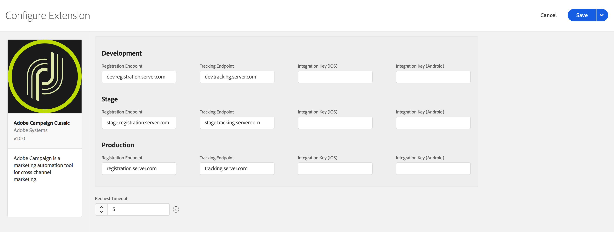

# Adobe Campaign Classic

## Configure Campaign Classic extension in the Data Collection UI

1. In the Data Collection UI, click the **Extensions** tab.
2. On the **Catalog** tab, locate the **Adobe Campaign Classic** extension, and click **Install**.
3. Type in the settings for your extension.
4. Click **Save**.
5. Complete the publishing process to update the SDK configuration.

   For more information about publishing, see the [publishing overview](https://experienceleague.adobe.com/docs/launch/using/publish/overview.html).

### Configure Campaign Classic extension




You can retrieve your Campaign Classic registration or tracking endpoint URLs in the Campaign Classic interface under the **Tools > Advanced > Deployment wizard** menu. The endpoint for push notifications is usually the same as the URL that is used for web forms and surveys.


#### Registration endpoints

Type the registration endpoint URL(s) for your Campaign Classic instances. You can specify up to three unique endpoints for your development, staging, and production environments.


For this extension, the registration endpoint URLs should be entered **without** a prefixing `https://.`


#### Tracking endpoints

Type the tracking endpoint URL(s) for your Campaign Classic instances. Like the registration URLs, you can specify up to three unique endpoints for your development, staging, and production environments.


For this extension, the tracking endpoint URLs should be entered **without** a prefixing `https://.`


#### Integration key (iOS)

You can specify up to three unique iOS integration keys for your development, staging, and production environments. iOS integration keys are generated after creating a service that contains iOS applications using the [Campaign Classic client console](https://experienceleague.adobe.com/docs/campaign-classic/using/installing-campaign-classic/connect-to-campaign/installing-the-client-console.html). For more information on where to find the integration key, see the tutorial on [configuring the mobile application in Adobe Campaign](https://experienceleague.adobe.com/docs/campaign-classic/using/sending-messages/sending-push-notifications/configure-the-mobile-app/configuring-the-mobile-application.html).

#### Integration key (Android)

You can specify up to three unique Android integration keys for your development, staging, and production environments. Android integration keys are generated after creating a service that contains Android applications using the [Campaign Classic client console](https://experienceleague.adobe.com/docs/campaign-classic/using/installing-campaign-classic/connect-to-campaign/installing-the-client-console.html). For more information on where to find the integration key, see the tutorial on [configuring the mobile application in Adobe Campaign](https://experienceleague.adobe.com/docs/campaign-classic/using/sending-messages/sending-push-notifications/configure-the-mobile-app/configuring-the-mobile-application-android.html).

#### Request timeout

The request timeout is the amount of time, in seconds, to wait for a response from the registration or tracking endpoint before timing out. The SDK default timeout value is 30 seconds.

## Add Campaign Classic to your app



#### Java

1. Add the Campaign Classic extension to your project using the app's Gradle file.

   ```java
   implementation 'com.adobe.marketing.mobile:campaignclassic:1.+'
   ```

2. Import the Campaign Classic and Lifecycle extensions in your application's main activity.

   ```java
   import com.adobe.marketing.mobile.CampaignClassic;
   import com.adobe.marketing.mobile.Lifecycle;
   ```




Adobe Campaign Classic has not yet been released as an AEP 3.x Swift extension. Please reach out to your Adobe customer account manager if you have any questions or would like to express interest in the AEP 3.x Campaign Classic extension.




1. Add the Campaign Classic and [Mobile Core](../../foundation-extensions/mobile-core/) libraries to your project.

   You can add the following pods to your `Podfile`:

   ```text
   pod 'ACPCampaignClassic'
   pod 'ACPLifecycle'
   pod 'ACPCore'
   ```

   or you can manually include the [Mobile Core](https://github.com/Adobe-Marketing-Cloud/acp-sdks/releases/tag/v1.0.1-ACPCore) and [Campaign Classic](https://github.com/Adobe-Marketing-Cloud/acp-sdks/releases/tag/v1.0.0-ACPCampaignClassic) libraries found in Github.

2. In the Xcode project, import the Mobile Core and Campaign Classic extensions:

**Swift**

```swift
   import ACPCore
   import ACPCampaignClassic
   import ACPLifecycle
```

**Objective-C**

```objectivec
   #import "ACPCore.h"
   #import "ACPCampaignClassic.h"
   #import "ACPLifecycle.h"
```




### Register Campaign Classic with Mobile Core



In your app's `OnCreate` method, register the Campaign Classic and Lifecycle extensions:

```java
public class CampaignClassicTestApp extends Application {

    @Override
    public void onCreate() {
        super.onCreate();
        MobileCore.setApplication(this);
        MobileCore.setLogLevel(LoggingMode.VERBOSE);

        try {
            CampaignClassic.registerExtension();
            Lifecycle.registerExtension();
            MobileCore.start(null);
        } catch (Exception e) {
            Log.e("CampaignClassicTestApp", e.getMessage());
        }

    }
}
```




Adobe Campaign Classic has not yet been released as an AEP 3.x Swift extension. Please reach out to your Adobe customer account manager if you have any questions or would like to express interest in the AEP 3.x Campaign Classic extension.




In your app's `application:didFinishLaunchingWithOptions:` method, register the Campaign Classic and Lifecycle extensions:

#### Swift

```swift
func application(_ application: UIApplication, didFinishLaunchingWithOptions launchOptions: [UIApplication.LaunchOptionsKey: Any]?) -> Bool {
   ACPCampaignClassic.registerExtension();
   ACPLifecycle.registerExtension();
  // Override point for customization after application launch.
  return true;
}
```

#### Objective-C

```objectivec
- (BOOL)application:(UIApplication *)application didFinishLaunchingWithOptions:(NSDictionary *)launchOptions {
    [ACPCampaignClassic registerExtension];
    [ACPLifecycle registerExtension];
  // Override point for customization after application launch.
  return YES;
}
```



## Configuration keys

To update SDK configuration programmatically, use the following information to change your Campaign Classic configuration values. For more information, see the [Configuration API reference](https://aep-sdks.gitbook.io/docs/using-mobile-extensions/mobile-core/configuration/configuration-api-reference).

| Key | Required | Description | Data Type |
| :--- | :--- | :--- | :--- |
| `build.environment` | Yes | Specifies which environment to use (prod, dev, or staging) when sending registration and tracking information. It is also used to specify which mobile app integration key to use. | String |
| `campaignclassic.timeout` | No | Specifies the amount of time to wait for a response from the Campaign Classic registration or tracking server. | Integer |
| `campaignclassic.marketingServer` | Yes | Sets the marketing server, which receives registration requests. | String |
| `campaignclassic.trackingServer` | Yes | Sets the tracking server, which receives tracking requests. | String |
| `campaignclassic.ios.integrationKey` | Yes | Sets the iOS mobile app integration key, which links the app to an iOS application campaign in Campaign Classic. | String |
| `campaignclassic.android.integrationKey` | Yes | Sets the Android mobile app integration key, which links the app to an Android application campaign in Campaign Classic. | String |

