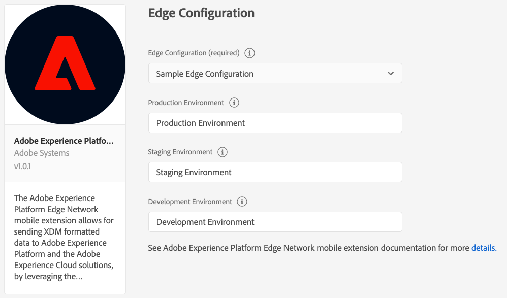

# Adobe Edge

## Configure the Adobe Experience Platform Edge Network extension in Experience Platform Launch

1. In Experience Platform Launch, in your mobile property, click the **Extensions** tab.
2. On the **Catalog** tab, locate or search for the **Adobe Experience Platform Edge Network** extension, and click **Install**.
3. Type the extension settings. For more information, see [Configure the AEP Edge Network extension](./).
4. Click **Save**.
5. Follow the publishing process to update SDK configuration.

### Configure the AEP Edge Network extension



#### Edge Configuration

Select the `Edge Configuration` from the drop-down list. Once you do that, the Production, Staging and Development Environments will be automatically prefilled. If no Edge configuration was created before, see [Set up the Edge Configuration](../../getting-started/edge-configuration.md).

If you use multiple Development configurations, select the desired one from the `Development Environment` drop-down.

The Edge configuration used by the client-side implementation is one of the followings:

* the `Production Environment` configuration when the Launch library is published to production \(in the Published column in the Launch publishing flow\).
* the`Staging Environment` configuration when the Launch library is published to staging \(in the Submitted column in the Launch publishing flow\).
* the `Developement Environment` configuration when the Launch library is in development.

## Add the AEP Edge extension to your app

### Download and import the Edge extension



### Java

1. Add the Mobile Core and Edge extensions to your project using the app's Gradle file.

   ```java
   implementation 'com.adobe.marketing.mobile:sdk-core:1.+'
   implementation 'com.adobe.marketing.mobile:edge:1.+'
   ```

2. Import the Mobile Core and Edge extensions in your application class.

   ```java
    import com.adobe.marketing.mobile.*;
   ```



1. Add the Mobile Core and Edge extensions to your project using Cocoapods. Add following pods in your `Podfile`:

   ```swift
   use_frameworks!
   target 'YourTargetApp' do
       pod 'AEPCore'
       pod 'AEPLifecycle'
       pod 'AEPIdentity'
       pod 'AEPSignal'
       pod 'AEPEdge'
   end
   ```

2. Import the Mobile Core and Edge libraries:

### Swift

```swift
// AppDelegate.swift
import AEPCore
import AEPEdge
import AEPIdentity
import AEPLifecycle
import AEPSignal
```

### Objective-C

```text
// AppDelegate.h
@import AEPCore;
@import AEPEdge;
@import AEPIdentity;
@import AEPLifecycle;
@import AEPSignal;
```



### Register Edge with Mobile Core



### Java

```java
public class MobileApp extends Application {

    @Override
    public void onCreate() {
        super.onCreate();
      MobileCore.setApplication(this);
      MobileCore.configureWithAppID("yourAppId");

      try {
        Edge.registerExtension(); //Register Edge with Mobile Core
        Identity.registerExtension();
        Lifecycle.registerExtension();
        Signal.registerExtension();
        MobileCore.start(new AdobeCallback() {
          @Override
          public void call(final Object o) {
            // processing after start
          }});
      } catch (Exception e) {
        //Log the exception
      }
    }
}
```



### Swift

```swift
// AppDelegate.swift
func application(_ application: UIApplication, didFinishLaunchingWithOptions launchOptions: [UIApplication.LaunchOptionsKey: Any]?) -> Bool {
    MobileCore.registerExtensions([Lifecycle.self, Identity.self, Signal.self, Edge.self], {
    MobileCore.configureWith(appId: "yourAppId")
  })
  ...
}
```

### Objective-C

```text
// AppDelegate.m
- (BOOL)application:(UIApplication *)application didFinishLaunchingWithOptions:(NSDictionary *)launchOptions {
    [AEPMobileCore registerExtensions:@[AEPMobileIdentity.class, AEPMobileLifecycle.class, AEPMobileSignal.class, AEPMobileEdge.class] completion:^{
    ...
  }];
  [AEPMobileCore configureWithAppId: @"yourAppId"];
  ...
}
```



## Configuration keys

To update the SDK configuration programmatically, use the following information to change the Edge configuration values.

| Key | Required | Description | Data Type |
| :--- | :--- | :--- | :--- |
| edge.configId | Yes | See [Edge Configuration](./#edge-configuration). | String |

## What OS & platform versions are supported?

* Android versions 4.4 or later \(API levels 19 or later\)
* iOS versions 10 or later

