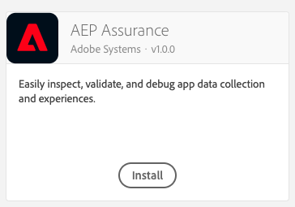

# Adobe Experience Platform Assurance

This extension enables capabilities for [Project Griffon](../../beta/project-griffon/).


Project Griffon is a beta product. To use it, you must accept the terms on [https://experience.adobe.com/griffon](https://experience.adobe.com/griffon).


To get started with [Project Griffon](../../beta/project-griffon/) in your app, you'll need to:

1. Install the Assurance extension in Experience Platform Launch
2. Add AEPAssurance SDK extension library to your app
   1. Import AEPAssurance into your app
   2. Register and implement extension APIs

## Install the Assurance extension in Experience Platform Launch

Follow these steps to add the install the extension in Experience Platform Launch:

1. In Experience Platform Launch, click the **Extensions** tab.
2. On the **Catalog** tab, locate the **AEP Assurance** extension, and click **Install**.
3. Follow the publishing process to update SDK configuration.



## Add AEPAssurance to your app

### Import the library to your app code



**Java**

1. Add the following libraries in your project's `build.gradle` file:

   ```java
   implementation 'com.adobe.marketing.mobile:core:1+'
   implementation 'com.adobe.marketing.mobile:assurance:1+'
   ```

2. Import the Project Griffon libraries with the other SDK libraries:

   ```java
   import com.adobe.marketing.mobile.Assurance; 
   import com.adobe.marketing.mobile.MobileCore;
   ```



Add the library to your project via your [Cocoapods](https://cocoapods.org/pods/AEPAssurance) `Podfile`

```text
pod 'ACPCore'
pod 'AEPAssurance'
```

Import the Project Griffon libraries along with other SDK libraries:

#### Objective-C

```objectivec
#import "ACPCore.h"
#import "AEPAssurance.h" // <-- import the AEPAssurance library
```

#### Swift

```swift
import ACPCore
import AEPAssurance // <-- import the AEPAssurance library
```



#### React Native


Updated support for React Native is coming. This section will be updated shortly.




#### Dart

Flutter install instructions for AEPAssurance can be found [here](https://pub.dev/packages/flutter_assurance/install).



#### Cordova


Updated support for Cordova is coming. This section will be updated shortly.




#### C\#


Updated support for Unity is coming. This section will be updated shortly.




#### C\#


Updated support for Xamarin is coming. This section will be updated shortly.




### Register AEPAssurance with Mobile Core



Registering the extension with Core, sends Experience Platform SDK events to an active Project Griffon session. To start using the extension library, you must first register the extension with the [Mobile Core](https://aep-sdks.gitbook.io/docs/using-mobile-extensions/mobile-core) extension.

#### Java

1. Register the extension when you register other extensions.

   ```java
     public class MobileApp extends Application {
      @Override
      public void onCreate() {
         super.onCreate();
         MobileCore.setApplication(this);
         MobileCore.configureWithAppId("yourAppId");
         try {
            Assurance.registerExtension();
            MobileCore.start(null);
         } catch (Exception e) {
            // Log the exception
         }
      }
     }
   ```



Registering the extension with Core sends Experience Platform SDK events to an active Project Griffon session. To start using the extension library, you must first register the extension with the [Mobile Core](https://aep-sdks.gitbook.io/docs/using-mobile-extensions/mobile-core) extension.

#### Objective-C

```objectivec
- (BOOL)application:(UIApplication *)application didFinishLaunchingWithOptions:(NSDictionary *)launchOptions {
    [ACPCore configureWithAppId:@"yourAppId"];
    [AEPAssurance registerExtension]; // <-- register AEPAssurance with Core
    [ACPCore start:nil];
    // Override point for customization after application launch.
    return YES;
 }
```

#### Swift

```swift
func application(_ application: UIApplication, didFinishLaunchingWithOptions launchOptions: [UIApplication.LaunchOptionsKey: Any]?) -> Bool {
     ACPCore.configure(withAppId: "yourAppId")   
     AEPAssurance.registerExtension() // <-- register AEPAssurance with Core
     ACPCore.start(nil)
     // Override point for customization after application launch. 
     return true;
}
```




Updated support for React Native is coming. This section will be updated shortly.




When using Flutter, registering AEPAssurance with Mobile Core should be done in native code which is shown under the Android and iOS tabs.




Updated support for Cordova is coming. This section will be updated shortly.


When using Cordova, registering AEPAssurance with Mobile Core must be done in native code which is shown under the Android and iOS tabs.



#### C\#


Updated support for Unity is coming. This section will be updated shortly.





Updated support for Xamarin is coming. This section will be updated shortly.




### Implement AEPAssurance session start APIs \(iOS only\)

The `startSession` API needs to be called to begin a Project Griffon session. When called, SDK displays a PIN authentication overlay to begin a session.


You may call this API when the app launches with a url \(see code snippet below for sample usage\)




### startSession

#### Objective-C

#### Syntax

```objectivec
+ (void) startSession: (NSURL* _Nonnull) url;
```

#### Example

```objectivec
- (BOOL)application:(UIApplication *)app openURL:(nonnull NSURL *)url options:(nonnull NSDictionary<UIApplicationOpenURLOptionsKey,id> *)options {
    [AEPAssurance startSession:url];
    return false;
}
```

In iOS 13 and later, for a scene-based application, use the `UISceneDelegate`'s `scene(_:openURLContexts:)` method as follows:

```objectivec
- (void) scene:(UIScene *)scene openURLContexts:(NSSet<UIOpenURLContext *> *)URLContexts {
    UIOpenURLContext * urlContext = URLContexts.anyObject;
    if (urlContext != nil) {
        [AEPAssurance startSession:urlContext.URL];
    }
}
```

#### Swift

#### Example

```swift
func application(_ app: UIApplication, open url: URL, options: [UIApplication.OpenURLOptionsKey : Any] = [:]) -> Bool {
    do {
        AEPAssurance.startSession(url)
        return false
    }
}
```

In iOS 13 and later, for a scene-based application, use the `UISceneDelegate`'s `scene(_:openURLContexts:)` method as follows:

```swift
func scene(_ scene: UIScene, openURLContexts URLContexts: Set<UIOpenURLContext>) {
        AEPAssurance.startSession((URLContexts.first!).url)
}
```



