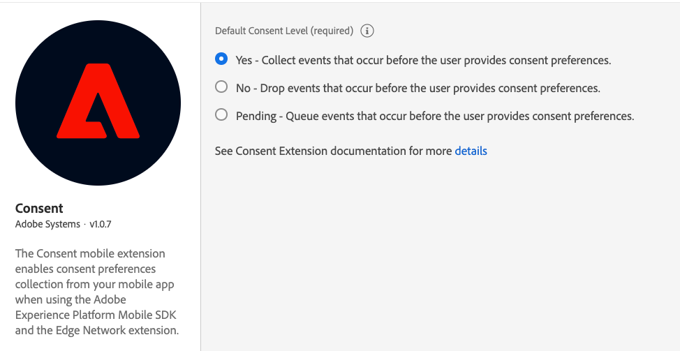

# Adobe Experience Platform Messaging

The Adobe Experience Platform Messaging mobile extension allows you to send push notification tokens and push notification click-through feedback to the Adobe Experience Platform.


The Adobe Experience Platform Messaging extension is currently in Beta development.


## Prerequisites

* IMS organization is enabled for messaging.
* [Mobile Core](../mobile-core/README.md) and [Adobe Experience Platform Edge Network](../adobe-edge/README.md) extensions have been implemented in the app.

## Configure Profile Dataset in Edge Configuration
1. Follow the [edge configuration](../../getting-started/edge-configuration.md) document to configure edge.
2. In the screen below update the **Profile Dataset** with the `CJM Push Profile Dataset`

3. Hit **Save**.

## Configure the Adobe Experience Platform Messaging extension in Experience Platform Launch

1. In Experience Platform Launch, in your mobile property, click the **Extensions** tab.
2. On the **Catalog** tab, locate or search for the **Adobe Experience Platform - Messaging** extension, and click **Install**.
3. Select the **Event Dataset** for Production, Stage and Development Environments. The datasets selected should use a schema that uses the Push Notification Tracking mixin. For more information, see [Setup Schemas & Datasets](../../getting-started/configure-schema-and-dataset.md).
4. Click **Save**.
5. Follow the publishing process to update SDK configuration.


## Configure Application Configuration
1. In Experience Platform Launch, click the **App Configurations** tab on the left pane.
2. Click the **Add App Configuration** button.
3. Provide a **Name** and select the **Messaging Service Type**





4. Provide the **App ID (Android package name)**. Usually the package name is the app id in your `build.gradle` file.
5. Drag and drop the FCM push credentials. For more details on how to get the push credentials follow [this](https://firebase.google.com/docs/admin/setup#initialize-sdk).
 






4. Provide the **App ID (iOS Bundle ID)**. Bundle Id can be found in the `General` tab of the primary target in **XCode**.
5. Drag and drop the **Apple Push Notification Authentication Key** for your Apple developer account. This key can be acquired from the **Certificates, Identifiers & Profiles** page. 
6. Provide the **Key ID**. This is a 10 character string assigned during the creation of p8 auth key. It can be found under **Keys** tab in **Certificates, Identifiers & Profiles** page.
7. Provide the **Team ID**. This is a string value which can be found under the Membership tab.


For more information follow this [link](https://help.apple.com/developer-account/#/deva05921840)




## Configure the application to allow push notification 


To add Firebase Messaging Service to your app please follow the [link](https://firebase.google.com/docs/cloud-messaging/android/client)




To add APNs to your app please follow the [link](https://developer.apple.com/documentation/usernotifications/registering_your_app_with_apns)




## Add the AEP Messaging extension to your application

### Download and import the Messaging extension




### Java

1. Add the Mobile Core, Edge and Messaging extensions to your project using the app's Gradle file.

   ```java
   implementation 'com.adobe.marketing.mobile:core:1.+'
   implementation 'com.adobe.marketing.mobile:edge:1.+'
   implementation 'com.adobe.marketing.mobile:edgeidentity:1.+'
   implementation 'com.adobe.marketing.mobile:messaging:1.+'
   ```

2. Import the Mobile Core Edge and Messaging extensions in your application class.

   ```java
    import com.adobe.marketing.mobile.*;
   ```






1. Add the Mobile Core, Edge and Messaging extensions to your project using Cocoapods. Add following pods in your `Podfile`:

   ```swift
   use_frameworks!
   target 'YourTargetApp' do
       pod 'AEPCore'
       pod 'AEPEdge'
       pod 'AEPEdgeIdentity'
       pod 'AEPMessaging'
   end
   ```

2. Import the Mobile Core, Edge and Messaging libraries:

### Swift

```swift
// AppDelegate.swift
import AEPCore
import AEPEdge
import AEPEdgeIdentity
import AEPMessaging
```

### Objective-C

```text
// AppDelegate.h
@import AEPCore;
@import AEPEdge;
@import AEPEdgeIdentity;
@import AEPMessaging;
```




### Register Messaging extensions with Mobile Core




### Java

```java
public class MobileApp extends Application {
    @Override
    public void onCreate() {
      super.onCreate();
      MobileCore.setApplication(this);
      MobileCore.configureWithAppID("yourLaunchEnvironmentID");
      try {
        Edge.registerExtension();
        Identity.registerExtension();
        AEPMessaging.registerExtension(); // register Messaging
        MobileCore.start(new AdobeCallback() {
          @Override
          public void call(final Object o) {
            // processing after start
          }});
      } catch (Exception e) {
        //Log the exception
      }
    }
}
```





### Swift

```swift
// AppDelegate.swift
func application(_ application: UIApplication, didFinishLaunchingWithOptions launchOptions: [UIApplication.LaunchOptionsKey: Any]?) -> Bool {
    MobileCore.registerExtensions([Identity.self, Edge.self, AEPMessaging.self], {
    	MobileCore.configureWith(appId: "yourLaunchEnvironmentID")
    })
  ...
}
```

### Objective-C

```objective-c
// AppDelegate.m
- (BOOL)application:(UIApplication *)application didFinishLaunchingWithOptions:(NSDictionary *)launchOptions {
    [AEPMobileCore registerExtensions:@[AEPMobileEdgeIdentity.class, AEPMobileEdge.class, AEPMobileMessaging.class] completion:^{
    [AEPMobileCore configureWithAppId: @"yourLaunchEnvironmentID"];
  }];
  ...
}
```




## Configuration keys
To update the SDK configuration programmatically, use the following information to change the Messaging configuration values.

| Key             | Required | Description                                                  | Data Type           | Platform         |
| :-------------- | :------- | :----------------------------------------------------------- | :------------------ | :---------------- |
| messaging.eventDataset | Yes       | Experience Event Dataset Id which can be found from experience platform | String | Android/iOS |
| messaging.useSandbox | No       | See more details [here](https://github.com/adobe/aepsdk-messaging-ios/blob/dev/Documentation/SetupSDK.md#using-apnssandbox-environment-for-push-notification) | Boolean | iOS |


## What OS & platform versions are supported?

* Android versions 4.4 or later \(API levels 19 or later\)
* iOS versions 10 or later