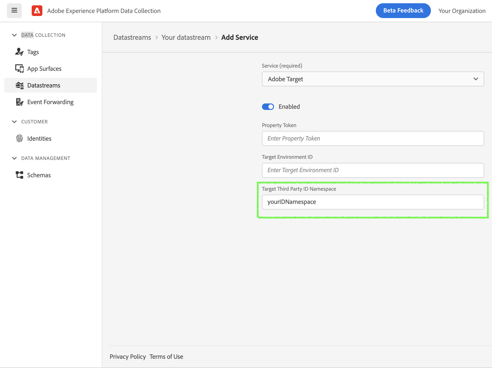

# Adobe Journey Optimizer - Decisioning Extension

The Adobe Journey Optimizer - Decisioning extension powers real-time personalization workflows using Adobe Journey Optimizer - Offer Decisions or Adobe Target in mobile apps via the Edge Network. It helps deliver personalized decisions to your app and enables tracking user interactions with the proposed decisions.

## Prerequisites

Before starting, make sure the following steps are completed.

* Your IMS organization is provisioned for Edge decisioning. 
* If using Adobe Target, Target activities are set up in your organization/ workspace on Target UI. For more details, see [Target activities guide](https://experienceleague.adobe.com/docs/target/using/activities/target-activities-guide.html?lang=en).
* If using Journey Optimizer - Offer Decisions, Decisions are set up in your organization/ sandbox on Experience Platform UI. For more details, see [Create Decisions](https://experienceleague.adobe.com/docs/offer-decisioning/using/create-manage-activities/create-offer-activities.html?lang=en).

## Adobe Experience Platform Data Collection setup

### Configure the Datastream for Adobe Target and/ or Journey Optimizer - Offer Decisions

On [Experience Platform Data Collection](https://launch.adobe.com/), navigate to **Data Collection** > **Datatreams** using the left navigation panel. Select an existing datastream or create a new datastream. For more details, see [Configure datastreams](https://aep-sdks.gitbook.io/docs/getting-started/configure-datastreams).

1. In the datastream, click on the desired environment from the list. Make sure **Adobe Experience Platform** section is enabled and configured with the required information like **Sandbox** and **Event Dataset**.
2. For Journey Optimizer - Offer Decisions, navigate to **Adobe Experience Platform** section and enable **Offer Decisioning** checkbox.
3. For Adobe Target, navigate to **Adobe Target** section and enable it. Specify the configuration. Make sure to configure the required information like Client Code.
4. Click **Save**.


### Configure Adobe Journey Optimizer - Decisioning extension in Tag property for Mobile

On [Experience Platform Data Collection](https://launch.adobe.com/), navigate to **Data Collection** > **Tags** using the left navigation panel. Select an existing mobile Tag property or create a new property.

1. In your mobile property, navigate to **Extensions** in the left navigation panel and click on the **Catalog** tab.
2. In the extensions Catalog, search or locate the **Adobe Journey Optimizer - Decisioning** extension, and click **Install*.
3. No extension configuration is necessary so click **Save**.
4. Follow the publishing process to update SDK configuration. For more details, see [Publish the configuration](https://aep-sdks.gitbook.io/docs/getting-started/create-a-mobile-property#publish-the-configuration).


## Integrate Experience Platform Optimize SDK in your mobile application


For AEPOptimize APIs to work properly, it is required that you integrate Mobile Core and Edge extensions as well in your mobile app. For more details see, [Mobile Core](https://aep-sdks.gitbook.io/docs/foundation-extensions/mobile-core) and [Adobe Experience Platform Edge Network](https://aep-sdks.gitbook.io/docs/foundation-extensions/experience-platform-extension).


### Install the Experience Platform Mobile SDK



1. Configure your app target to fetch Mobile Core, Edge, Identity for Edge Network, Optimize from Cocoapods by specifying the following pod dependencies in your `Podfile`.

   ```swift
   platform :ios, '10.0'

   use_frameworks!
   target 'YourAppTarget' do
       pod 'AEPCore'
       pod 'AEPEdge'
       pod 'AEPEdgeIdentity'
       pod 'AEPOptimize'
   end
   ```



### Register the extensions with Mobile Core



#### Swift

```swift
// AppDelegate.swift

import AEPCore
import AEPEdge
import AEPEdgeIdentity
import AEPOptimize

@UIApplicationMain
final class AppDelegate: UIResponder, UIApplicationDelegate {
  var window: UIWindow?

  func application(_ application: UIApplication, didFinishLaunchingWithOptions launchOptions: [UIApplication.LaunchOptionsKey: Any]? = nil) -> Bool {

      // register the extensions
      MobileCore.registerExtensions([Edge.self, AEPEdgeIdentity.Identity.self, Optimize.self]) {
        MobileCore.configureWith(appId: YOUR_ENVIRONMENT_FILE_ID)
      }

      return true
  }
}
```

#### Objective-C

```objc
// AppDelegate.m

@import AEPCore;
@import AEPEdge;
@import AEPEdgeIdentity;
@import AEPOptimize;

- (BOOL)application:(UIApplication *)application didFinishLaunchingWithOptions:(NSDictionary *)launchOptions {

    // register the extensions
    [AEPMobileCore registerExtensions:@[AEPMobileEdge.class, AEPMobileEdgeIdentity.class, , AEPMobileOptimize.class] completion:^{
      [AEPMobileCore configureWithAppId: YOUR_ENVIRONMENT_FILE_ID];
  }];
  ...
}
```



## Adobe Journey Optimizer - Offer Decisions


Some offer constraints are currently not supported with the mobile Experience Edge workflows, for example Capping. The Capping field value specifies the number of times an offer can be presented across all users. For more details, see [Offer eligibility rules and constraints guide](https://experienceleague.adobe.com/docs/offer-decisioning/using/managing-offers-in-the-offer-library/creating-personalized-offers.html#eligibility).


### Decision Scope

The `DecisionScope` public class provides a convenience initializer to create a scope object using the activityId, placementId and optional itemCount. The Decision scope activity and placement information can be obtained from the Decision on Experience Platform UI. 



#### Swift

```swift
let decisionScope = DecisionScope(activityId: "xcore:offer-activity:1111111111111111", 
                                  placementId: "xcore:offer-placement:1111111111111111",
                                  itemCount: 3)
```

#### Objective-C

```objc
AEPDecisionScope* decisionScope = [[AEPDecisionScope alloc] initWithActivityId:@"xcore:offer-activity:1111111111111111"         
                                                                   placementId:@"xcore:offer-placement:1111111111111111" 
                                                                     itemCount:3];
```



Alternately, the class's designated initializer can be used to create a scope object using the encoded decision scope. The encoded scope can also be read directly from the Decision on Experience Platform UI.



#### Swift

```swift
let decisionScope = DecisionScope(name: "eyJ4ZG06YWN0aXZpdHlJZCI6Inhjb3JlOm9mZmVyLWFjdGl2aXR5OjEyYmEyZjM4MWJjYTY3NWUiLCJ4ZG06cGxhY2VtZW50SWQiOiJ4Y29yZTpvZmZlci1wbGFjZW1lbnQ6MTJiOWEwMDA1NTUwNzM1NyIsICJ4ZG06aXRlbUNvdW50IjozfQ==")
```

#### Objective-C

```objc
AEPDecisionScope* decisionScope = [[AEPDecisionScope alloc] initWithName:@"eyJ4ZG06YWN0aXZpdHlJZCI6Inhjb3JlOm9mZmVyLWFjdGl2aXR5OjEyYmEyZjM4MWJjYTY3NWUiLCJ4ZG06cGxhY2VtZW50SWQiOiJ4Y29yZTpvZmZlci1wbGFjZW1lbnQ6MTJiOWEwMDA1NTUwNzM1NyIsICJ4ZG06aXRlbUNvdW50IjozfQ=="];
```



## Adobe Target

### Target location

The `DecisionScope` public class provides a designated initializer which can be used to create a Target location (or mbox).



#### Swift

```swift
let decisionScope = DecisionScope(name: "myTargetLocation")
```

#### Objective-C

```objc
AEPDecisionScope* decisionScope = [[AEPDecisionScope alloc] initWithName:@"myTargetLocation"];
```



### Target Parameters

Target Parameters can be sent in a personalization query request to the Experience Edge network by adding them in `data` dictionary when calling the `updatePropositions` API.



#### Swift

```swift
var data: [String: Any] = [:]
var targetParameters: [String: String] = [:]

// Add mbox parameters
targetParameters["someKey"] = "someValue"

// Add profile parameters - prefix with profile.
targetParameters["profile.membershipLevel"] = "platinum"

// Add product parameters
targetParameters["productId"] = "111"
targetParameters["categoryId"] = "Books"

// Add order parameters
targetParameters["orderId"] = "10"
targetParameters["orderTotal"] = "110.56"
targetParameters["purchasedProductIds"] = "111"

data["__adobe"] = [
  "target": targetParameters
]

let decisionScope = DecisionScope(name: "myTargetLocation") // Target location (or mbox)
Optimize.updatePropositions(for: decisionScope withXdm: nil andData: data)
```

#### Objective-C

```objc
NSMutableDictionary* data = [NSMutableDictionary dictionary];
NSMutableDictionary* targetParameters = [NSMutableDictionary dictionary];

// Add mbox parameters
targetParameters[@"someKey"] = @"someValue";

// Add profile parameters - prefix with profile.
targetParameters[@"profile.membershipLevel"] = @"platinum";

// Add product parameters
targetParameters[@"productId"] = @"111";
targetParameters[@"categoryId"] = @"Books";

// Add order parameters
targetParameters[@"orderId"] = @"10";
targetParameters[@"orderTotal"] = @"110.56";
targetParameters[@"purchasedProductIds"] = @"111";

[data setObject:[NSDictionary dictionaryWithObject:targetParameters forKey:@"target"] forKey:@"__adobe"];

AEPDecisionScope* decisionScope = [[AEPDecisionScope alloc] initWithName:@"myTargetLocation"]; // Target location (or mbox)
[AEPMobileOptimize updatePropositions:@[decisionScope] withXdm:nil andData:data];
```



### Target Third Party ID

To use Target Third Party ID in the Experience Edge mobile workflows, the corresponding namespace needs to be configured in Experience Platform Data Collection.

1. On [Experience Platform Data Collection](https://launch.adobe.com/), navigate to **Data Collection** > **Datatreams** using the left navigation panel.
2. Select your configured datastream and click on the desired environment from the list.
3. Navigate to **Adobe Target** section, specify the **Target Third Party ID Namespace**.
4. Click **Save**.



In your mobile application, integrate the Identity for Edge Network extension to add the Target Third Party ID in the Identity Map in the personalization query request to the Edge network when calling the `updatePropositions` API. For more details see, [Identity for Edge Network - updateIdentities API](https://aep-sdks.gitbook.io/docs/foundation-extensions/identity-for-edge-network/api-reference#updateidentities).
 


#### Swift

```swift
let identityMap = IdentityMap()
identityMap.add(item: IdentityItem(id: "1111", authenticatedState: AuthenticatedState.authenticated, primary: true),
                withNamespace: "userCRMID") // userCRMID being used as Third Party ID
Identity.updateIdentities(with: identityMap)
```

#### Objective-C

```objc
AEPIdentityItem *item = [[AEPIdentityItem alloc] initWithId:@"1111" authenticatedState:AEPAuthenticatedStateAuthenticated primary:true];

AEPIdentityMap *identityMap = [[AEPIdentityMap alloc] init];
[identityMap addItem:item withNamespace:@"userCRMID"]; // userCRMID being used as Third Party ID

[AEPMobileEdgeIdentity updateIdentities:identityMap];
```



### Analytics for Target (A4T)

Set up the Analytics for Target (A4T) cross-solution integration, by enabling the A4T campaigns, to use Analytics as the reporting source for an activity. Subsequently, all reporting and segmentation for that activity is based on Analytics data collection. For more information, see [Adobe Analytics for Adobe Target (A4T)](https://docs.adobe.com/content/help/en/target/using/integrate/a4t/a4t.html).

Once Analytics is listed as the reporting source for an activity on Target UI, A4T works out of the box in the Optimize SDK. The Experience Edge handles forwarding any Target A4T payloads to Adobe Analytics and no additional action is required on the client-side.


For this integration to work, make sure Analytics is enabled in your datastream configuration for the desired environment and Report Suite information is provided. 


## Tracking

### Proposition tracking using direct Offer class methods

User interactions with the decision propositions can be tracked using the following public methods in the `Offer` class. 



```swift
public extension Offer {
    /// Dispatches an event for the Edge extension to send an Experience Event to the Edge network with the display interaction data for the given proposition item.
    func displayed() {...}

    /// Dispatches an event for the Edge extension to send an Experience Event to the Edge network with the tap interaction data for the given proposition item.
    func tapped() {...}
}
```



Upon calling these `Offer` methods, an Experience Event is sent to the Edge network with the proposition interaction data for the given offer.



#### Swift

```swift
offer.displayed() // Sends an Offer display notification to Edge network
```

#### Objective-C

```objc
[offer displayed]; // Sends an Offer display notification to Edge network
```



### Proposition tracking using Edge extension API

For more advanced tracking use cases, additional public methods are available in the `Offer` and `Proposition` classes. These methods can be used to generate XDM formatted data for `Experience Event - Proposition Interactions` and `Experience Event - Proposition Reference` field groups. 



```swift
public extension Offer {
  /// Creates a dictionary containing XDM formatted data for `Experience Event - Proposition Interactions` field group from the given proposition option.
  ///
  /// The Edge `sendEvent(experienceEvent:_:)` API can be used to dispatch this data in an Experience Event along with any additional XDM, free-form data, or override dataset identifier.
  ///
  /// - Note: The returned XDM data also contains the `eventType` for the Experience Event with value `display`.
  /// - Returns A dictionary containing XDM data for the propositon interactions.
  func generateDisplayInteractionXdm() -> [String: Any] {...}

  /// Creates a dictionary containing XDM formatted data for `Experience Event - Proposition Interactions` field group from the given proposition option.
  ///
  /// The Edge `sendEvent(experienceEvent:_:)` API can be used to dispatch this data in an Experience Event along with any additional XDM, free-form data, or override dataset identifier.
  ///
  /// - Note: The returned XDM data also contains the `eventType` for the Experience Event with value `click`.
  /// - Returns A dictionary containing XDM data for the propositon interactions.
  func generateTapInteractionXdm() -> [String: Any] {...}
}
```
```swift
public extension Proposition {
    /// Creates a dictionary containing XDM formatted data for `Experience Event - Proposition Reference` field group from the given proposition.
    ///
    /// The Edge `sendEvent(experienceEvent:_:)` API can be used to dispatch this data in an Experience Event along with any additional XDM, free-form data, or override dataset identifier.
    ///
    /// - Note: The returned XDM data does not contain an `eventType` for the Experience Event.
    /// - Returns A dictionary containing XDM data for the propositon reference.
    func generateReferenceXdm() -> [String: Any] {...}
}
```



The Edge `sendEvent` API can then be used to send this tracking XDM data along with any additional XDM and freeform data to the Experience Edge network. Additionally, an override dataset can also be specified for tracking data. For more details, see [Edge - sendEvent API](https://aep-sdks.gitbook.io/docs/foundation-extensions/experience-platform-extension/edge-network-api-reference#sendevent).



#### Swift

```swift
// When a proposition is retrieved using getPropositions API or onUpdatePropositions API callback 
// and the corresponding offer is displayed, invoke method on Offer object to get the XDM data.

let displayInteractionXdm = offer.generateDisplayInteractionXdm() // Offer display tracking XDM
let additionalData: [String: Any] = ["someDataKey": "someDataValue"]

let experienceEvent = ExperienceEvent(xdm: displayInteractionXdm, data: additionalData)
Edge.sendEvent(experienceEvent)
```

#### Objective-C

```objc
// When a proposition is retrieved using getPropositions API or onUpdatePropositions API callback 
// and the corresponding offer is displayed, invoke method on Offer object to get the XDM data.

NSDictionary* displayInteractionXdm = [offer generateDisplayInteractionXdm];
NSDictionary* additionalData = @{@"someDataKey": @"someDataValue"};

AEPExperienceEvent* experienceEvent = [[AEPExperienceEvent alloc] initWithXdm:displayInteractionXdm data:additionalData datasetIdentifier:nil];
[AEPMobileEdge sendExperienceEvent:event completion:nil];
```



## Configuration keys

To update the SDK configuration programmatically, use the following information to change the Optimize extension configuration values. For more information, see [Programmatic updates to Configuration](https://aep-sdks.gitbook.io/docs/foundation-extensions/mobile-core/configuration/configuration-api-reference#updateconfiguration).

| Key | Required | Description | Data Type |
| :--- | :--- | :--- | :--- |
| optimize.datasetId | No | Override dataset's Identifier which can be obtained from the Experience Platform UI. For more details see, [Datasets UI guide](https://experienceleague.adobe.com/docs/experience-platform/catalog/datasets/user-guide.html?lang=en) | String |


If the override dataset is used for proposition tracking, make sure the corresponding schema definition contains the `Experience Event - Proposition Interaction` field group. For more information, see [Setup schemas & datasets](https://github.com/Adobe-Marketing-Cloud/aep-sdks-documentation/tree/62a861aec745af2d8237c287656c68d8f8cdd5ed/getting-started/configure-schema-and-dataset.md).



