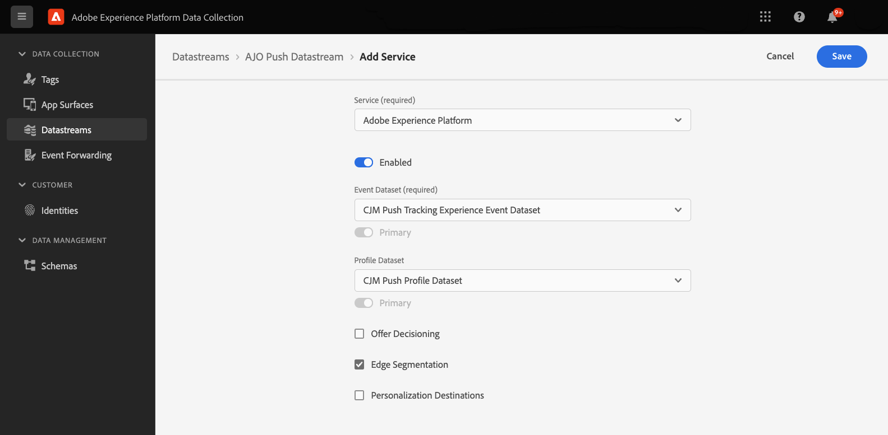
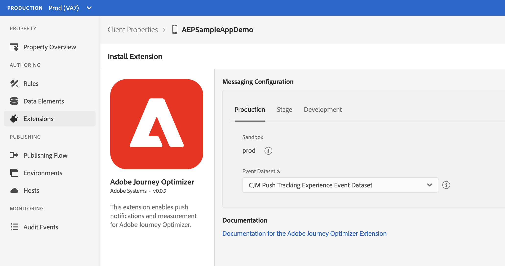

# Adobe Journey Optimizer

The [Adobe Journey Optimizer](https://business.adobe.com/products/journey-optimizer/adobe-journey-optimizer.html) (AJO) extension for Adobe Experience Platform Mobile SDKs powers push notifications for your mobile apps. This extension helps you collect user push tokens and manages interaction measurement with Adobe Experience Platform services.

The following documentation details configuration requirements and explains how to use the AJO extension. It also includes steps for implementing AJO-powered push notifications in your app.

## Before starting

1. Read the tutorial on [getting started with push configuration](https://experienceleague.adobe.com/docs/journey-optimizer/using/get-started/configuration/push-config/push-gs.html?lang=en) to learn how to configure push channels in Journey Optimizer.
1. [Update your app's datastream](#update-datastream-with-profile-dataset) in [Adobe Experience Platform Data Collection](https://experience.adobe.com/#/data-collection/)
1. Integrate with following extensions:
   * [Mobile Core](../../foundation-extensions/mobile-core/)
   * [Adobe Experience Platform Edge Network](../../foundation-extensions/experience-platform-extension/)
   * [Identity for Edge Network](../../foundation-extensions/identity-for-edge-network/)

### Update datastream with a profile dataset

Navigate to a previously configured datastream by following the instructions in the [configure datastreams tutorial](../../getting-started/configure-datastreams.md) in [Adobe Experience Platform Data Collection](https://experience.adobe.com/#/data-collection/).

* For **Event Dataset**, select **CJM Push Tracking Experience Event Dataset**
* For **Profile Dataset**, select **CJM Push Profile Dataset**

Save your changes when finished.



## Setup Adobe Journey Optimizer extension

### Configure extension in the Data Collection UI

Go to the [Experience Platform Data Collection UI](https://experience.adobe.com/#/data-collection/), select mobile property and navigate to **Extensions** from the left navigation panel:

1. Navigate to the **Catalog** tab, locate the **Adobe Journey Optimizer** extension, and select **Install**
2. Select the pre-created **CJM Push Tracking Event Dataset** from the **Event Dataset** dropdown.
3. Select **Save**.
4. Follow the publishing process to update SDK configuration.


The datasets selected should use a schema that uses the "Push Notification Tracking" XDM field group. The pre-created CJM Push Tracking Dataset contains this XDM field group in its schema definition. For more information, please read the tutorial on [setting up schemas and datasets](../../getting-started/setup-schemas-and-datasets.md).




### Implement extension in mobile app

Follow these steps to integrate the Adobe Journey Optimizer extension.

#### Import the extension





1. Add the Mobile Core, Edge, Edge Identity, and Messaging extensions to your project using the app's Gradle file.

   ```java
   implementation 'com.adobe.marketing.mobile:core:1.+'
   implementation 'com.adobe.marketing.mobile:edge:1.+'
   implementation 'com.adobe.marketing.mobile:edgeidentity:1.+'
   implementation 'com.adobe.marketing.mobile:messaging:1.+'
   ```

1. Import the Mobile Core, Edge, Edge Identity, and Messaging extensions in your application class.

   #### Java

   ```java
    import com.adobe.marketing.mobile.*;
    import com.adobe.marketing.mobile.edge.identity.Identity;
   ```





1. Add the Mobile Core, Edge, Edge Identity, and Messaging extensions to your project using Cocoapods. Add the following pods to your `Podfile`:

   ```swift
   use_frameworks!
   target 'YourTargetApp' do
       pod 'AEPCore'
       pod 'AEPEdge'
       pod 'AEPEdgeIdentity'
       pod 'AEPMessaging'
   end
   ```

2. Import the Mobile Core, Edge, Edge Identity, and Messaging libraries:

   #### Swift

    ```swift
    // AppDelegate.swift

    import AEPCore
    import AEPEdge
    import AEPEdgeIdentity
    import AEPMessaging
    ```

    #### Objective-C

    ```objc
    // AppDelegate.h

    @import AEPCore;
    @import AEPEdge;
    @import AEPEdgeIdentity;
    @import AEPMessaging;
    ```





This extension is built on the AEPCore (3.x) and it is not compatible with ACPCore (2.x). Please follow [the guide for migrating to the Swift AEPCore](../../resources/migrate-to-swift).





#### Register the extension with Mobile Core





#### Java

```java
public class MobileApp extends Application {
    @Override
    public void onCreate() {
        super.onCreate();
        MobileCore.setApplication(this);
        MobileCore.configureWithAppID("YOUR_APP_ID");
        try {
            Edge.registerExtension();
            Identity.registerExtension();
            Messaging.registerExtension();
            MobileCore.start(new AdobeCallback() {
                @Override
                public void call(final Object o) {
                    // processing after start
                }
            });
        } catch (Exception e) {
            // handle the exception
        }
    }
}
```




#### Swift

```swift
// AppDelegate.swift
func application(_ application: UIApplication, didFinishLaunchingWithOptions launchOptions: [UIApplication.LaunchOptionsKey: Any]?) -> Bool {
    MobileCore.registerExtensions([Identity.self, Edge.self, Messaging.self], {
        MobileCore.configureWith(appId: "YOUR_APP_ID")
    })

    ...
}
```

#### Objective-C

```objc
// AppDelegate.m
- (BOOL) application:(UIApplication *)application didFinishLaunchingWithOptions:(NSDictionary *)launchOptions {
    [AEPMobileCore registerExtensions:@[AEPMobileEdgeIdentity.class, AEPMobileEdge.class, AEPMobileMessaging.class] completion:^{
        [AEPMobileCore configureWithAppId: @"YOUR_APP_ID"];
    }];

    ...
}
```





This extension is built on the AEPCore (3.x) and it is not compatible with ACPCore (2.x). Please follow [the guide for migrating to the Swift AEPCore](../../resources/migrate-to-swift).





#### Sync the user push token with Adobe

After importing and registering the extensions with your application, you need to sync the push token with Adobe Experience Platform, by using the `setPushIdentifier` API.





To retrieve the push token from Firebase Messaging Service, read the tutorial on [retrieving the registration token](https://firebase.google.com/docs/cloud-messaging/android/client#retrieve-the-current-registration-token) within the Firebase documentation. After retrieving the push token, use the following API to sync it with the Profile in Platform.

#### Java

**Syntax**

```java
public static void setPushIdentifier(final String pushIdentifier);
```

| Variable | Type | Description |
| :----------- | :------- | :-------------- |
| `pushIdentifier` | String | The push token value. |

**Example**

```java
FirebaseMessaging.getInstance().getToken().addOnCompleteListener(new OnCompleteListener<String>() {
    @Override
    public void onComplete(@NonNull Task<String> task) {
        if (task.isSuccessful()) {
            String token = task.getResult();
            MobileCore.setPushIdentifier(token);
        }
    }
});
```




To retrieve the push token in iOS, read the tutorial on [registering your application](https://developer.apple.com/documentation/usernotifications/registering_your_app_with_apns) within Apple's documentation. After retrieving the push token, use the following API to sync it with the Profile in Platform.

#### Swift

**Syntax**

```swift
public static func setPushIdentifier(_ deviceToken: Data?)
```

| Variable | Type | Description |
| :----------- | :------- | :-------------- |
| `deviceToken` | Data | The push token value. |

**Example**

```swift
func application(_: UIApplication, didRegisterForRemoteNotificationsWithDeviceToken deviceToken: Data) {
    MobileCore.setPushIdentifier(deviceToken)
}
```

#### Objective-C

**Syntax**

```objc
@objc(setPushIdentifier:)
public static func setPushIdentifier(_ deviceToken: Data?)
```

| Variable | Type | Description |
| :----------- | :------- | :-------------- |
| `deviceToken` | Data | The push token value. |

**Example**

```objc
- (void) application:(UIApplication *)application didRegisterForRemoteNotificationsWithDeviceToken:(NSData *)deviceToken {
    [AEPMobileCore setPushIdentifier:deviceToken];
}
```





This extension is built on the AEPCore (3.x) and it is not compatible with ACPCore (2.x). Please follow [the guide for migrating to the Swift AEPCore](../../resources/migrate-to-swift).





## Next steps

* [Track Push Interactions](api-reference.md#addpushtrackingdetails)

## Configuration keys

You can update the SDK configuration, including the Messaging configuration values, programmatically by using the following information:

| Key | Required | Description | Data Type | Operating System |
| :--- | :--- | :--- | :--- | :--- |
| messaging.eventDataset | Yes | Experience Event Dataset ID which can be found from Experience Platform | String | Android/iOS |
| messaging.useSandbox | No | A variable that lets the `apnsSandbox` environment be used for receiving push notifications. More details can be found in the [messaging documentation](https://github.com/adobe/aepsdk-messaging-ios/blob/dev/Documentation/SetupSDK.md#using-apnssandbox-environment-for-push-notification) | Boolean | iOS |
