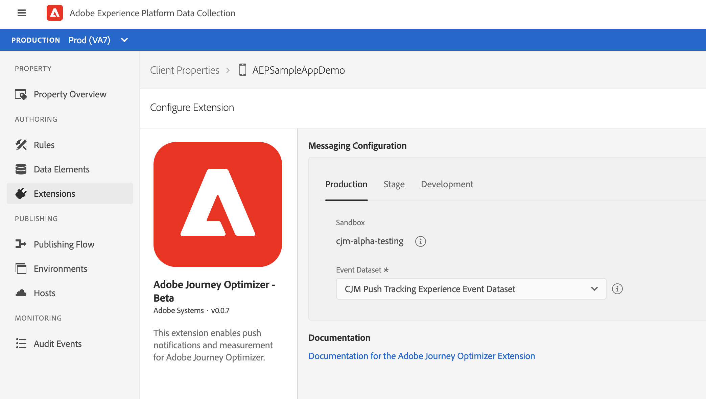

# Adobe Journey Optimizer

The [Adobe Journey Optimizer](https://business.adobe.com/products/journey-optimizer/adobe-journey-optimizer.html) extension for Adobe Experience Platform Mobile SDKs powers push notifications for your mobile apps. This extension helps you collects user push tokens and manages interaction measurement with Adobe Experience Platform services.

The following documentation details how to use the extension as well as the required configuration across Adobe Experience Platform services, app stores, and your apps to get started with push notifications for Adobe Journey Optimizer.

## Before starting

1. Follow the steps in [this page](https://experienceleague-review.corp.adobe.com/docs/journey-optimizer/using/get-started/configuration/push-config/push-configuration.html?lang=en) to configure push channel in Adobe Journey Optimizer.
2. [Update your app's Datastream](./#update-datastream-with-profile-dataset) in [Adobe Experience Platform Data Collection](https://launch.adobe.com)
3. Integrate with following extensions:
   -  [Mobile Core](../../foundation-extensions/mobile-core/)
   - [Adobe Experience Platform Edge Network](../../foundation-extensions/experience-platform-extension/)
   - [Identity for Edge Network](../../foundation-extensions/identity-for-edge-network/)


### Update Datastream with Profile Dataset

Navigate to a previously configured Datastream by following [Configure datastreams](../../getting-started/configure-datastreams.md) in [Adobe Experience Platform Data Collection](https://launch.adobe.com), then:

Select the pre-created **CJM Push Profile Dataset** in **Profile Dataset** dropdown \(under _Adobe Experience Platform_ section\) and select **Save**.


## Setup Adobe Journey Optimizer extension

### Configure extension in Launch

Navigate to [Experience Platform Data Collection](https://launch.adobe.com) - select mobile property and navigate to **Extensions** from the left navigation panel**:**

1. Navigate to the **Catalog** tab, locate the **Adobe Journey Optimizer** extension, and select **Install**
2. Select the pre-created **CJM Push Tracking Event Dataset** from the **Event Dataset** dropdown.
3. Click **Save**.
4. Follow the publishing process to update SDK configuration.


The datasets selected should use a schema that uses the Push Notification Tracking XDM mixin. The pre-created CJM Push Tracking Dataset contains this XDM mixin in its schema definition. For more information, see [Setup Schemas & Datasets](https://github.com/Adobe-Marketing-Cloud/aep-sdks-documentation/tree/62a861aec745af2d8237c287656c68d8f8cdd5ed/getting-started/configure-schema-and-dataset.md).




### Implement extension in mobile app

Follow these steps to integrate the Adobe Journey Optimizer extension.

#### Import the extension



### Java

1. Add the Mobile Core, Edge, EdgeIdentity and Messaging extensions to your project using the app's Gradle file.

   ```java
   implementation 'com.adobe.marketing.mobile:core:1.+'
   implementation 'com.adobe.marketing.mobile:edge:1.+'
   implementation 'com.adobe.marketing.mobile:edgeidentity:1.+'
   implementation 'com.adobe.marketing.mobile:messaging:1.0.0-beta-1'
   ```

2. Import the Mobile Core, Edge, EdgeIdentity and Messaging extensions in your application class.

   ```java
    import com.adobe.marketing.mobile.*;
    import com.adobe.marketing.mobile.edge.identity.Identity;
   ```



1. Add the Mobile Core, Edge, EdgeIdentity and Messaging extensions to your project using Cocoapods. Add following pods in your `Podfile`:

   ```swift
   use_frameworks!
   target 'YourTargetApp' do
       pod 'AEPCore'
       pod 'AEPEdge'
       pod 'AEPEdgeIdentity'
       pod 'AEPMessaging', :git => 'https://github.com/adobe/aepsdk-messaging-ios.git', :branch => 'main'
   end
   ```

2. Import the Mobile Core, Edge, EdgeIdentity and Messaging libraries:

### Swift

```swift
// AppDelegate.swift
import AEPCore
import AEPEdge
import AEPEdgeIdentity
import AEPMessaging
```

### Objective-C

```text
// AppDelegate.h
@import AEPCore;
@import AEPEdge;
@import AEPEdgeIdentity;
@import AEPMessaging;
```



#### Register extension with Mobile Core



### Java

```java
public class MobileApp extends Application {
    @Override
    public void onCreate() {
      super.onCreate();
      MobileCore.setApplication(this);
      MobileCore.configureWithAppID("yourLaunchEnvironmentID");
      try {
        Edge.registerExtension();
        Identity.registerExtension();
        Messaging.registerExtension(); // register Messaging
        MobileCore.start(new AdobeCallback() {
          @Override
          public void call(final Object o) {
            // processing after start
          }});
      } catch (Exception e) {
        //Log the exception
      }
    }
}
```



### Swift

```swift
// AppDelegate.swift
func application(_ application: UIApplication, didFinishLaunchingWithOptions launchOptions: [UIApplication.LaunchOptionsKey: Any]?) -> Bool {
    MobileCore.registerExtensions([Identity.self, Edge.self, Messaging.self], {
        MobileCore.configureWith(appId: "yourLaunchEnvironmentID")
    })
  ...
}
```

### Objective-C

```text
// AppDelegate.m
- (BOOL)application:(UIApplication *)application didFinishLaunchingWithOptions:(NSDictionary *)launchOptions {
    [AEPMobileCore registerExtensions:@[AEPMobileEdgeIdentity.class, AEPMobileEdge.class, AEPMobileMessaging.class] completion:^{
    [AEPMobileCore configureWithAppId: @"yourLaunchEnvironmentID"];
  }];
  ...
}
```



#### Synch user push token with Adobe

Use the setPushIdentifier API to sync user push token from the device with Adobe Experience Platform services.



To retrieve the push token from Firebase Messaging Service follow this [Firebase documentation](https://firebase.google.com/docs/cloud-messaging/android/client#retrieve-the-current-registration-token). After retrieving the push token use the below core API to sync it with profile in platform.

### Java

#### Syntax

```java
public static void setPushIdentifier(final String pushIdentifier);
```

* _pushIdentifier_ - A `String` value denoting the push token.

#### Examples

```java
FirebaseMessaging.getInstance().getToken()
        .addOnCompleteListener(new OnCompleteListener<String>() {
            @Override
            public void onComplete(@NonNull Task<String> task) {
                if (task.isSuccessful()) {
                    String token = task.getResult();
                    MobileCore.setPushIdentifier(token);
                }
            }
        });
```



### Swift

To retrieve the push token in iOS, checkout the apple documentation [Apple's documentation](https://developer.apple.com/documentation/usernotifications/registering_your_app_with_apns).  
After retrieving the push token use the below core API to sync it with profile in platform.

#### Syntax

```swift
public static func setPushIdentifier(_ deviceToken: Data?)
```

* _deviceToken_ - A `Data` value denoting the push token.

#### Examples

```swift
func application(_: UIApplication, didRegisterForRemoteNotificationsWithDeviceToken deviceToken: Data) {
    MobileCore.setPushIdentifier(deviceToken)
}
```

### Objective-C

#### Syntax

```text
public static func setPushIdentifier(_ deviceToken: Data?)
```

* _deviceToken_ - A `Data` value denoting the push token.

#### Examples

```text
- (void)application:(UIApplication *)application didRegisterForRemoteNotificationsWithDeviceToken:(NSData *)deviceToken { 
    [AEPMobileCore setPushIdentifier:deviceToken];
}
```



## Next Steps

* [Track Push Interactions](api-reference.md#addpushtrackingdetails)

## Configuration keys

To update the SDK configuration programmatically, use the following information to change the Messaging configuration values.

| Key | Required | Description | Data Type | Platform |
| :--- | :--- | :--- | :--- | :--- |
| messaging.eventDataset | Yes | Experience Event Dataset Id which can be found from experience platform | String | Android/iOS |
| messaging.useSandbox | No | See more details in the [Messaging documentation](https://github.com/adobe/aepsdk-messaging-ios/blob/dev/Documentation/SetupSDK.md#using-apnssandbox-environment-for-push-notification) | Boolean | iOS |

