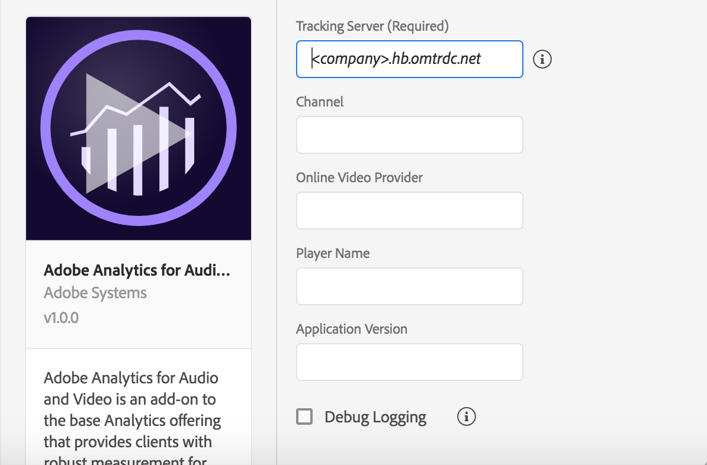

# Adobe Media Analytics for Audio and Video

## Configure Media Analytics extension in Launch

1. In Launch, click the **Extensions** tab.
2. On the **Catalog** tab, locate the **Adobe Media Analytics for Audio and Video** extension, and click **Install**.
3. Type the extension settings. For more information, see [Configure Media Analytics Extension](./#configure-media-analytics-extension).
4. Click **Save**.
5. Follow the publishing process to update your SDK configuration.

### Configure the Media Analytics extension



#### Tracking Server


This server is different from your Analytics tracking server.


Type the name of the tracking server to which all media tracking data should be sent.

#### Channel

Type the channel name property.

#### Online Video Provider

Type the name of the online platform through which content is distributed.

#### Player Name

Type the name of the media player in use \(for example, _AVPlayer_, _Native Player_, or _Custom Player_\).

#### Application Version

Type the version of the media player application/SDK.

#### Debug Logging


Disable this option for your production application.


Enables or disables Media SDK logs.

## Add Media Analytics to your app


This extension requires the [Adobe Analytics Extension](../adobe-analytics/). You must add the Analytics extension to your Launch property and make sure the extension is correctly configured.


1. Add the Media extension and its dependencies to your project using the app's Gradle file.

   ```text
   implementation 'com.adobe.marketing.mobile:analytics:1.+'
   implementation 'com.adobe.marketing.mobile:media:1.+'
   implementation 'com.adobe.marketing.mobile:sdk-core:1.+'
   ```

2. Import the Media extension in your application's main activity.

   ```java
   import com.adobe.marketing.mobile.*;
   ```

3. Add the Media library and its dependencies to your project. You will need to add the following pods to your `Podfile`:

   ```text
   pod 'ACPMedia', '~> 1.0'
   pod 'ACPAnalytics', '~> 2.0'
   pod 'ACPCore', '~> 2.0'
   ```

or you can manually include the libraries found in [Github](https://github.com/Adobe-Marketing-Cloud/acp-sdks).

1. In Xcode project, import Media extension:

   **Objective-C**

   ```objectivec
    #import <ACPMedia.h>
   ```

   **Swift**

   ```swift
   import ACPMedia
   ```

### Register Media with Mobile Core



#### Java

To register media with Mobile Core, call the `setApplication()` method in `onCreate()`, then call setup methods, as shown in this sample:

```java
import com.adobe.marketing.mobile.*;

public class MobileApp extends Application {

  @Override
  public void onCreate() {
      super.onCreate();
      MobileCore.setApplication(this);

      try {
          Media.registerExtension();
          Analytics.registerExtension();
          Identity.registerExtension();
          MobileCore.start(new AdobeCallback () {
              @Override
              public void call(Object o) {
                  MobileCore.configureWithAppID("your-launch-app-id");
              }
          });
      } catch (InvalidInitException e) {

      }
  }
}
```



In your app's `application:didFinishLaunchingWithOptions`, register Media with Mobile Core:

#### Objective-C

```objectivec
#import <ACPCore.h>
#import <ACPAnalytics.h>
#import <ACPMedia.h>
#import <ACPIdentity.h>

- (BOOL)application:(UIApplication *)application didFinishLaunchingWithOptions:(NSDictionary *)launchOptions {
    [ACPCore setLogLevel:ACPMobileLogLevelDebug];
    [ACPCore configureWithAppId:@"your-launch-app-id"];

    [ACPMedia registerExtension];
    [ACPAnalytics registerExtension];
    [ACPIdentity registerExtension];

    [ACPCore start:^{

    }];

    return YES;
  }
```

#### Swift

```swift
import ACPCore
import ACPAnalytics
import ACPMedia
import ACPIdentity
import ACPLifecycle

func application(_ application: UIApplication, 
                 didFinishLaunchingWithOptions launchOptions: [UIApplication.LaunchOptionsKey: Any]?) -> Bool {
    ACPCore.setLogLevel(.debug)
    ACPCore.configure(withAppId: "your-launch-app-id")

    ACPMedia.registerExtension()
    ACPAnalytics.registerExtension()
    ACPIdentity.registerExtension()

    ACPCore.start {

    }

    return true;
}
```



## Configuration keys

To update your SDK configuration programmatically, use the following information to change your Media configuration values. For more information, see [Configuration Methods Reference](../mobile-core/configuration-reference/#update-configuration).

| Key | Required | Description |
| :--- | :--- | :--- |
| `media.trackingServer` | Yes | See [Tracking Server](./#tracking-server). |
| `media.channel` | No | See [Channel](./#channel). |
| `media.ovp` | No | See [Online Video Provider](./#online-video-provider). |
| `media.playerName` | No | See [Player Name](./#player-name). |
| `media.appVersion` | No | See [Application Version](./#application-version). |
| `media.debugLogging` | No | See [Debug Logging](./#debug-logging). |

