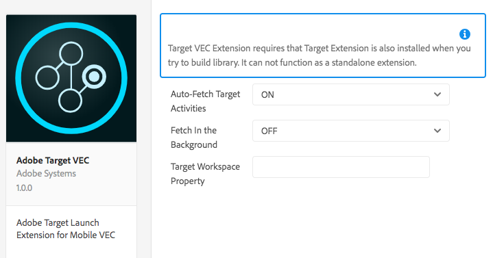

# Adobe Target - Visual Experience Composer
This extension enables Adobe Target Visual Experience Composer (Target VEC) functionality. The Target VEC for Native Mobile Apps lets you create activities and personalize content on native mobile apps in a do-it-yourself fashion without continuous development dependencies and app-release cycles.

For more information, see:

* [Mobile App Visual Experience Composer](https://docs.adobe.com/content/help/en/target/using/implement-target/mobile-apps/composer/mobile-visual-experience-composer.html)
* [Setup Mobile VEC for Android](https://docs.adobe.com/content/help/en/target/using/implement-target/mobile-apps/composer/mobile-visual-experience-composer-android.html)
* [Setup Mobile VEC for iOS](https://docs.adobe.com/content/help/en/target/using/implement-target/mobile-apps/composer/mobile-visual-experience-composer-ios.html)
* [Set up click tracking in the Mobile VEC](https://docs.adobe.com/content/help/en/target/using/implement-target/mobile-apps/composer/set-up-click-tracking-in-the-mobile-vec.html)

To get started with Target VEC, complete the following steps:

1. Configure the Adobe Target - VEC extension.
   The VEC extension is dependent on the Adobe Target Extension. Make sure Adobe Target extension is already configured and enabled.
2. Add the Target VEC Extension to your app.
3. Select one of the following implementation methods:
   1. Auto-Fetch Target Activities, where options are:
      a. Fetch in a blocking call (background is OFF)
      b. Fetch in an asynchronous mode (background is ON)
   2. Fetch Target Activities Programmatically
   3. Handle Target Workspace Restrictions


## Configure the Adobe Target - VEC extension in Launch   <a id="configuring-the-adobe-target-vec-extension-in-adobe-launch"></a>



1. In Launch, click the **Extensions** tab.
2. On the **Installed** tab, locate the Adobe Target VEC extension, and click **Configure**.
3. The default configuration options loads Target VEC activities as a blocking call on App launch. See [Implementation Methods for Target VEC](https://aep-sdks.gitbook.io/docs/using-mobile-extensions/adobe-target-vec#implementation-methods-for-target-vec) for details.
4. Click **Save**.
5. Follow the publishing process to update SDK configuration

## Add Target VEC to your app



#### Java

1. Add Target VEC extension and it's dependencies to your project using the app's Gradle file.
```
   implementation 'com.adobe.marketing.mobile:target-vec:1.+'
```
Dependencies
```java
   implementation 'com.google.code.gson:gson:2.8.2'
   implementation 'android.arch.lifecycle:extensions:1.1.1'
   implementation 'io.github.sac:SocketclusterClientJava:1.7.5'
   implementation 'com.android.support:support-annotations:28.0.0'
   implementation 'com.android.support:support-compat:28.0.0'
   implementation 'com.android.support:design:28.0.0'
```
2. Import the Target VEC extension in your application's main activity.  `import com.adobe.target.mobile.TargetVEC;`
3. Add the Target VEC library to your project via your `Podfile` by adding `pod 'ACPTargetVEC'`



#### Objective-C

Import the Target and Identity library.

```objectivec
   #import "ACPCore.h"
   #import "ACPTargetVEC.h"
   #import "ACPTarget.h"
   #import "ACPIdentity.h"
   #import "ACPTargetRequestObject.h"
   #import "ACPTargetPrefetchObject.h"
```

#### Swift

```swift
   #import ACPCore
   #import ACPTarget
   #import ACPTargetVEC
   #import ACPIdentity
```




### Register Target VEC with Mobile Core



#### Java

After calling the `setApplication()` method in the `onCreate()` method, register Target VEC with Mobile Core.

Here is code sample that calls these set up methods:

```java
public class SampleApp extends Application {

 @Override
 public void onCreate() {
     super.onCreate();
     MobileCore.setApplication(this);
     try {
         //Other Extensions that you need
         TargetVEC.registerExtension();
         Target.registerExtension();
         MobileCore.start(new AdobeCallback () {
           @Override
           public void call(Object o) {
               MobileCore.configureWithAppID("YOUR_LAUNCH_ID");
           }
         });
     } catch (Exception e) {
         //Log the exception
     }
 }
}
```



#### Objective-C

1. In your app's `didFinishLaunchingWithOptions` function register the Target VEC extension

```objectivec
- (BOOL)application:(UIApplication *)application didFinishLaunchingWithOptions:(NSDictionary *)launchOptions {
  //Other Extensions that you need
  [ACPTargetVEC registerExtension];
  [ACPTarget registerExtension];
  [ACPCore start:^{
    [ACPCore lifecycleStart:nil];
  }];
  // Override point for customization after application launch.
  return YES;
}
```

#### Swift
1. In your app's `didFinishLaunchingWithOptions` function register the Target VEC extension

```swift
func application(_ application: UIApplication, didFinishLaunchingWithOptions launchOptions: [UIApplication.LaunchOptionsKey: Any]?) -> Bool {
  //Other Extensions that you need
  ACPTargetVEC.registerExtension()
  ACPTarget.registerExtension()
  [ACPCore start:^{
    [ACPCore lifecycleStart:nil];
  }];
  return true
}
```



## Implementation Methods for Target VEC   <a id="implementation-methods-for-target-vec"></a>
The Target VEC extension retrieves the relevant Target experiences for your app through a network request. Offers are retrieved via this network call and applied automatically on the targeted screens. No subsequent network requests are made to retrieve VEC experiences as the user navigates through multiple screens of the app.

The default behavior of the extension is to make a synchronous network request (blocking call) at the time of Application launch. You can use Launch to control the behavior of this network request to meet your application behavior.

### Auto-Fetch Target Activities
This is the default behavior where a network request is initiated automatically by the Target VEC extension. You can use one of the following options to make this request a blocking call or an asynchronous request.

   * Fetch in a synchronous call (background is OFF)
     When selected, Target VEC extension makes a network request as a blocking call on App launch. Offers are applied immediately and there is no flicker in the app. This is the default behavior of the extension.

   * Fetch in an asynchronous call (background is ON)
     When selected, Target VEC extension makes a network request in the background on App launch but does not block the app from loading. If your experiences are authored on the home screen of your app, the offers may not apply for the home screen if the screen is rendered before the call completes. The app screen rendering is typically identified via the lifecycle events `didFinishLaunchingWithOptions` and `onActivityResumed`  on iOS and Android respectively. Offers will be automatically apply on all subsequent screens.

### Fetch Target Activities Programmatically
You can disable the Target VEC extension to make the network request automatically and decide to programmatically call the Extension API. This gives your developers control on how they want to integrate Target VEC offers in the App. The Target VEC extension has two static methods `prefetchOffers` and `prefetchOffersBackground` that can used to programmatically retrieve Target VEC offers.
   * `prefetchOffers` method will hide the current screen until Target VEC offers are fetched. The offers are automatically applied to the current screen if applicable and the screen is visible again.
   * `prefetchOffersBackground` method will not hide the current screen and a call will be made to retrieve the relevant Target offers. Target offers will *not* be applied on the current screen and there will not be a flicker. As the user navigates to subsequent screens, offers will be automatically applied as applicable.

### Handle Target Workspace Restrictions
You can set the `at_property` value for your workspace using the Launch interface. This ensures only activities in that workspace will be delivered to your Mobile App.
