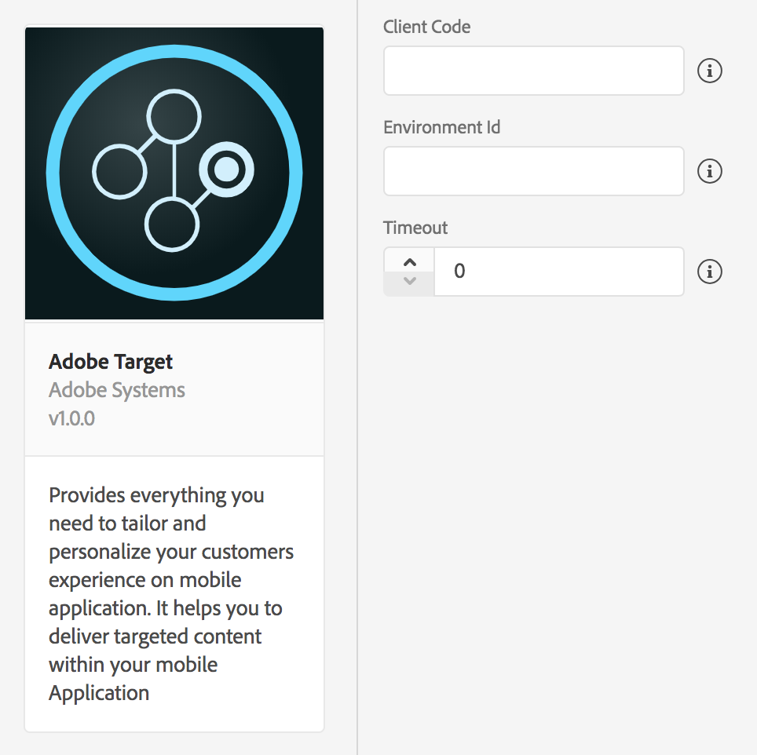

# Adobe Target

[Adobe Target](https://www.adobe.com/marketing/target/mobile-optimization.html) helps test, personalize, and optimize mobile app experiences based on user behavior and mobile context. You can deliver interactions that engage and convert through iterative testing as well as rules-based and AI-powered personalization.

To get started with **Target**, follow these steps:

1. Configure the **Target Extension** in **Launch**
2. Add the **Target Extension** to your app
3. Implement Target APIs to:
   1. Request activities
   2. Prefetch offers
   3. Enter visual preview mode

## Configure Target Extension in Launch <a id="configuring-the-adobe-target-extension-in-adobe-launch"></a>



1. In Launch, click the **Extensions** tab.
2. On the Installed tab, locate the Adobe Target extension and click **Configure**.
3. Provide your **Target** client code.
4. Optionally, provide your Environment ID.
5. Set the timeout value to 5s or greater.
6. Click **Save**.
7. Follow the publishing process, to update SDK configuration


You can find your Target client code by going to the Setup tab and selecting Implementation on the left menu. Under Implementation Method, you can click "Edit at.js Settings" to pop-up a window that contains the client code.


## Add Target to your app



#### Java

1. Add the Target extension to your project using the app's Gradle file.
2. Import the Target extension in your application's main activity.

   ```java
   import com.adobe.marketing.mobile.*;
   ```



#### Objective-C

1. Add the Target library to your project via your `Podfile` by adding `pod 'ACPTarget'`
2. Import the Target and Identity library. 

   ```objectivec
   #import <ACPCore_iOS/ACPCore_iOS.h>
   #import <ACPTarget_iOS/ACPTarget_iOS.h>
   #import <ACPIdentity_iOS/ACPIdentity_iOS.h>
   ```

#### Swift

Update the bridging header



### Register Target with Mobile Core



#### Java

You may do the following after calling the `setApplication()` method in the `onCreate()` method. Here is code sample which calls these setup methods:

```java
public class TargetApp extends Application {

 @Override
 public void onCreate() {
     super.onCreate();
     MobileCore.setApplication(this);

     try {
         Target.registerExtension();
         Identity.registerExtension();
     } catch (Exception e) {
         //Log the exception
     }
 }
}
```



#### Objective-C

1. In your app's `didFinishLaunchingWithOptions` function register the Target extension

```objectivec
- (BOOL)application:(UIApplication *)application didFinishLaunchingWithOptions:(NSDictionary *)launchOptions {
  [ACPIdentity registerExtension];
  [ACPTarget registerExtension];

  // Override point for customization after application launch.
  return YES;
}
```

#### Swift



## Prefetch offers <a id="integrating-adobe-target-with-analytics-a-4-t"></a>

The SDK can minimize the number of times it reaches out to Target servers in order to fetch offers by caching server responses. When this feature is enabled, offer content will be retrieved and cached during the prefetch call. This content will be retrieved from the cache for all future calls that contain cached content for the specified **mbox** name. This "prefetch" process reduces offer load time, network calls made to Target servers, and even provides for Target to be notified which **mbox** was visited by the mobile app user.


Prefetched offer content does not persist across launches. The prefetch content is cached as long as the application lives or until the API to [clear cache](./#clear-prefetch-offer-cache) is called.


### Using prefetch APIs



#### Java

#### Using the `TargetPrefetch` Builder

`TargetPrefetch` builder helps to create a `TargetPrefetch` instance with the specified data. The returned instance can be used with `prefetchContent`, which accepts a `TargetPrefetch` object list to prefetch offers for the specified **mbox** locations.

#### Syntax

```java
TargetPrefetch prefetchRequest = new TargetPrefetch.Builder("mboxName")
                .setMboxParameters(new HashMap<String, String>())
                .setOrderParameters(new HashMap<String, Object>())
                .setProductParameters(new HashMap<String, String>())
                .build();
```

#### Using `prefetchContent`

Sends a prefetch request to your configured Target server with the `TargetPrefetch` list and specified `profileParameters`. The callback will be invoked when the prefetch is complete, which returns a success status for the prefetch request.

#### Syntax

```java
public static void prefetchContent(final List<TargetPrefetch>                                                                         targetPrefetchList,
                                    final Map<String, Object> profileParameters,
                                    final AdobeCallback<Boolean> callback);
```

#### Example

```java
// first prefetch request
Map<String, Object> mboxParameters1 = new HashMap<>();
mboxParameters1.put("status", "platinum");

// second prefetch request
Map<String, Object> mboxParameters2 = new HashMap<>();
mboxParameters2.put("userType", "paid");

List<String> purchasedIds = new ArrayList<String>();
purchasedIds.add("34");
purchasedIds.add("125"); 

Map<String, Object> orderParameters2 = new HashMap<>();
orderParameters2.put("id", "ADCKKIM");
orderParameters2.put("total", "344.30");
orderParameters2.put("purchasedProductIds",  purchasedIds);

Map<String, Object> productParameters2 = new HashMap<>();
productParameters2.put("id", "24D3412");
productParameters2.put("categoryId","Books");

TargetPrefetch prefetchRequest1 = new TargetPrefetch.Builder("mboxName1")
                .setMboxParameters(mboxParameters1)
                .build();


TargetPrefetch prefetchRequest2 = new TargetPrefetch.Builder("mboxName2")
                .setMboxParameters(mboxParameters2)
                .setOrderParameters(orderParameters2)
                .setProductParameters(productParameters2)
                .build();


List<TargetPrefetchObject> prefetchMboxesList = new ArrayList<>();
prefetchMboxesList.add(prefetchRequest1);
prefetchMboxesList.add(prefetchRequest2);


// Call the prefetchContent API.
Target.prefetchContent(prefetchMboxesList, profileParameters, prefetchStatusCallback);
```



#### Objective C

Use `prefetchContent` to send a prefetch request to your configured Target server with the `ACPTargetPrefetchObject` array and specified `profileParameters`. The callback will be invoked when the prefetch is complete, which returns a success status for the prefetch request.

#### Syntax

```objectivec
+ (void) prefetchContent: (nonnull NSArray<ACPTargetPrefetchObject*>*) targetPrefetchObjectArray
         withProfileParameters: (nullable NSDictionary<NSString*, NSString*>*) profileParameters
                      callback: (nullable void (^) (BOOL success)) callback;
```

#### Objective-C Example 

```objectivec
NSDictionary *mboxParameters1 = @{@"status":@"platinum"};
NSDictionary *productParameters1 = @{@"id":@"24D3412",
                                        @"categoryId":@"Books"};
NSDictionary *orderParameters1 = @{@"id":@"ADCKKIM",
                                      @"total":@"344.30",
                                      @"purchasedProductIds":@"34, 125, 99"};

NSDictionary *mboxParameters2 = @{@"userType":@"Paid"};
NSDictionary *productParameters2 = @{@"id":@"764334",
                                         @"categoryId":@"Online"};
NSArray *purchaseIDs = @[@"id1",@"id2"];
NSDictionary *orderParameters2 = @{@"id":@"4t4uxksa",
                                       @"total":@"54.90",
                                       @"purchasedProductIds":purchaseIDs};

// Creating Prefetch Objects
ACPTargetPrefetchObject *prefetch1 = [ACPTargetPrefetchObject prefetchObjectWithName:@"logo" mboxParameters:mboxParameters1];
prefetch1.productParameters = productParameters1;
prefetch1.orderParameters = orderParameters1;

ACPTargetPrefetchObject *prefetch2 = [ACPTargetPrefetchObject prefetchObjectWithName:@"buttonColor" mboxParameters:mboxParameters2];
prefetch2.productParameters = productParameters2;
prefetch2.orderParameters = orderParameters2;

// Creating prefetch Array
NSArray *prefetchArray = @[prefetch1,prefetch2];

// Creating Profile parameters
NSDictionary *profileParameters = @{@"age":@"20-32"};

// Target API Call
[ACPTarget prefetchContent:prefetchArray withProfileParameters:profileParameters callback:^(BOOL isSuccess){
       // do something with the Boolean result
}];
```



### Clear prefetch offer cache

To clear prefetched, cached offer data, use the following:



#### **Syntax**

```java
public static void clearPrefetchCache()
```

#### **Example**

```java
Target.clearPrefetchCache();
```



#### Syntax

```objectivec
+ (void) clearPrefetchCache;
```

#### Objective-C Example 

```objectivec
[ACPTarget clearPrefetchCache];
```



## Visual preview <a id="integrating-adobe-target-with-analytics-a-4-t"></a>

Visual preview mode allows you to easily perform end-to-end QA for Target activities by enrolling and previewing these activities on your device without requiring a specialized testing setup.

To get started, make sure to follow the Target's [documentation](https://marketing.adobe.com/resources/help/en_US/target/target/target-mobile-preview.html) on setting up a URL scheme and generating preview links.

You may also set an app deep link that can be triggered when selections are made in the preview mode by using the following methods:



#### **Syntax**

```java
public static void setPreviewRestartDeepLink(final Uri deepLink);
```

#### **Example**

```java
Target.setPreviewRestartDeepLink("myApp://HomePage");
```



#### Syntax

`+ (void) setPreviewRestartDeepLink: (nonnull NSURL*) deepLink;`

#### **Objective-C Example**

`[ACPTarget setPreviewRestartDeepLink:@"myApp://HomePage"];`

#### **Swift Example**

`ACPTarget.setPreviewRestartDeepLink("myApp://HomePage")`



The `collectLaunchInfo` API is used to enter the visual preview mode. After the visual preview mode is enabled, a red floating button is displayed on the app screen. This button can be pressed to enter the visual preview mode again.





#### Syntax

`+ (void) collectLaunchInfo: (nonnull NSDictionary*) userInfo;`

#### **Objective-C Example**

`[ACPCore collectLaunchInfo: @{@"adb_deeplink":@"com.adobe.targetpreview://app.adobetarget.com?at_preview_token=tokenFromTarget"}];`

#### **Swift Example**

`ACPCore.collectLaunchInfo(["adb_deeplink" : "com.adobe.targetpreview://app.adobetarget.com?at_preview_token=tokenFromTarget")`



## Target with Analytics \(A4T\) <a id="integrating-adobe-target-with-analytics-a-4-t"></a>

To see the performance of your Target activities for certain segments you can set up the Analytics for Target \(A4T\) cross-solution integration by enabling the A4T campaigns. This integration allows you use Analytics reports to examine your results. If you use Analytics as the reporting source for an activity, all reporting and segmentation for that activity is based on Analytics data collection. For more information, see [Adobe Analytics for Adobe Target \(A4T\)](https://marketing.adobe.com/resources/help/en_US/target/a4t/a4t.html)

## Configuration Keys

If you need to update SDK configuration, programmatically, please use the following information to change your Target configuration values. For more information, [Configuration Methods Reference](../mobile-core/configuration-reference/#update-configuration).

| Key | Description |
| :--- | :--- |
| target.clientcode | Client code for your account. |
| target.timeout | Time, in seconds, to wait for a response from Target servers before timing out. |
| target.environmentId | Environment ID you want to use, if this is left blank, the default production environment will be used. |

## Further Reading

* How to get your Target client code? See [this page](https://marketing.adobe.com/resources/help/en_US/target/ov/r_advanced_mboxjs_settings.html), under **Client**
* What is an [**mbox**](https://marketing.adobe.com/resources/help/en_US/target/target/c_mobile-how-target-works-mobile-apps.html)?
* [What is Analytics for Target \(A4T\)](https://marketing.adobe.com/resources/help/en_US/target/a4t/a4t.html)?

