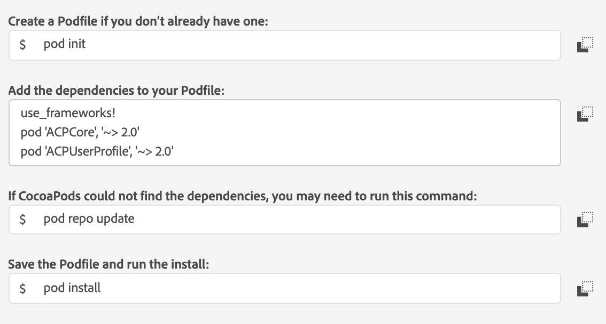

# Signal

The Signal framework is bundled with [Mobile Core](https://aep-sdks.gitbook.io/docs/using-mobile-extensions/mobile-core/) and enables your app with Adobe's Experience Cloud ID service. This extension allows you to send data third-party endpoints as postback via GET and POST requests. Signals are configured by using rules in Launch. 

By leveraging the same triggers and traits that you use to display an in-app message, you can configure the SDK to send customized data to a third-party destination. Also, with the appropriate permissions and configurations, you can use the `collectPii` API to send PII to a remote server.

Here are the implications of the privacy status for this extension:

- When the `global.privacy` configuration is set to `optedout`, the Signals extension clears all queued hits and drops future network send requests.
- If the configuration is `optunknown`, the network sends requests that are queued but not sent out.
- If the configuration is `optedin`, the network requests to a third-party destination are allowed, provided the trigger conditions match.

To get started with Identity, complete the following steps:

1. Add the **Signal** framework to your app.
2. Define the necessary rules in Adobe Experience Platform Launch. 
3. Implement the SDK APIs to send PII data to external destinations.

## Add the Signal framework to your app




#### Java

Add the  [Mobile Core](https://aep-sdks.gitbook.io/docs/using-mobile-extensions/mobile-core) extension to your project using the app's Gradle file:

```
implementation 'com.adobe.marketing.mobile:sdk-core:1.+'
```

Import the library:

```java
import com.adobe.marketing.mobile.*;
```





#### iOS

1. Add the  [Mobile Core](https://aep-sdks.gitbook.io/docs/using-mobile-extensions/mobile-core) extension to your project using Cocoapods:




2. Import the Signal extension:

**Objective-C**

```objectivec
#import  "ACPSignal.h"
```

**Swift**

In swift, the ACPCore includes ACPSignal:

```swift
import ACPCore
```





Import the Signal extension:

#### JavaScript

```jsx
import {ACPSignal} from '@adobe/react-native-acpcore';
```




## Register the Signal extension

The `registerExtension()` API registers the Signal extension with the MobileCore extension. This API allows the extension to send and receive events to and from the Mobile SDK.

To register the Signal extension, use the following code sample:



After calling the `setApplication()` method in the `onCreate()` method, register the extension. If the registration was not successful, an `InvalidInitException` is thrown.

#### Java

```java
public class MobiletApp extends Application {
@Override
public void onCreate() {
super.onCreate();
     MobileCore.setApplication(this);
     try {
         ...........................
         Signal.registerExtension();
         ...........................
     } catch (Exception e) {
         //Log the exception
     }
  }
}
```





#### iOS

Register the Signal extension in your app's `didFinishLaunchingWithOptions` function:

**Objective-C**

```objectivec
- (BOOL)application:(UIApplication *)application didFinishLaunchingWithOptions:(NSDictionary *)launchOptions {
  [ACPSignal registerExtension];
  // Override point for customization after application launch.
  return YES;
}
```

**Swift**

```swift
func application(_ application: UIApplication, didFinishLaunchingWithOptions launchOptions: [UIApplication.LaunchOptionsKey: Any]?) -> Bool {
  ..............................
  ACPSignal.registerExtension()
  ..............................  
  // Override point for customization after application launch.
  return true;
}
```





#### JavaScript

```jsx
import {ACPSignal} from '@adobe/react-native-acpcore';

initSDK() {
    ACPSignal.registerExtension();
}
```




## Version of the Signal extension

The `extensionVersion()` API returns the version of the Signal extension that is registered with the MobileCore extension.

To get the version of the Identity extension, use the following code sample:




#### Java

```java
String signalExtensionVersion = Signal.extensionVersion();
```





#### iOS

**Objective-C**

```objectivec
NSString *signalExtensionVersion = [ACPSignal extensionVersion];
```

**Swift**

```swift
var signalExtensionVersion  = ACPSignal.extensionVersion()
```





#### JavaScript

```jsx
ACPSignal.extensionVersion().then(signalExtensionVersion => console.log("AdobeExperienceSDK: ACPSignal version: " + signalExtensionVersion));
```




##Define rules in Adobe Experience Platform Launch

Define the rules in AEP Launch by following the steps in the [Signal extension and Rules engine Integaration document](signals-extension-and-rules-engine-integration)

##Implement the SDK APIs to send PII data to external destinations

To send PII data to external destinations, the `PII` action can trigger the Rules engine when certain triggers and traits match. When setting a rule, you can also set the `PII` action for a Signal event. The `collectPii` API can then be used to trigger the rule and send the PII data.

For the information on collectPii and its usage, see collectPii in [AEP Mobile Core API reference Page](https://aep-sdks.gitbook.io/docs/using-mobile-extensions/mobile-core/mobile-core-api-reference#collect-pii)