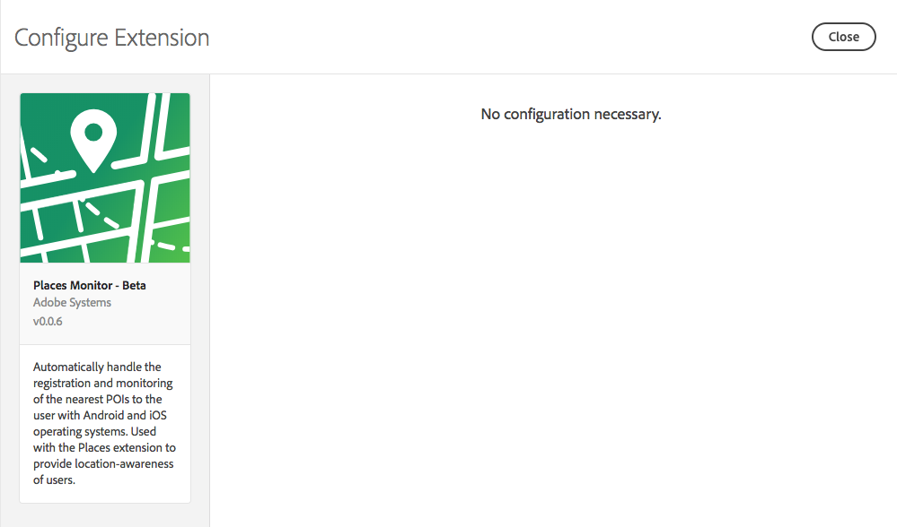
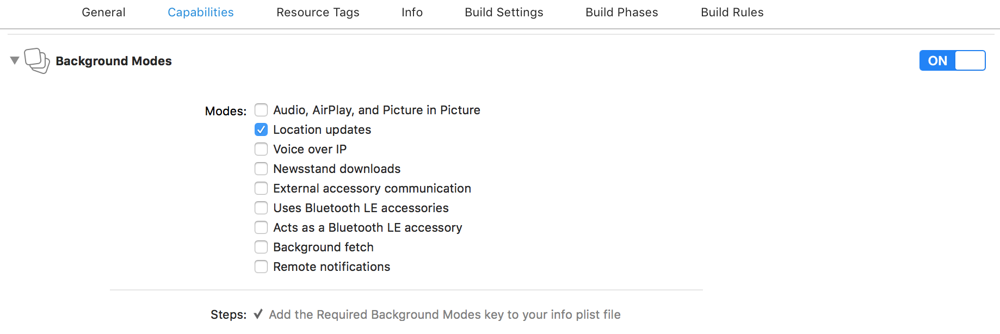
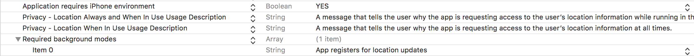

# Using the Places Monitor extension

## Configure the Places Monitor extension in Launch <a id="configure-places-monitoring-extension-in-launch"></a>

1. In Launch, click the **Extensions** tab.
2. On the **Catalog** tab, locate the **Places Monitor** extension, and click **Install**.
3. If the **Adobe Places extension** is not installed, locate the **Adobe Places** extension

   on the **Catalog** tab, and click **Install**. 

4. Click **Save**.
5. Follow the publishing process to update the SDK configuration.

### **Configure Places Monitor extension** <a id="configure-places-extension"></a>

There are no configuration tasks for the Places Monitor extension.



## Add the Places Monitor extension to your app <a id="add-places-monitor-extension-to-your-app"></a>

iOS

1. Add the library to your project via your Cocoapods `Podfile` by adding `pod 'ACPPlacesMonitor'` 
2. Import the Places and Places Monitor libraries:

#### Objective-C <a id="objective-c"></a>

```text
#import "ACPCore.h"#import "ACPPlaces.h"#import "ACPPlacesMonitor.h"
```

#### Swift <a id="swift"></a>

```text
import ACPPlacesimport ACPPlacesMonitor
```

## Register the Places Monitor with Mobile Core

### **iOS**

In your app's`application:didFinishLaunchingWithOptions`, register `PlacesMonitor` and Places with Mobile Core:

#### Objective-C <a id="objective-c-1"></a>

```text
- (BOOL)application:(UIApplication *)application didFinishLaunchingWithOptions:(NSDictionary *)launchOptions {    [ACPCore configureWithAppId:@"yourAppId"];    [ACPPlaces registerExtension];    [ACPPlacesMonitor registerExtension];     [ACPCore start:^{        // do other initialization required for the SDK    }];    return YES; }
```

#### Swift <a id="swift-1"></a>

```text
func application(_ application: UIApplication, didFinishLaunchingWithOptions launchOptions: [UIApplication.LaunchOptionsKey: Any]?) -> Bool {     ACPCore.configure(withAppId: "yourAppId")        ACPPlaces.registerExtension()     ACPPlacesMonitor.registerExtension()     ACPCore.start(nil)     // Override point for customization after application launch.      return true;}
```

**Important**: Places monitoring depends on the Places extension. When manually installing the Analytics extension, ensure that you also add the `libACPPlaces_iOS.a` library to your project.

## Enable location updates in the background <a id="enable-location-updates-in-background"></a>

iOS supports the delivery of location events to apps that are suspended or no longer running. To receive location updates in the background for the Places Monitor extension, configure the Location updates capability for your app in `Xcode.background-location-updates`.



## Configuring the plist keys <a id="configuring-the-plist-keys"></a>

You must include the `NSLocationWhenInUseUsageDescription` and `NSLocationAlwaysAndWhenInUseUsageDescription` keys in your app's `Info.plist` file. If the keys are not present, the authorization requests fail immediately.

**Important**: If your app supports iOS 10 and earlier, the `NSLocationAlwaysUsageDescription` key is also required.

* `NSLocationWhenInUseUsageDescription` should be added with the value describing why the app is requesting access to the user’s location information while running in the foreground.
* `NSLocationAlwaysAndWhenInUseUsageDescription` should be added with the describing why the app is requesting access to the user’s location information at all times.



